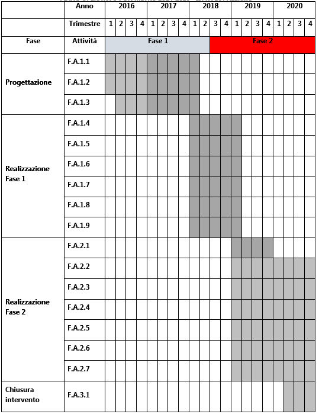

.. _h107e796c1a3b33102a165414e784c25:

PA1.1.1.f – Piattaforma ICT “Ambiente e Territorio”
###################################################

+--------------------------+--------------------------------------------------------+
|Codice progetto           |\ |STYLE0|\                                             |
+--------------------------+--------------------------------------------------------+
|\ |STYLE1|\               |\ |STYLE2|\                                             |
+--------------------------+--------------------------------------------------------+
|\ |STYLE3|\  (se presente)|D71H17000050007                                         |
+--------------------------+--------------------------------------------------------+
|\ |STYLE4|\               |\ |STYLE5|\                                             |
+--------------------------+--------------------------------------------------------+
|\ |STYLE6|\               |\ |STYLE7|\                                             |
+--------------------------+--------------------------------------------------------+
|\ |STYLE8|\               |Comune di Palermo – C.F. 80016350821                    |
+--------------------------+--------------------------------------------------------+
|\ |STYLE9|\               |Dott.ssa Vincenza Simonte (Comune di Palermo)           |
+--------------------------+--------------------------------------------------------+
|                          |v.simonte@comune.palermo.it, +39 091 7406342/43         |
+--------------------------+--------------------------------------------------------+
|\ |STYLE10|\              |SISPI - Sistema Palermo Informatica (“in house”)        |
+--------------------------+--------------------------------------------------------+
|                          |Salvatore Morreale, s.morreale@sispi.it, +39 091 6319811|
+--------------------------+--------------------------------------------------------+

.. _h122e634036157b7d235c25455a5918:

Descrizione del progetto
************************

.. _h6e6359221a5a3c7d4e35346c6c471978:

Obiettivi e ricadute del progetto
=================================

Gli \ |STYLE11|\  che si prefigge di raggiungere la Piattaforma ICT “\ |STYLE12|\ ” sono molteplici e di seguito schematicamente rappresentati:

* \ |STYLE13|\  distribuiti sul territorio (a bordo dei mezzi del TPL, integrati nel sistema di illuminazione, fisicamente distribuiti sul territorio) per il monitoraggio e l’analisi in tempo reale del territorio e dell’ambiente;

* \ |STYLE14|\  presenti sul territorio, cui associare i parametri ambientali acquisiti con i sistemi di monitoraggio di cui al punto precedente;

* \ |STYLE15|\  a supporto di una piattaforma di \ |STYLE16|\  per lo studio e il monitoraggio del territorio anche attraverso la creazione di cruscotti di visualizzazione specifici per le diverse categorie di utenti: cittadini, autorità politiche, tecnici;

* \ |STYLE17|\ ;

* \ |STYLE18|\  per uno scambio proficuo di informazioni.

Le \ |STYLE19|\  attese della Piattaforma sul territorio sono molteplici, prevalentemente attinenti alla creazione di un sistema integrato di analisi, monitoraggio, pianificazione e governo del territorio e dell’ambiente sia del Comune di Palermo sia dei Comuni di area metropolitana coinvolti.

.. _h5b383b4c5047625c7f4257e7d4d123d:

Beneficiari
===========

I beneficiari della presente piattaforma sono molteplici:

* \ |STYLE20|\  coinvolti, che potranno utilizzare la piattaforma per un monitoraggio dell’ambiente e del territorio e per lo studio e la pianificazione degli interventi che di volta in volta si mostreranno necessari;

* \ |STYLE21|\ , che potrà utilizzare la piattaforma come valido strumento di supporto alle decisioni a supporto della pianificazione, dello sviluppo e della valorizzazione del territorio oltre a quelle di tutela dell’ambiente;

* \ |STYLE22|\ , che potranno integrare le piattaforme in proprio possesso con quella presente, arricchendo così in modo consistente mole e dettaglio dei dati di cui dispongono a supporto dei propri interventi;

\ |STYLE23|\ , che potranno disporre, in modo trasparente e in tempo reale, di dati inerenti l’inquinamento, i parametri ambientali, lo stato del suolo e delle acque nonché le relative serie storiche, potendo così esercitare un controllo tipico della cittadinanza attiva sulle scelte di indirizzo della classe politica e sulle modalità di attuazione delle strutture amministrative e tecniche.

.. _h637d2d14366527a111435544b537a18:

Coerenza con la programmazione nazionale/regionale e con gli strumenti di pianificazione previsti per il livello comunale
=========================================================================================================================

\ |STYLE24|\  sono presenti molteplici elementi di sinergia con il PON “Governance e Capacità Istituzionali” FESR e FSE, con l’Agenda Digitale del FESR nonché con programmi a finanziamento diretto quali Horizon2020, Life etc.

\ |STYLE25|\  è presente una forte sinergia con gli interventi previsti dal PO FESR Regionale.

\ |STYLE26|\  la presente proposta presenta molteplici elementi di sinergia con quanto previsto dal progetto “\ |STYLE27|\ ” di cui alla delibera di Giunta Municipale n. 56 del 05/04/2016.

.. _h112b357f132f3b762c72584697933:

Coerenza con il Programma, i criteri di selezione degli interventi e la strategia d’Asse
========================================================================================

\ |STYLE28|\  la Piattaforma ICT “\ |STYLE29|\ ” è coerente con quanto previsto dal Programma Operativo che sostiene la realizzazione di iniziative di Agenda Digitale attraverso l’acquisizione e messa in esercizio di sistemi tecnologici e gestionali nell’Area Tematica Ambiente e Territorio.

\ |STYLE30|\  la Piattaforma risponde ai criteri di selezione previsti dal programma in quanto prevede lo sviluppo e il rinnovamento di servizi digitali dedicati al potenziamento e integrazione dei sistemi di raccolta di informazioni in materia di qualità dell’aria, raccolta dei rifiuti e dissesto idrogeologico finalizzati allo sviluppo di sistemi di pianificazione e controllo del territorio.

\ |STYLE31|\  dal punto di vista strategico, la Piattaforma prevede lo sviluppo di servizi on-line dedicati alla raccolta di informazioni in tempo reale provenienti dal territorio e riferiti all’ambiente.

.. _h643e4c470556f2a11587657e23160:

Collegamento e sinergia con altre azioni del PON Metro (azioni integrate)
=========================================================================

I collegamenti e le sinergie con altre azioni del PON Metro sono molteplici, anche in ragione dell’approccio sistemico adottato nella implementazione dalla più complessiva piattaforma di Agenda Digitale del PON Metro Palermo.

Per quanto attiene nello specifico la Piattaforma ICT “\ |STYLE32|\ ”, notevoli sono le sinergie con le Piattaforme “\ |STYLE33|\ ”, “\ |STYLE34|\ ” e “\ |STYLE35|\ ” dovute non solo alla condivisione delle componenti tecnologiche abilitanti le singole piattaforme (strato di \ |STYLE36|\ , piattaforma di gestione documentale, piattaforma \ |STYLE37|\ , \ |STYLE38|\ , piattaforma di \ |STYLE39|\ , piattaforma di georeferenziazione, etc.) ma anche a uno stretto coordinamento dei formati e modelli dei dati gestiti dalle singole piattaforme al fine di supportare una “naturale” interoperabilità tra le piattaforme.

.. _h165fd805c1c30506f6e24534074f9:

Descrizione dei contenuti progettuali
=====================================

La Piattaforma ICT “\ |STYLE40|\ ” è una piattaforma estremamente innovativa e complessa, in grado di integrare lo stato dell’arte della tecnologia disponibile in diversi ambiti applicativi per il monitoraggio, l’analisi e il governo dell’ambiente e del territorio.

La piattaforma prevede la creazione di sistemi e procedure che consentano l’implementazione di un \ |STYLE41|\ . Questo si realizzerà attraverso il concorso di diverse \ |STYLE42|\ :

* \ |STYLE43|\  a bordo dei mezzi del TPL, integrati nel sistema di illuminazione pubblica, fisicamente integrati nel territorio. Tali sensori, gestiti in una logica propria dell’\ |STYLE44|\ , collegati tra loro e con il CED attraverso la rete WiFi “di distretto” e l’anello telematico del Comune, rappresenteranno una vera e propria \ |STYLE45|\  che consentirà alla piattaforma di essere costantemente in contatto con il territorio, monitorandolo, analizzandolo e supportando gli interventi mirati per governarlo. Con riferimento alla “Piattaforma di connettività urbana: Wi-Fi di distretto” si precisa che il sistema è esclusivamente funzionale e strumentale all'attuazione del servizio di sensoristica IOT ambientale. La piattaforma non è volta ad aumentare l’accessibilità ai servizi da parte dei cittadini.La sensoristica ambientale a bordo dei mezzi TPL è stata inserita tra le spese dell’asse 2; la relativa spesa, stimabile oggi in 400.000,00 €, sarà trasferita sul progetto PA2.2.2.c.

* \ |STYLE46|\  se la sensoristica di cui al punto precedente sarà presente sul solo territorio del Comune di Palermo, la piattaforma di gestione delle informazioni sarà concepita in logica di \ |STYLE47|\  prevedendone la messa a disposizione dei Comuni di area metropolitana che parteciperanno al progetto. In particolare, l’intero ecosistema dei servizi, che verranno sviluppati e di seguito descritti, sarà fruibile non solo da parte del Comune di Palermo ma anche da parte dei Comuni di area metropolitana sostanzialmente secondo le medesime modalità e funzionalità; 

* \ |STYLE48|\  l’enorme mole di dati generata dal sistema di sensoristica distribuita sul territorio nonché dai sistemi più tradizionali di acquisizione dei dati ●        o già in possesso delle amministrazioni coinvolte, comporta la necessità di disporre di un’adeguata piattaforma di analisi dei dati stessi, anche in una chiave di georeferenziazione delle informazioni che renda la piattaforma in grado di interoperare con le altre piattaforme del progetto quali quelle “\ |STYLE49|\ ” e “\ |STYLE50|\ ”.

Per quanto attiene alle \ |STYLE51|\  implementate, queste rappresenteranno altrettanti capisaldi della piattaforma e sono di seguito descritti:

* \ |STYLE52|\  un elemento centrale dell’intera piattaforma è rappresentato dalla creazione di anagrafiche tematiche dettagliate di oggetti (edifici, spazi attrezzati, strutture) e infrastrutture (strade, ponti, impianti), opportunamente georeferenziate, in grado di interoperare con la piattaforma webGIS già in produzione;

*  \ |STYLE53|\  la creazione delle anagrafiche è propedeutica all’introduzione di sistemi di identità degli stessi oggetti e infrastrutture, attraverso l’integrazione dei dati anagrafici grezzi con attributi specifici dei singoli oggetti;

* \ |STYLE54|\  si tratta di una funzionalità di particolare rilievo a supporto del governo del territorio e dello sviluppo di sistemi predittivi dei trend ambientali;

* \ |STYLE55|\  una volta raccolti i dati provenienti dal territorio e dall’ambiente e censiti gli oggetti e le infrastrutture presenti, sarà possibile sviluppare dei cruscotti direzionali ritagliati sulle specifiche esigenze di gruppi di utenti: cittadini, amministratori locali, tecnici etc. La funzione di tali cruscotti consiste nel fornire veloci e snelli sistemi di monitoraggio dei parametri ambientali specificamente in materia di qualità dell’aria e delle acque, conferimento dei rifiuti, utilizzo del suolo, erosione e dissesto idrogeologico.

Accanto agli strumenti sopra descritti, si realizzerà un \ |STYLE56|\  che fungerà, tra le altre cose, da collettore dei dati del territorio e sarà fortemente integrato sia con il Portale della Formazione previsto dalla Piattaforma ICT “\ |STYLE57|\ ” sia con la Piattaforma ICT “\ |STYLE58|\ ”. Se il Portale della Formazione avrà un ruolo prevalentemente di servizio nell’erogazione dei contenuti, fornendo gli strumenti per la creazione e navigazione dei contenuti, il Portale della Conoscenza contribuirà a produrre i contenuti, con riferimento prevalente alle tematiche che attengono all’area metropolitana, in stretta collaborazione con l’Università di Palermo. Con riferimento ad alcune specifiche tematiche, il Portale della Conoscenza fungerà anche da strumento di visualizzazione e navigazione degli Open Data associati, fornendo in alcuni casi gli strumenti necessari per le relative attività di analisi e prospettazione sintetica dei principali indicatori associati, in stretto collegamento con i cruscotti direzionali e di monitoraggio ambientale. In particolare, il Portale della Conoscenza raccoglierà dati e studi inerenti il territorio metropolitano, con specifico riferimento agli ambiti dell’ambiente e della sua tutela, dell’utilizzo del territorio, dell’energia, della mobilità, rendendoli fruibili ai cittadini, alle imprese e alle pubbliche amministrazioni per le finalità che ciascuno vorrà perseguire. Il Portale della Formazione fornirà il \ |STYLE59|\  standard e gli strumenti per esporre e rendere fruibili i contenuti in modo strutturato. Il Portale della Conoscenza non sarà pertanto un semplice repository documentale o, più in generale, di informazioni, ma rappresenterà l’elemento abilitante per l’erogazione dei servizi veri e propri al cittadino, svolgendo quella indispensabile funzione di collante tra ambiti e Piattaforme distinte (“\ |STYLE60|\ ”, “\ |STYLE61|\ ”, “\ |STYLE62|\ ”) che le singole applicazioni non sono in grado, da sole, di svolgere.

Per quanto attiene i servizi ai cittadini, la Piattaforma ICT “\ |STYLE63|\ ” rappresenta un elemento cruciale di abilitazione del concetto di cittadinanza attiva, prevedendo la realizzazione di applicazioni in grado di fornire ai cittadini una moltitudine di dati, non solo storici ma anche in tempo reale, che consenta di farsi parte attiva nel monitoraggio dell’ambiente e nella tutela del territorio, consentendo così di potere progettare reali politiche condivise di tutela dell’ambiente.

.. _h433ac47c5d441b546c7b551f24b2d:

Articolazione temporale delle attività progettuali
==================================================

Lo sviluppo temporale della Piattaforma ICT “\ |STYLE64|\ ”, analogamente a quanto previsto per altre Piattaforme, si articola in due Fasi. Ciò è reso necessario dalla molteplicità di piattaforme tecnologiche coinvolte nella realizzazione della Piattaforma in questione combinata con la complessità e con l’elevato livello di innovatività delle stesse che comporta la difficoltà di reperire sul mercato prodotti chiavi-in-mano pronti a soddisfare i requisiti progettuali richiesti.

* \ |STYLE65|\  questa prima fase è dedicata allo studio e implementazione di una prima soluzione prototipale della piattaforma, in grado di integrare le diverse piattaforme tecnologiche di supporto, con specifica enfasi sulle componenti IoT e sull’avvio dell’utilizzo della Piattaforma di \ |STYLE66|\ . Tale Fase è previsto che duri fino al 31/03/2019;

* \ |STYLE67|\  dopo avere testato le diverse soluzioni presenti sul mercato che maggiormente soddisfano i requisiti progettuali e sviluppato una soluzione prototipale, nel corso di questa seconda fase si procederà alla implementazione della infrastruttura definitiva di progetto, allo sviluppo delle interfacce utente nonché all’erogazione dei servizi ai cittadini e ai Comuni di cintura. Tale Fase prenderà avvio il 01/01/2019 per terminare il 31/12/2020.

.. _h2a27307412b1b6951405f6d2b1fb6e:

Sostenibilità economica e gestionale e governance del progetto
==============================================================

La \ |STYLE68|\  della Piattaforma ICT “\ |STYLE69|\ ”, analogamente a quanto accade con le altre Piattaforme, è garantita da una strategia articolata, basata sulla modularità e sul livello dei servizi erogati. In particolare:

* i costi di sviluppo della Piattaforma e dei servizi base sono interamente coperti dalle risorse del presente progetto;

* l’erogazione dei servizi base, quelli cioè prevalentemente attinenti alle anagrafiche di oggetti e infrastrutture e alle funzionalità base del sistema di monitoraggio ambientale e territoriale, terminato il progetto e quindi a partire dal 2021, saranno erogati dalla società \ |STYLE70|\  Sispi previa copertura dei costi vivi di gestione in esercizio dei servizi stessi;

* lo sviluppo e l’erogazione di nuovi servizi sarà governata dalla stipula di appositi accordi onerosi negoziati dai singoli committenti con la società \ |STYLE71|\  Sispi del Comune di Palermo cui è affidato lo sviluppo e la gestione in esercizio della piattaforma e dei servizi dalla stessa erogati.

I \ |STYLE72|\  per il Comune di Palermo e per i Comuni di Cintura, associati all’adozione della presente Piattaforma, saranno considerevolmente inferiori rispetto a quelli medi di mercato dal momento che le componenti architetturali sulle quali si fonda la Piattaforma stessa sono parte di un ecosistema che consente di ottimizzare l’impiego delle risorse, riducendone altresì il costo. L’alta \ |STYLE73|\  della Piattaforma, consentita dall’adozione diffusa di tecnologia \ |STYLE74|\ , dallo sviluppo di applicativi \ |STYLE75|\ -ready e dalla condivisione delle componenti infrastrutturali con le altre Piattaforme di progetto, è garanzia di riduzione dei costi di gestione e di esercizio all’aumentare del numero di Amministrazioni che intenderanno avvalersi del servizio.

La \ |STYLE76|\  della Piattaforma sarà garantita dalla società \ |STYLE77|\  Sispi del Comune di Palermo la quale gestirà la Piattaforma inserendola in modo organico, sin dalla sua progettazione e sviluppo, all’interno del parco applicativo dalla stessa gestito.

La \ |STYLE78|\  sarà gestita dall’Autorità Urbana del Comune di Palermo, di concerto con la società \ |STYLE79|\  Sispi e con i diversi Comuni di area metropolitana coinvolti nel progetto stesso.

.. _h504b405a2d6c6a2a924465c1d696631:

Elementi tecnologici
====================

La Piattaforma ICT “\ |STYLE80|\ ” poggia su diversi componenti tecnologici, alcuni dei quali in comune con le altre Piattaforme di progetto. Di seguito si riportano i riferimenti ai principali elementi tecnologici impiegati e utilizzati dalla presente Piattaforma:

* \ |STYLE81|\  si tratta della piattaforma computazionale di base, in grado non solo di fornire il supporto computazionale alla Piattaforma ma anche di renderla scalabile in termini di risorse disponibili e abilitare la replicabilità della stessa, in modo personalizzato, ai Comuni di area metropolitana coinvolti nel progetto. Sulla piattaforma di \ |STYLE82|\  insistono buona parte delle componenti middleware utilizzate e di seguito descritte. Condivisa con altre Piattaforme di progetto;

* \ |STYLE83|\  si tratta della piattaforma per la raccolta e analisi dei dati provenienti dalla variegata sensoristica distribuita sul territorio, basata su tecnologie aperte e strettamente integrata con l’ESB;

* \ |STYLE84|\  basata sull’infrastruttura di \ |STYLE85|\  e sullo standard \ |STYLE86|\ , opportunamente integrata con strumenti di reportistica, implementa l’intelligenza dell’intera piattaforma, a stretto supporto della governance e del monitoraggio del territorio e dell’ambiente. Condivisa con altre Piattaforme di progetto;

* \ |STYLE87|\  fornisce gli strumenti per la georeferenziazione delle informazioni e la geolocalizzazione di eventi, oggetti e individui. Condivisa con altre Piattaforme di progetto;

* \ |STYLE88|\  fornisce il supporto alla gestione dei documenti e delle informazioni, prevalentemente a supporto del Portale della Conoscenza. Condivisa con altre Piattaforme di progetto;

* \ |STYLE89|\  fornisce il supporto alla gestione per processi di tutta la componente di \ |STYLE90|\ . Condivisa con altre Piattaforme di progetto;

* \ |STYLE91|\  rappresenta l’elemento collante, di interoperabilità tra le diverse Piattaforme infrastrutturali, in grado altresì di standardizzare i dati per una loro esposizione ad altre applicazioni e piattaforme tematiche. Condivisa con altre Piattaforme di progetto;

* \ |STYLE92|\  fornirà gli strumenti base di autenticazione degli utenti alla piattaforma, siano essi cittadini, operatori delle istituzioni o aziende. Condivisa con altre Piattaforme di progetto.

Verrà sviluppato un sistema di monitoraggio ambientale, fruibile sia come Web Application basata sulla tecnologia SOA sia come Mobile App disponibili per le principali piattaforme (iOS, Android, Windows). I servizi saranno fruibili online tramite interfacce basate su grafica personalizzabile tramite \ |STYLE93|\ , erogabili anche tramite \ |STYLE94|\ .

L’adozione nativa del paradigma del \ |STYLE95|\  nonché l’utilizzo di componenti middleware condivisi con le altre Piattaforme, garantisce una naturale \ |STYLE96|\  in termini sia di \ |STYLE97|\  sia di \ |STYLE98|\ . Per quanto concerne le funzionalità di \ |STYLE99|\ , queste potranno essere raggruppate in due categorie:

* quelle di \ |STYLE100|\ , legate alla gestione delle funzionalità di base degli applicativi e delle componenti infrastrutturali, in capo alla società \ |STYLE101|\  Sispi del Comune di Palermo che se ne farà garante per l’intera Piattaforma e per tutti gli utenti;

* quelle di \ |STYLE102|\ , legate alla personalizzazione dei servizi da parte delle singole Amministrazioni/utenti, in capo ai singoli presidii delle rispettive Amministrazioni/utenti.

.. _h40575ce71476d3a3d4a6627c37193d:

Area territoriale di intervento
===============================

L’ambito territoriale di intervento della Piattaforma ICT “\ |STYLE103|\ ” è rappresentato, in primo luogo, dal Comune di Palermo nonché dai Comuni di area metropolitana coinvolti nel progetto. Considerata la natura dei servizi sviluppati nonché la modalità di erogazione dei servizi in \ |STYLE104|\  (in grado pertanto di garantire un’ampia scalabilità dei servizi erogati), è possibile immaginare l’estensione della Piattaforma ad un ambito territoriale molto più vasto, potendo pensare di candidarla a diventare il Portale del Monitoraggio Ambientale e Territoriale per l’intera Regione Sicilia.

.. _h5d4e63201617411656760177b1be:

Risultato atteso  - Indicatori di Output
========================================

+-----------------------------+-----------------------------+-----------+-----------+
|Descrizione indicatore output|Descrizione indicatore output|Target 2018|Target 2023|
+=============================+=============================+===========+===========+
|IO01                         |Numero di                    |0          |7          |
|                             |                             |           |           |
|                             |comuni associati             |           |           |
|                             |                             |           |           |
|                             |a sistemi                    |           |           |
|                             |                             |           |           |
|                             |informativi                  |           |           |
|                             |                             |           |           |
|                             |integrati                    |           |           |
+-----------------------------+-----------------------------+-----------+-----------+

\ |STYLE105|\ 

Relativamente alla realizzazione della \ |STYLE106|\ , si prevede che la rete sarà implementata sul territorio del Comune di Palermo entro il 31/12/2019 e la piattaforma di raccolta e analisi dei dati sarà resa disponibile ad almeno 42 Comuni entro il 31/12/2020.

Relativamente all’\ |STYLE107|\ , si prevede che il servizio sarà aperto e disponibile agli operatori istituzionali di almeno 7 Comuni entro il 31/12/2019 e ad almeno 42 Comuni entro il 31/12/2020.

Relativamente al \ |STYLE108|\  e al \ |STYLE109|\ , si prevede che i servizi saranno aperti e disponibili agli operatori istituzionali di almeno 4 Comuni entro il 31/12/2019 ed esteso alla fruizione da parte di almeno 42 Comuni e ai turisti entro il 31/12/2020.

.. _h271f768271872255d2f7d182d767d38:

Data inizio / fine 
===================

01/2016 – 12/2020

.. _h4268225104312295833593b4d173410:

Fonti di finanziamento
======================

+----------------------------+--------------+
|Risorse PON METRO           |\ |STYLE110|\ |
+----------------------------+--------------+
|\ |STYLE111|\  (se presenti)|\ |STYLE112|\ |
+----------------------------+--------------+
|\ |STYLE113|\  (se presenti)|\ |STYLE114|\ |
+----------------------------+--------------+
|\ |STYLE115|\               |\ |STYLE116|\ |
+----------------------------+--------------+

.. _h131c113c45802457634c7e701a6b5f59:

Cronoprogramma attività
=======================

\ |IMG1|\ 

 

.. _h2626a662a6b113685261702b40722c:

Cronoprogramma finanziario
==========================

+--------------+--------------+
|\ |STYLE117|\ |€ 0,00        |
+--------------+--------------+
|\ |STYLE118|\ |€ 0,00        |
+--------------+--------------+
|\ |STYLE119|\ | € 0,00       |
+--------------+--------------+
|\ |STYLE120|\ |€ 571.428,00  |
+--------------+--------------+
|\ |STYLE121|\ |€ 571.428,00  |
+--------------+--------------+
|\ |STYLE122|\ |€ 3.372.144,00|
+--------------+--------------+
|\ |STYLE123|\ |\ |STYLE124|\ |
+--------------+--------------+

.. bottom of content

.. |STYLE0| replace:: *PA1.1.1.f*

.. |STYLE1| replace:: **Titolo progetto**

.. |STYLE2| replace:: *Piattaforma ICT “Ambiente e Territorio”*

.. |STYLE3| replace:: **CUP**

.. |STYLE4| replace:: **Modalità di attuazione**

.. |STYLE5| replace:: *A titolarità*

.. |STYLE6| replace:: **Tipologia di operazione**

.. |STYLE7| replace:: *Acquisto e realizzazione di servizi*

.. |STYLE8| replace:: **Beneficiario**

.. |STYLE9| replace:: **Responsabile Unico del Procedimento**

.. |STYLE10| replace:: **Soggetto attuatore**

.. |STYLE11| replace:: **obiettivi**

.. |STYLE12| replace:: *Ambiente e Territorio*

.. |STYLE13| replace:: **creazione di una rete di sensori**

.. |STYLE14| replace:: **creazione di un’anagrafica univoca di oggetti e infrastrutture**

.. |STYLE15| replace:: **sviluppo di un sistema integrato di geolocalizzazione e di storicizzazione dei dati**

.. |STYLE16| replace:: *Big Data Analytics*

.. |STYLE17| replace:: **sviluppo di un sistema integrato di governance del territorio**

.. |STYLE18| replace:: **integrazione con le piattaforme di “Edilizia e Catasto”, “Cultura e Tempo Libero” e “Lavori Pubblici”**

.. |STYLE19| replace:: **ricadute**

.. |STYLE20| replace:: **le strutture amministrative degli Enti Locali**

.. |STYLE21| replace:: **la governance politica**

.. |STYLE22| replace:: **la Protezione Civile e l’ARPA**

.. |STYLE23| replace:: **i cittadini in genere**

.. |STYLE24| replace:: **Programmazione Nazionale:**

.. |STYLE25| replace:: **Programmazione Regionale:**

.. |STYLE26| replace:: **Pianificazione Comunale:**

.. |STYLE27| replace:: *Verso Palermo Città Metropolitana – Piano Sociale, prospettive di sviluppo sociale, economico e culturale della città e del suo territorio*

.. |STYLE28| replace:: **Coerenza con il Programma:**

.. |STYLE29| replace:: *Ambiente e Territorio*

.. |STYLE30| replace:: **Criteri di selezione:**

.. |STYLE31| replace:: **Strategia di Asse:**

.. |STYLE32| replace:: *Ambiente e Territorio*

.. |STYLE33| replace:: *Edilizia e Catasto*

.. |STYLE34| replace:: *Cultura e Tempo Libero*

.. |STYLE35| replace:: *Lavori Pubblici*

.. |STYLE36| replace:: *Cloud Computing*

.. |STYLE37| replace:: *CRM*

.. |STYLE38| replace:: *DataWareHouse*

.. |STYLE39| replace:: *Big Data Analytics*

.. |STYLE40| replace:: *Ambiente e Territorio*

.. |STYLE41| replace:: **sistema informativo per la governance del territorio**

.. |STYLE42| replace:: **tecnologie**

.. |STYLE43| replace:: **Azione coordinata con l’intervento PA2.2.2.c - Sensoristica distribuita sul territorio:**

.. |STYLE44| replace:: *Internet fo Things (IoT)*

.. |STYLE45| replace:: **rete sensiente**

.. |STYLE46| replace:: **tecnologia diCloud Computing:**

.. |STYLE47| replace:: *Cloud Computing*

.. |STYLE48| replace:: **sistemi di Big Data Analytics integrati con sistemi cartografici georeferenziati:**

.. |STYLE49| replace:: *Edilizia e Catasto*

.. |STYLE50| replace:: *Lavori Pubblici*

.. |STYLE51| replace:: **funzionalità**

.. |STYLE52| replace:: **anagrafiche univoche di oggetti e infrastrutture:**

.. |STYLE53| replace:: **associazione di identità a oggetti e infrastrutture:**

.. |STYLE54| replace:: **storicizzazione dei dati:**

.. |STYLE55| replace:: **cruscotti direzionali e di monitoraggio ambientale e territoriale:**

.. |STYLE56| replace:: **Portale della Conoscenza**

.. |STYLE57| replace:: *Lavoro e Formazione*

.. |STYLE58| replace:: *Cultura e Tempo Libero*

.. |STYLE59| replace:: *framework*

.. |STYLE60| replace:: *Lavoro e Formazione*

.. |STYLE61| replace:: *Cultura e Tempo Libero*

.. |STYLE62| replace:: *Ambiente e Territorio*

.. |STYLE63| replace:: *Ambiente e Territorio*

.. |STYLE64| replace:: *Ambiente e Territorio*

.. |STYLE65| replace:: **Fase 1 – realizzazione di un’infrastruttura iniziale e rilascio dei primi servizi:**

.. |STYLE66| replace:: *Big Data Analytics*

.. |STYLE67| replace:: **Fase 2 – implementazione della Piattaforma completa:**

.. |STYLE68| replace:: **sostenibilità economica**

.. |STYLE69| replace:: *Ambiente e Territorio*

.. |STYLE70| replace:: *in-house*

.. |STYLE71| replace:: *in-house*

.. |STYLE72| replace:: **costi marginali**

.. |STYLE73| replace:: **scalabilità**

.. |STYLE74| replace:: *Cloud*

.. |STYLE75| replace:: *Cloud*

.. |STYLE76| replace:: **sostenibilità gestionale**

.. |STYLE77| replace:: *in-house*

.. |STYLE78| replace:: **governance del progetto**

.. |STYLE79| replace:: *in-house*

.. |STYLE80| replace:: *Ambiente e Territorio*

.. |STYLE81| replace:: **Infrastruttura computazionale diCloud Computing:**

.. |STYLE82| replace:: *Cloud Computing*

.. |STYLE83| replace:: **Piattaforma IoT:**

.. |STYLE84| replace:: **Piattaforma di Big Data Analytics:**

.. |STYLE85| replace:: *Cloud Computing*

.. |STYLE86| replace:: *Apache Hadoop*

.. |STYLE87| replace:: **Piattaforma di georeferenziazione:**

.. |STYLE88| replace:: **Piattaforma di Gestione Documentale:**

.. |STYLE89| replace:: **Piattaforma di BPM:**

.. |STYLE90| replace:: *back-office*

.. |STYLE91| replace:: **Piattaforma ESB:**

.. |STYLE92| replace:: **Piattaforma SPID:**

.. |STYLE93| replace:: *CSS*

.. |STYLE94| replace:: *widget*

.. |STYLE95| replace:: *Cloud Computing*

.. |STYLE96| replace:: **scalabilità del servizio**

.. |STYLE97| replace:: *front-office*

.. |STYLE98| replace:: *back-office*

.. |STYLE99| replace:: *back-office*

.. |STYLE100| replace:: **basso livello**

.. |STYLE101| replace:: *in-house*

.. |STYLE102| replace:: **alto livello**

.. |STYLE103| replace:: *Ambiente e Territorio*

.. |STYLE104| replace:: *Cloud*

.. |STYLE105| replace:: *Nota: la previsione/tabella precedente è redatta in modo tale che un Comune federato a più piattaforme venga contato una sola volta.*

.. |STYLE106| replace:: **Rete di Sensori**

.. |STYLE107| replace:: **Anagrafe univoca di oggetti e infrastrutture**

.. |STYLE108| replace:: **Sistema integrato di geolocalizzazione e di storicizzazione dei dati**

.. |STYLE109| replace:: **Sistema integrato di governance del Territorio**

.. |STYLE110| replace:: *€ 4.515.000,00*

.. |STYLE111| replace:: **Altre risorse pubbliche**

.. |STYLE112| replace:: *€ 0,00*

.. |STYLE113| replace:: **Risorse private**

.. |STYLE114| replace:: *€ 0,00*

.. |STYLE115| replace:: **Costo totale**

.. |STYLE116| replace:: *€ 4.515.000,00*

.. |STYLE117| replace:: *2014/2015*

.. |STYLE118| replace:: *2016*

.. |STYLE119| replace:: *2017*

.. |STYLE120| replace:: *2018*

.. |STYLE121| replace:: *2019*

.. |STYLE122| replace:: *2020*

.. |STYLE123| replace:: **Totale**

.. |STYLE124| replace:: **€ 4.515.000,00**

