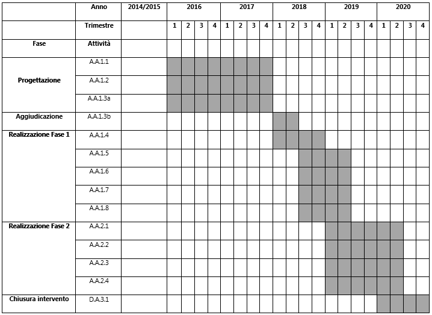

.. _h132b32214d6d29492c33112038783146:

PA1.1.1.a – Piattaforma ICT “Assistenza e Sostegno Sociale”
###########################################################

* \ |STYLE0|\  \ |STYLE1|\ 

* \ |STYLE2|\  \ |STYLE3|\ 

* \ |STYLE4|\  (se presente): D71H17000010007

* \ |STYLE5|\  \ |STYLE6|\ 

* \ |STYLE7|\  \ |STYLE8|\ 

* \ |STYLE9|\  Comune di Palermo – C.F. 80016350821

* \ |STYLE10|\  Dott.ssa Vincenza Simonte (Comune di Palermo). v.simonte@comune.palermo.it, +39 091 7406342/43

* \ |STYLE11|\  SISPI - Sistema Palermo Informatica (“in house”). Ing. Salvatore Morreale, s.morreale@sispi.it, 091.6319811 

.. _h122e634036157b7d235c25455a5918:

Descrizione del progetto
************************

.. _h6e6359221a5a3c7d4e35346c6c471978:

Obiettivi e ricadute del progetto
=================================

Gli \ |STYLE12|\  che la Piattaforma ICT “\ |STYLE13|\ ” si prefigge di raggiungere sono molteplici, strettamente correlati gli uni agli altri e di seguito sinteticamente indicati:

        ●        \ |STYLE14|\  che sia pronta a integrarsi con l’Anagrafe Nazionale della Popolazione Residente (ANPR) con specifico riferimento agli aspetti legati all’Anagrafe degli Assegnatari;

        ●        \ |STYLE15|\ , sia dei singoli sia di interi nuclei familiari, in grado di collegare le informazioni di natura prettamente sociale con quelle relative alla formazione, al lavoro, alla sanità, etc.;

        ●        \ |STYLE16|\ , finalizzata a consentire l’incontro della domanda (disagio abitativo) con l’offerta (strutture abitative private e pubbliche destinate a fini ERP);

        ●        \ |STYLE17|\ , attraverso il quale i cittadini possano dichiarare il proprio disagio e avviare le procedure per la sua soluzione.

Le \ |STYLE18|\  attese della Piattaforma sul territorio sono molteplici e schematicamente riassumibili nei seguenti punti:

        ●        creazione di un unico punto di accesso ai servizi di Assistenza e Sostegno Sociale;

        ●        supporto, laddove possibile come nel caso del disagio abitativo, dell’incontro della domanda con l’offerta;

coordinamento delle politiche territoriali di Assistenza e Sostegno Sociale con interventi basati su una visione multifattoriale del disagio.

.. _h5b383b4c5047625c7f4257e7d4d123d:

Beneficiari
===========

I beneficiari della presente piattaforma sono molteplici:

        ●        \ |STYLE19|\ , che potranno disporre di un punto di riferimento unitario per tutto ciò che concerne l’Assistenza e il Sostegno Sociale;

\ |STYLE20|\ , che potranno disporre di una visione unitaria e integrata dei bisogni sociali, potendo così implementare dei modelli cooperativi trans-comunali in grado di creare benefiche sinergie e messa in comune delle risorse disponibili oltre che delle politiche di intervento.

.. _h637d2d14366527a111435544b537a18:

Coerenza con la programmazione nazionale/regionale e con gli strumenti di pianificazione previsti per il livello comunale
=========================================================================================================================

\ |STYLE21|\  sono presenti molteplici elementi di sinergia con il PON Governance, il PON Inclusione FSE, il PON Legalità FSER e FSE, il PON Sistemi di Politiche Attive per l’Occupazione e con l’Agenda Digitale del FESR.

\ |STYLE22|\  è presente una forte sinergia con gli interventi previsti dal PO FESR Regionale e, in particolare, con quanto previsto dagli Assi 2 (Agenda Digitale) e 9 (Inclusione Sociale) dell’Agenda Urbana Regionale.

\ |STYLE23|\  la presente proposta presenta molteplici elementi di sinergia con quanto previsto dal progetto “\ |STYLE24|\ ” di cui alla delibera di Giunta Municipale n. 56 del 05/04/2016.

.. _h112b357f132f3b762c72584697933:

Coerenza con il Programma, i criteri di selezione degli interventi e la strategia d’Asse
========================================================================================

\ |STYLE25|\  la Piattaforma ICT “\ |STYLE26|\ ” è coerente con quanto previsto dal Programma Operativo che sostiene la realizzazione di un’Agenda Digitale attraverso l’acquisizione e messa in esercizio di sistemi tecnologici e gestionali nell’Area Tematica di Assistenza e Sostegno Sociale.

\ |STYLE27|\  la Piattaforma risponde ai criteri di selezione previsti dal programma in quanto prevede lo sviluppo e il rinnovamento di servizi digitali dedicati alla gestione del patrimonio residenziale (Anagrafe degli Assegnatari), al contrasto al disagio abitativo e a una più generale analisi dei bisogni socio/assistenziali.

\ |STYLE28|\  dal punto di vista strategico, la Piattaforma prevede interventi di digitalizzazione dei processi amministrativi interni agli Enti e di integrazione tra banche dati funzionali alla disponibilità di fonti integrate di dati sulle quali basare strategie di sistema.

.. _h643e4c470556f2a11587657e23160:

Collegamento e sinergia con altre azioni del PON Metro (azioni integrate)
=========================================================================

I collegamenti e le sinergie con altre azioni del PON Metro sono molteplici, anche in ragione dell’approccio sistemico adottato nella implementazione dalla più complessiva piattaforma di Agenda Digitale del PON Metro Palermo.

Per quanto attiene nello specifico della Piattaforma ICT “\ |STYLE29|\ ”, notevoli sono le sinergie con le Piattaforme “\ |STYLE30|\ ”, “\ |STYLE31|\ ” e “\ |STYLE32|\ ” dovute non solo alla condivisione delle componenti tecnologiche abilitanti le singole piattaforme (infrastruttura di \ |STYLE33|\ , piattaforma di gestione documentale, piattaforma \ |STYLE34|\ , Piattaforma BPM, piattaforma di georeferenziazione, etc.) ma anche alla realizzazione di una politica integrata di Assistenza e Sostegno Sociale, anche in chiave sovra-comunale.

Gli interventi orientati a lenire il disagio abitativo trovano altresì molteplici ragioni di collegamento e sinergia con gli interventi previsti negli Assi 3 e 4 del PON Metro Palermo.

.. _h165fd805c1c30506f6e24534074f9:

Descrizione dei contenuti progettuali
=====================================

La Piattaforma ICT “\ |STYLE35|\ ” si prefigge l’obiettivo di supportare il coordinamento degli interventi in materia di disagio sociale. Tale disagio si declina in una molteplicità di forme, legate alla mancanza di abitazione, lavoro, formazione, assistenza sanitaria etc... Tale evidenza comporta la necessità di coniugare una pluralità di ambiti diversi ed eterogenei che però concorrono congiuntamente a risolvere o lenire un disagio sempre più diffuso. Obiettivo della Piattaforma è pertanto l’incremento dei servizi offerti al cittadino funzionali a consentirgli di accedere alle risorse offerte dagli Enti Locali in una logica sia puntuale, riferita al singolo servizio, sia di sistema.

La realizzazione della Piattaforma prevede una pluralità di interventi, alcuni specifici della Piattaforma e altri strettamente connessi con altri contesti e/o Piattaforme, alcune previste nell’Asse 1 del PON Metro Palermo. Di seguito si riporta sinteticamente un insieme di interventi sui quali poggerà la Piattaforma:

        ●        \ |STYLE36|\  si tratta degli elementi fondanti della Piattaforma, in grado di dare contezza e evidenza dei bisogni e di una parte delle risorse disponibili per alleviarli;

        ●        \ |STYLE37|\ , già previsto anche all’interno delle Piattaforme ICT “\ |STYLE38|\ ” e “\ |STYLE39|\ ”, con specifico riferimento alla implementazione degli strumenti in grado di fornire un’informazione quanto più possibile completa del livello di benessere/disagio del singolo cittadino e/o del nucleo familiare incrociando dati di natura la più variegata: abitativi, formativi, lavorativi, sanitari, fiscali, etc.;

        ●        \ |STYLE40|\  inteso non solo come strumento a disposizione del cittadino per interagire con le istituzioni ma anche come strumento di coordinamento delle istituzioni stesse, anche su scala sovra-comunale.

Specifica attenzione verrà riservata agli elementi di geolocalizzazione dei contenuti (piattaforma WebGIS), a supporto della creazione di mappe tematiche in grado di supportare gli interventi di sistema, anche a livelli multi-fattoriali.

.. _h433ac47c5d441b546c7b551f24b2d:

Articolazione temporale delle attività progettuali
==================================================

Lo sviluppo temporale della Piattaforma ICT “\ |STYLE41|\ ”, analogamente a quanto previsto per le altre Piattaforme, si articola in due Fasi. Ciò è reso necessario dalla molteplicità di piattaforme tecnologiche coinvolte nella realizzazione e a fondamento della Piattaforma in questione, combinata con la complessità e con l’elevato livello di innovatività delle stesse che comporta la difficoltà di reperire sul mercato prodotti chiavi-in-mano pronti a soddisfare i requisiti progettuali richiesti.

*  \ |STYLE42|\  questa prima fase è dedicata allo studio e all’implementazione delle strutture dati a fondamento dei diversi sistemi di anagrafica, alle modalità di interoperabilità con gli altri sistemi di anagrafica già presenti e/o da sviluppare (in primis ANPR); è dedicata altresì allo studio delle componenti base, logiche e tecnologiche, del FDC e alla realizzazione di un sistema prototipale di Portale Sociale.

* \ |STYLE43|\  dopo avere implementato le Anagrafiche, i sistemi di interoperabilità con le altre Anagrafiche e il prototipo di Portale Sociale del Territorio, si procederà alla messa in produzione di questi sistemi e al loro popolamento da parte dei cittadini e delle istituzioni preposte. 

.. _h2a27307412b1b6951405f6d2b1fb6e:

Sostenibilità economica e gestionale e governance del progetto
==============================================================

La \ |STYLE44|\  della Piattaforma ICT “\ |STYLE45|\ ”, analogamente a quanto accade con le altre Piattaforme, è garantita da una strategia articolata, basata sulla modularità e sul livello dei servizi erogati. In particolare:

*  i costi di sviluppo della Piattaforma e dei servizi base sono interamente coperti dalle risorse del presente progetto;

* l’erogazione dei servizi base, quelli cioè prevalentemente attinenti alle componenti anagrafiche e alle funzionalità base del Portale Sociale, terminato il progetto e quindi a partire dal 2021, saranno erogati dalla società \ |STYLE46|\  Sispi del Comune di Palermo previa copertura dei costi vivi di gestione in esercizio dei servizi stessi;

* lo sviluppo e l’erogazione di nuovi servizi (sviluppo di sezioni specifiche del Portale Sociale, erogazione di servizi in Alta Affidabilità, etc.) saranno governati dalla stipula di appositi accordi onerosi, negoziati dai singoli committenti con la società \ |STYLE47|\  Sispi del Comune di Palermo cui è affidato lo sviluppo e la gestione in esercizio della piattaforma e dei servizi dalla stessa erogati.

I \ |STYLE48|\  per il Comune di Palermo e per i Comuni di area metropolitana, associati all’adozione della presente Piattaforma, saranno considerevolmente inferiori rispetto a quelli medi di mercato dal momento che le componenti architetturali sulle quali si fonda la Piattaforma stessa sono parte di un ecosistema che consente di ottimizzare l’impiego delle risorse, riducendone altresì il costo. L’alta \ |STYLE49|\  della Piattaforma, consentita dall’adozione diffusa della tecnologia di \ |STYLE50|\ , dallo sviluppo di applicativi \ |STYLE51|\ -ready e dalla condivisione delle componenti infrastrutturali con le altre Piattaforme di progetto, è garanzia di riduzione dei costi di gestione e di esercizio all’aumentare del numero di Amministrazioni che intenderanno avvalersi del servizio.

La \ |STYLE52|\  della Piattaforma sarà garantita dalla società \ |STYLE53|\  Sispi del Comune di Palermo la quale gestirà la Piattaforma inserendola in modo organico, sin dalla sua progettazione e sviluppo, all’interno del parco applicativo e infrastrutturale dalla stessa gestito.

La \ |STYLE54|\  sarà affidata all’Autorità Urbana della Città di Palermo, la quale opererà di concerto con la società \ |STYLE55|\  Sispi del Comune di Palermo e con i diversi Comuni di area metropolitana coinvolti nel progetto stesso.

.. _h504b405a2d6c6a2a924465c1d696631:

Elementi tecnologici
====================

La Piattaforma ICT “\ |STYLE56|\ ” poggia su diverse componenti tecnologiche, alcune delle quali in comune con le altre Piattaforme di progetto. Di seguito si riportano i riferimenti ai principali elementi tecnologici impiegati e utilizzati dalla presente Piattaforma:

* \ |STYLE57|\  si tratta della piattaforma computazionale di base, in grado non solo di fornire il supporto computazionale alla Piattaforma ma anche di renderla scalabile in termini di risorse disponibili e abilitare la replicabilità della stessa, in modo personalizzato, ai Comuni di area metropolitana coinvolti nel progetto. Sulla piattaforma di \ |STYLE58|\  insistono buona parte delle componenti middleware utilizzate e di seguito descritte. Condivisa con altre Piattaforme di progetto;

* \ |STYLE59|\  fornisce gli strumenti per la georeferenziazione delle informazioni e la geolocalizzazione di eventi, oggetti e individui. Condivisa con altre Piattaforme di progetto; 

* \ |STYLE60|\  fornisce il supporto alla gestione delle diverse Anagrafiche. Condivisa con altre Piattaforme di progetto; 

* \ |STYLE61|\  fornisce il supporto alla gestione per processi di tutta la componente di \ |STYLE62|\ . Condivisa con altre Piattaforme di progetto;

* \ |STYLE63|\  la Piattaforma \ |STYLE64|\  (\ |STYLE65|\ ) ricopre un ruolo cruciale nell’analisi dei feedback e delle esigenze degli utenti della piattaforma, finalizzata alla valorizzazione della \ |STYLE66|\  manifestata dagli utenti stessi, e all’ottimale soddisfacimento delle loro esigenze che, in questo caso, scaturiscono dall’interazione tra diverse Piattaforme. Condivisa con altre Piattaforme di progetto;  

* \ |STYLE67|\  rappresenta l’elemento collante, di interoperabilità, tra le diverse Piattaforme infrastrutturali, in grado altresì di standardizzare i dati per una loro esposizione ad altre applicazioni e piattaforme tematiche. Tale piattaforma supporterà, tra gli altri, il disaccoppiamento del livello di accesso ai dati/applicazioni dai front-end applicativi. Condivisa con altre Piattaforme di progetto.

Verrà sviluppato un sistema articolato di Web Applications basate sul modello SOA e di \ |STYLE68|\  disponibili per le principali piattaforme (iOS, Android, Windows) per consentire agli utenti (privati cittadini e istituzioni) di fruire delle informazioni presenti sulla piattaforma. I servizi saranno fruibili online tramite interfacce basate su grafica personalizzabile tramite CSS, erogabili anche tramite \ |STYLE69|\ .

L’adozione nativa del paradigma del \ |STYLE70|\ , nonché l’utilizzo di componenti middleware condivise con le altre Piattaforme, garantisce una naturale scalabilità del servizio in termini sia di front-office sia di \ |STYLE71|\ . Per quanto concerne le funzionalità di \ |STYLE72|\ , queste potranno essere raggruppate in due categorie:

* quelle di \ |STYLE73|\ , legate alla gestione delle funzionalità di base degli applicativi e delle componenti infrastrutturali, in capo alla società \ |STYLE74|\  Sispi del Comune di Palermo che se ne farà garante per l’intera Piattaforma e per tutti gli utenti;

* quelle di \ |STYLE75|\ , legate alla personalizzazione dei servizi da parte delle singole Amministrazioni/utenti, in capo ai singoli presidii delle rispettive Amministrazioni/utenti.

Relativamente all’\ |STYLE76|\ , si prevede che il servizio sarà operativo e accessibile da parte dell’intera popolazione residente di almeno 7 Comuni entro il 31/12/2019 e di almeno 42 Comuni entro il 31/12/2020.

Relativamente all’\ |STYLE77|\ , si prevede che il servizio sarà operativo e accessibile all’intera popolazione residente di almeno 4 Comuni entro il 30/06/2020 e di almeno 42 Comuni entro 31/12/2020.

Relativamente all’\ |STYLE78|\ , si prevede che il servizio sarà operativo e accessibile all’intera popolazione residente di almeno 3 Comuni entro il 31/12/2019 e di almeno 42 Comuni entro il 31/12/2023.

Relativamente al \ |STYLE79|\ , si prevede che il servizio sarà operativo e accessibile all’intera popolazione residente di almeno 3 Comuni entro il 31/12/2019 e di almeno 42 Comuni entro il 31/12/2023.

.. _h40575ce71476d3a3d4a6627c37193d:

Area territoriale di intervento
===============================

L’ambito territoriale di intervento della Piattaforma ICT “\ |STYLE80|\ ” è rappresentato, in primo luogo, dal Comune di Palermo nonché dai Comuni di area metropolitana coinvolti nel progetto. Considerata la natura dei servizi sviluppati, sintetizzabile nella messa a punto di un Portale Sociale, nonché la modalità di erogazione dei servizi in \ |STYLE81|\  (in grado pertanto di garantire un’ampia scalabilità dei servizi erogati), è possibile immaginare l’estensione della Piattaforma ad un ambito territoriale molto più vasto, potendo pensare di candidarla a diventare il Portale Sociale per l’intera Regione Sicilia.

.. _h6a4330416f555f6b102d6e6d75573c16:

Risultato atteso - Indicatori di Output
=======================================

+-----------------------------+------------------------------------+-----------+-----------+
|Descrizione indicatore output|Descrizione indicatore output       |Target 2018|Target 2023|
+=============================+====================================+===========+===========+
|IO01                         |Numero di comuni associati a sistemi|0          |7          |
|                             |                                    |           |           |
|                             |informativi integrati               |           |           |
+-----------------------------+------------------------------------+-----------+-----------+

\ |STYLE82|\ 

.. _h271f768271872255d2f7d182d767d38:

Data inizio / fine 
===================

01/2016 – 12/2020

.. _h4268225104312295833593b4d173410:

Fonti di finanziamento
======================

+---------------------------+-------------+
|Risorse PON METRO          |\ |STYLE83|\ |
+---------------------------+-------------+
|\ |STYLE84|\  (se presenti)|\ |STYLE85|\ |
+---------------------------+-------------+
|\ |STYLE86|\  (se presenti)|\ |STYLE87|\ |
+---------------------------+-------------+
|\ |STYLE88|\               |\ |STYLE89|\ |
+---------------------------+-------------+

.. _h131c113c45802457634c7e701a6b5f59:

Cronoprogramma attività
=======================

\ |IMG1|\ 

.. _h2626a662a6b113685261702b40722c:

Cronoprogramma finanziario
==========================

+-------------+--------------+
|\ |STYLE90|\ |€ 0,00        |
+-------------+--------------+
|\ |STYLE91|\ |€ 0,00        |
+-------------+--------------+
|\ |STYLE92|\ |€ 0,00        |
+-------------+--------------+
|\ |STYLE93|\ |€ 603.714,00  |
+-------------+--------------+
|\ |STYLE94|\ |€ 844.464,00  |
+-------------+--------------+
|\ |STYLE95|\ |€ 1.286.822,00|
+-------------+--------------+
|\ |STYLE96|\ |€ 2.735.000,00|
+-------------+--------------+

.. bottom of content

.. |STYLE0| replace:: **Codice progetto:**

.. |STYLE1| replace:: *PA1.1.1.a*

.. |STYLE2| replace:: **Titolo progetto:**

.. |STYLE3| replace:: *Piattaforma ICT “Assistenza e Sostegno Sociale”*

.. |STYLE4| replace:: **CUP**

.. |STYLE5| replace:: **Modalità di attuazione:**

.. |STYLE6| replace:: *A titolarità*

.. |STYLE7| replace:: **Tipologia di operazione:**

.. |STYLE8| replace:: *Acquisto e realizzazione di servizi*

.. |STYLE9| replace:: **Beneficiario:**

.. |STYLE10| replace:: **Responsabile Unico del Procedimento:**

.. |STYLE11| replace:: **Soggetto attuatore:**

.. |STYLE12| replace:: **obiettivi**

.. |STYLE13| replace:: *Assistenza e Sostegno Sociale*

.. |STYLE14| replace:: **realizzazione dell’Anagrafe dei Portatori di Bisogni**

.. |STYLE15| replace:: **realizzazione dell’Anagrafe dei Bisogni**

.. |STYLE16| replace:: **realizzazione dell’Anagrafe del Patrimonio Abitativo**

.. |STYLE17| replace:: **implementazione di un Portale Web Sociale**

.. |STYLE18| replace:: **ricadute**

.. |STYLE19| replace:: **i cittadini dell’area metropolitana**

.. |STYLE20| replace:: **le Amministrazioni Locali**

.. |STYLE21| replace:: **Programmazione Nazionale:**

.. |STYLE22| replace:: **Programmazione Regionale:**

.. |STYLE23| replace:: **Pianificazione Comunale:**

.. |STYLE24| replace:: *Verso Palermo Città Metropolitana – Piano Sociale, prospettive di sviluppo sociale, economico e culturale della città e del suo territorio*

.. |STYLE25| replace:: **Coerenza con il Programma:**

.. |STYLE26| replace:: *Assistenza a Sostegno Sociale*

.. |STYLE27| replace:: **Criteri di selezione:**

.. |STYLE28| replace:: **Strategia di Asse:**

.. |STYLE29| replace:: *Assistenza e Sostegno Sociale*

.. |STYLE30| replace:: *Lavoro e Formazione*

.. |STYLE31| replace:: *Edilizia e Catasto*

.. |STYLE32| replace:: *Tributi Locali*

.. |STYLE33| replace:: *Cloud Computing*

.. |STYLE34| replace:: *CRM*

.. |STYLE35| replace:: *Assistenza e Sostegno Sociale*

.. |STYLE36| replace:: **implementazione delle Anagrafi dei Portatori di Bisogno, dei Bisogni e del Patrimonio Abitativo:**

.. |STYLE37| replace:: **implementazione del Fascicolo Digitale del Cittadino (FDC)**

.. |STYLE38| replace:: *Lavoro e Formazione*

.. |STYLE39| replace:: *Tributi Locali*

.. |STYLE40| replace:: **implementazione del Portale Sociale del Territorio,**

.. |STYLE41| replace:: *Assistenza e Sostegno Sociale*

.. |STYLE42| replace:: **Fase 1 – implementazione iniziale delle strutture tecnologiche a supporto dei sistemi di Anagrafica e del FDC:**

.. |STYLE43| replace:: **Fase 2 – implementazione della Piattaforma completa:**

.. |STYLE44| replace:: **sostenibilità economica**

.. |STYLE45| replace:: *Assistenza e Sostegno Sociale*

.. |STYLE46| replace:: *in-house*

.. |STYLE47| replace:: *in-house*

.. |STYLE48| replace:: **costi marginali**

.. |STYLE49| replace:: **scalabilità**

.. |STYLE50| replace:: *Cloud Computing*

.. |STYLE51| replace:: *Cloud*

.. |STYLE52| replace:: **sostenibilità gestionale**

.. |STYLE53| replace:: *in-house*

.. |STYLE54| replace:: **governance del progetto**

.. |STYLE55| replace:: *in-house*

.. |STYLE56| replace:: *Assistenza e Sostegno Sociale*

.. |STYLE57| replace:: **Infrastruttura computazionale diCloud Computing:**

.. |STYLE58| replace:: *Cloud Computing*

.. |STYLE59| replace:: **Piattaforma di Georeferenziazione (WebGIS):**

.. |STYLE60| replace:: **Piattaforma di DataWareHouse:**

.. |STYLE61| replace:: **Piattaforma di BPM:**

.. |STYLE62| replace:: *back-office*

.. |STYLE63| replace:: **Piattaforma CRM:**

.. |STYLE64| replace:: *CRM*

.. |STYLE65| replace:: *Customer Relashionship Management*

.. |STYLE66| replace:: *user experience*

.. |STYLE67| replace:: **Piattaforma ESB:**

.. |STYLE68| replace:: *Mobile Apps*

.. |STYLE69| replace:: *widget*

.. |STYLE70| replace:: *Cloud Computing*

.. |STYLE71| replace:: *back-office*

.. |STYLE72| replace:: *back-office*

.. |STYLE73| replace:: **basso livello**

.. |STYLE74| replace:: *in-house*

.. |STYLE75| replace:: **alto livello**

.. |STYLE76| replace:: **Anagrafe dei Portatori di Bisogni**

.. |STYLE77| replace:: **Anagrafe dei Bisogni**

.. |STYLE78| replace:: **Anagrafe del Patrimonio Abitativo**

.. |STYLE79| replace:: **Portale Web Sociale**

.. |STYLE80| replace:: *Assistenza e Sostegno Sociale*

.. |STYLE81| replace:: *Cloud*

.. |STYLE82| replace:: **\*Nota: la previsione/tabella precedente è redatta in modo tale che un Comune federato a più piattaforme venga contato una sola volta.**

.. |STYLE83| replace:: *€ 2.735.000,00*

.. |STYLE84| replace:: **Altre risorse pubbliche**

.. |STYLE85| replace:: *€ 0,00*

.. |STYLE86| replace:: **Risorse private**

.. |STYLE87| replace:: *€ 0,00*

.. |STYLE88| replace:: **Costo totale**

.. |STYLE89| replace:: *€ 2.735.000,00*

.. |STYLE90| replace:: *2014/2015*

.. |STYLE91| replace:: *2016*

.. |STYLE92| replace:: *2017*

.. |STYLE93| replace:: *2018*

.. |STYLE94| replace:: *2019*

.. |STYLE95| replace:: *2020*

.. |STYLE96| replace:: **Totale**

