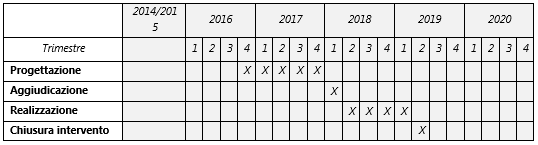

.. _h632f67723866f59102b965656a353f:

PA2.2.1.d - Piattaforma City Compass
####################################

+--------------------------+---------------------------------------------------------------------------------------------------------------------------------------------------------------------------------------------+
|Codice progetto           |PA2.2.1.d                                                                                                                                                                                    |
+--------------------------+---------------------------------------------------------------------------------------------------------------------------------------------------------------------------------------------+
|\ |STYLE0|\               |City Compass - Piattaforma di gestione e tracciamento in tempo reale flotta autobus e Sistema integrato a servizio del cittadino per la previsione di arrivo dei mezzi di trasporto pubblico.|
+--------------------------+---------------------------------------------------------------------------------------------------------------------------------------------------------------------------------------------+
|\ |STYLE1|\  (se presente)|                                                                                                                                                                                             |
+--------------------------+---------------------------------------------------------------------------------------------------------------------------------------------------------------------------------------------+
|\ |STYLE2|\               |A titolarità                                                                                                                                                                                 |
+--------------------------+---------------------------------------------------------------------------------------------------------------------------------------------------------------------------------------------+
|\ |STYLE3|\               |Acquisto e realizzazione di servizi                                                                                                                                                          |
+--------------------------+---------------------------------------------------------------------------------------------------------------------------------------------------------------------------------------------+
|\ |STYLE4|\               |Comune di Palermo, C.F.: 80016350821                                                                                                                                                         |
+--------------------------+---------------------------------------------------------------------------------------------------------------------------------------------------------------------------------------------+
|\ |STYLE5|\               |Ing. Roberto Biondo                                                                                                                                                                          |
+--------------------------+---------------------------------------------------------------------------------------------------------------------------------------------------------------------------------------------+
|                          |r.biondo@comune.palermo.it                                                                                                                                                                   |
+--------------------------+---------------------------------------------------------------------------------------------------------------------------------------------------------------------------------------------+
|\ |STYLE6|\               |Comune di Palermo                                                                                                                                                                            |
+--------------------------+---------------------------------------------------------------------------------------------------------------------------------------------------------------------------------------------+
|                          |pianotraffico@comune.palermo.it                                                                                                                                                              |
+--------------------------+---------------------------------------------------------------------------------------------------------------------------------------------------------------------------------------------+

.. _h122e634036157b7d235c25455a5918:

Descrizione del progetto
========================

Il progetto è basato su una piattaforma informativa che coniuga le tecnologie ICT/ITS (Information and Communications Technology ed Intelligent Transport System) con la mobilità cittadina relativa al trasporto pubblico.

Questo intervento si prefigge l’obiettivo di creare una piattaforma tecnologica, denominata “City Compass”, necessaria alla gestione e tracciamento della flotta bus del servizio di TPL cittadino. Tale piattaforma software oltre a gestire il sistema di tracciamento in real-time dei bus operanti per il servizio di TPL cittadino, si occuperà anche della gestione dei servizi di “infomobilità” in senso lato. Infatti tale piattaforma dovrà essere ingegnerizzata per storicizzare, analizzare e tradurre automaticamente i dati real-time provenienti dai bus del servizio di TPL, in informazioni per l’utenza, fruibili attraverso qualsiasi mezzo di comunicazione Azienda-Utente. Infatti, nelle previsioni progettuali saranno realizzati anche i servizi di “presentation”, attraverso i seguenti e differenti mezzi di comunicazione informativa:

* Portale WEB per l’esposizione del servizio di TPL in real-time;

* Portale WEB per la pianificazione degli spostamenti con i mezzi pubblici del TPL cittadino (Trip Planner);

* Gestione dei Pannelli Informativi e dei monitor presso HUB Strategici (progetto PA2.2.4.a);

* APP per smartphone per la pianificazione in real-time degli spostamenti;

* Servizio SMS per le previsioni di arrivo alle fermate del TPL;

* Generazione della messaggistica relativa alle variazioni di servizio, da integrare nei canali Social;

* Pubblicazione dei dati in real-time su piattaforma Open Data e sui maggiori Trip Planner;

* Piattaforma di Data Analytics per analizzare il servizio di TPL erogato;

* Servizi di fonia e messaggistica tra la Centrale Operativa e i Conducenti sul bus (progetto PA2.2.1.e AVM di bordo);

* Gestione dinamica della flotta.

Il sistema proposto consentirà, attraverso la successiva integrazione dei dati provenienti dal Sistema di Bigliettazione Elettronica, di affinare la matrice O/D degli spostamenti dell’utenza, la quale costituisce la base dati necessaria per una migliore programmazione dei servizi offerti agli utenti e degli interventi di ottimizzazione sulla rete di TPL cittadina.

La piattaforma di gestione e tracciamento in tempo reale della flotta autobus, consisterà di una centrale di controllo mediante la quale sarà possibile monitorare il servizio di trasporto pubblico al fine di intervenire tempestivamente per risolverne le eventuali criticità. Ciò in relazione all’obiettivo di adeguare l’offerta di trasporto pubblico ad elevati standard tecnologici. I mezzi saranno quindi dotati di sistemi di localizzazione (GPS) e di tecnologie per la comunicazione con la centrale di controllo e i livelli periferici (WI-FI di deposito, pannelli per l’infomobilità), in modo da consentire la piena integrazione all’interno dei sistemi ITS in coerenza con le indicazioni della Direttiva ITS Europea 2010/40/UE e del Piano d’Azione Nazionale sui Sistemi Intelligenti di Trasporto. Inoltre il PGTU del Comune di Palermo, prevede la realizzazione di un efficiente sistema di Telecontrollo della flotta veicolare del trasporto pubblico su gomma, di cui l’intervento risulta parte integrante. Quindi, al fine di provvedere allo scaricamento dei dati di esercizio e alle operazioni di aggiornamento e manutenzione dei sistemi di bordo, questi ultimi, che saranno acquisiti con il progetto PA2.2.1.e (AVM di Bordo), si interfacceranno con una rete Wi-Fi di deposito di imminente installazione.

Il sistema acquisirà e trasmetterà in tempo reale, tra l’altro, tutti i parametri e gli stati di esercizio del bus, al fine di meglio programmare gli interventi manutentivi, ordinari e straordinari, sulla flotta per ottimizzarne l’uso e la durata nel tempo.

Il progetto si propone quindi l’obiettivo di incentivare l’utenza all’utilizzo dei mezzi di trasporto pubblico attraverso il miglioramento degli standard di servizio, informazioni puntuali, sia alle paline informative che su App per smartphone, al fine di rendere più appetibile l’utilizzo del mezzo pubblico e limitare il traffico privato, contribuendo alla riduzione delle emissioni di CO2 e PM10.

A tal fine la piattaforma prevede un modulo di Data Analytics che analizza i dati del servizio di TPL erogato, al fine di fornire all’amministrazione gli strumenti più idonei all’efficientamento della rete di Trasporto Pubblico Locale.

L’adozione del sistema, previsto nel progetto City Compass, ha come principali ricadute l’immediatezza nell’approccio alla città e una maggiore certezza sui tempi e sulle modalità di spostamento da parte dei beneficiari del servizio.

Il target di riferimento del progetto è rappresentato dai cittadini residenti ma anche da soggetti non residenti che si recano in città per esigenze lavorative (pendolari) ovvero ricreative, culturali e commerciali (turisti, frequentatori di centri commerciali, ecc.).

Il progetto opera in sinergia con i seguenti altri progetti previsti nel PON METRO:

* \ |STYLE7|\ 

* \ |STYLE8|\ 

Al fine di realizzare una piattaforma perfettamente funzionale con tutti i requisiti, è prevista la progettazione congiunta tra gli interventi PA2.2.1.d, PA2.2.1.e e PA2.2.4.a. A tal fine si prevede di bandire un'unica gara la quale prevederà la rendicontazione separata in relazione ai tre progetti del PON METRO.

    Il progetto sarà inoltre integrato con le altre azioni che l’Amministrazione Comunale sta ponendo in essere per la creazione del “Big Data” cittadino, sui cui server la piattaforma sarà installata, in modo tale da agevolare l’interscambio di dati con la piattaforma, di futura progettazione, CIM (Centrale Integrata della Mobilità), nella quale confluiranno i dati relativi ai flussi di traffico, rilevazione accessi, rilevazione soste, e monitoraggio mezzi e rete stradale ecc.

    Questa piattaforma prevede, attraverso il progetto PA2.2.1.e (AVM di bordo), l’installazione a bordo di tutti i mezzi del servizio di TPL di un dispositivo AVM, in modo da monitorare l’intera rete di trasporto pubblico della città di Palermo, che ha una estensione in lunghezza delle direttrici viarie pari a Km 271,580.

L’attuazione del progetto contribuirà ad elevare i processi di razionalizzazione della mobilità cittadina, riducendo il traffico veicolare ed i tempi complessivi di spostamento, migliorando la vivibilità urbana.

Indicatori di stato

* N. annuo di utenti del servizio di trasporto pubblico

Indicatori di progetto

* N. di utilizzatori della piattaforma City Compass

* N. annuo di utenti del servizio di trasporto pubblico

Indicatori di risultato

* Riduzione complessiva dei tempi di spostamento

* Aumento degli accessi alla piattaforma

* Aumento degli utenti del servizio di trasporto pubblico

L’intervento si inserisce nell’ambito della programmazione Comunale in tema di mobilità sostenibile prevista dal PAES con l’azione 2.4 “Miglioramento ambientale della flotta per il trasporto pubblico e infrastrutture connesse” (pag. 114 e 115 del PAES Comune di Palermo Rev. Giugno 2013).

.. _h40575ce71476d3a3d4a6627c37193d:

Area territoriale di intervento
===============================

Comune capoluogo

.. _h7f345d487479715ef116e2e4834485b:

Risultato atteso - indicatori di output
=======================================

+-----------------+----------------------------------+-----------+
|Indicatore output|Descrizione indicatore output     |Target 2023|
+=================+==================================+===========+
|IO04             |Estensione in lunghezza           |271,58 km  |
|                 |                                  |           |
|                 |(direttrici viarie servite da ITS)|           |
+-----------------+----------------------------------+-----------+

.. _h271f768271872255d2f7d182d767d38:

Data inizio / fine 
===================

11/2016 - 06/2019

.. _h4268225104312295833593b4d173410:

Fonti di finanziamento
======================

+---------------------------+-------------+
|Risorse PON METRO          |\ |STYLE9|\  |
+---------------------------+-------------+
|\ |STYLE10|\  (se presenti)|\ |STYLE11|\ |
+---------------------------+-------------+
|\ |STYLE12|\  (se presenti)|\ |STYLE13|\ |
+---------------------------+-------------+
|\ |STYLE14|\               |\ |STYLE15|\ |
+---------------------------+-------------+

.. _h2c1d74277104e41780968148427e:

.. _h2c1d74277104e41780968148427e:

.. _h131c113c45802457634c7e701a6b5f59:

Cronoprogramma attività
=======================

.. _h761ab401543201137a78553757464:

\ |IMG1|\ ==========

.. _h2c1d74277104e41780968148427e:

.. _h2626a662a6b113685261702b40722c:

Cronoprogramma finanziario
==========================

+-------------+--------------+
|\ |STYLE16|\ |€ 0,00        |
+-------------+--------------+
|\ |STYLE17|\ |€ 0,00        |
+-------------+--------------+
|\ |STYLE18|\ |€ 0,00        |
+-------------+--------------+
|\ |STYLE19|\ |€ 0,00        |
+-------------+--------------+
|\ |STYLE20|\ |€ 1.342.000,00|
+-------------+--------------+
|\ |STYLE21|\ |€ 0,00        |
+-------------+--------------+
|\ |STYLE22|\ |\ |STYLE23|\  |
+-------------+--------------+

.. bottom of content

.. |STYLE0| replace:: **Titolo progetto**

.. |STYLE1| replace:: **CUP**

.. |STYLE2| replace:: **Modalità di attuazione**

.. |STYLE3| replace:: **Tipologia di operazione**

.. |STYLE4| replace:: **Beneficiario**

.. |STYLE5| replace:: **Responsabile Unico del Procedimento**

.. |STYLE6| replace:: **Soggetto attuatore**

.. |STYLE7| replace:: **PA2.2.1.e Realizzazione infrastruttura di bordo per il tracciamento in tempo reale della flotta bus (AVM di bordo) e sensoristica ambientale IoT a bordo dei mezzi;**

.. |STYLE8| replace:: **PA2.2.4.a Acquisto pannelli per l’informazione dinamica sul TPL, disposti in hub strategici.**

.. |STYLE9| replace:: *€ 1.342.000,00*

.. |STYLE10| replace:: **Altre risorse pubbliche**

.. |STYLE11| replace:: *€ 0,00*

.. |STYLE12| replace:: **Risorse private**

.. |STYLE13| replace:: *€ 0,00*

.. |STYLE14| replace:: **Costo totale**

.. |STYLE15| replace:: *€ 1.342.000,00*

.. |STYLE16| replace:: *2014/2015*

.. |STYLE17| replace:: *2016*

.. |STYLE18| replace:: *2017*

.. |STYLE19| replace:: *2018*

.. |STYLE20| replace:: *2019*

.. |STYLE21| replace:: *2020*

.. |STYLE22| replace:: **Totale**

.. |STYLE23| replace:: **€ 1.342.000,00**

