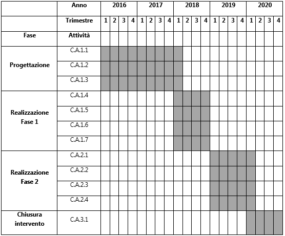

.. _h6e3170234765146f73d732c42354e47:

PA1.1.1.c – Piattaforma ICT “Cultura e Tempo Libero
###################################################

+--------------------------+----------------------------------------------------+
|Codice progetto           |\ |STYLE0|\                                         |
+--------------------------+----------------------------------------------------+
|\ |STYLE1|\               |\ |STYLE2|\                                         |
+--------------------------+----------------------------------------------------+
|\ |STYLE3|\  (se presente)|D71H17000030007                                     |
+--------------------------+----------------------------------------------------+
|\ |STYLE4|\               |\ |STYLE5|\                                         |
+--------------------------+----------------------------------------------------+
|\ |STYLE6|\               |\ |STYLE7|\                                         |
+--------------------------+----------------------------------------------------+
|\ |STYLE8|\               |Comune di Palermo – C.F. 80016350821                |
+--------------------------+----------------------------------------------------+
|\ |STYLE9|\               |Dott.ssa Vincenza Simonte (Comune di Palermo)       |
+--------------------------+----------------------------------------------------+
|                          |v.simonte@comune.palermo.it, +39 091 7406342/43     |
+--------------------------+----------------------------------------------------+
|\ |STYLE10|\              |SISPI - Sistema Palermo Informatica (“in house”)    |
+--------------------------+----------------------------------------------------+
|                          |Salvatore Morreale, s.morreale@sispi.it, 091.6319811|
+--------------------------+----------------------------------------------------+

.. _h122e634036157b7d235c25455a5918:

Descrizione del progetto
************************

.. _h6e6359221a5a3c7d4e35346c6c471978:

Obiettivi e ricadute del progetto
=================================

Gli \ |STYLE11|\  che la Piattaforma “\ |STYLE12|\ ” si prefigge di raggiungere sono molteplici e strettamente correlati gli uni agli altri, di seguito indicati sinteticamente:

* \ |STYLE13|\ , strettamente collegato al Portale della Conoscenza descritto di seguito, che possa diventare un punto di riferimento e di normalizzazione per diversi ambiti quali: il patrimonio artistico e monumentale, il patrimonio naturalistico e ambientale, le tradizioni e i prodotti eno-gastronomici, le tradizioni culturali, la cultura in genere, le strutture ricettive e di ristoro, gli eventi culturali e ricreativi;

* \ |STYLE14|\ , all’interno del Portale del Territorio, specificamente rivolti a diversi attori:

        o	i cittadini, per consentire loro di fruire appieno del territorio, delle risorse culturali di cui dispone e degli eventi ricreativi che propone;

        o	i turisti, per potere fruire appieno delle ricchezze e delle bellezze del territorio attraverso la possibilità di disegnare percorsi ad hoc o utilizzare percorsi standard che consentano loro di maturare un’esperienza completa di quanto offerto;

        o	le Pubbliche Amministrazioni, per coordinare e valorizzare appieno i tanti asset culturali che amministrano;

        o	le aziende, per valorizzare appieno la propria offerta in termini di prodotti, con un approccio di sistema che si aggiunge a quello affidato alla libera iniziativa di ciascuno di essi;

* \ |STYLE15|\ . Si tratta de:

        o	le politiche volte a definire le linee guida per la predisposizione dei contenuti sia per quanto attiene la loro strutturazione logica sia per quanto attiene la struttura dei metadati associati;

        o	la disponibilità di strumenti editoriali standard, pronti all’uso;

* \ |STYLE16|\  rivolti sia agli organizzatori sia ai potenziali fruitori, \ |STYLE17|\ , che consenta ai singoli promotori delle iniziative di disporre di uno strumento di comunicazione in grado di raggiungere in modo unitario i diversi destinatari;

* \ |STYLE18|\  riguardanti:

        o	orari e modalità di accesso a teatri, monumenti, strutture sportive, biblioteche, etc.;

        o	condivisione dell’accesso al patrimonio librario dell’intera area metropolitana attraverso la realizzazione di un portale unico di prenotazione e di consultazione in grado di mettere a sistema non solo le strutture comunali ma anche quelle scolastiche e universitarie;

* \ |STYLE19|\ , in grado non solo di proporre agli utenti servizi tradizionali (trasporto, vitto, alloggio, cultura e itinerario) ma anche di valorizzare i prodotti del territorio diventando un vero e proprio portale di marketing territoriale.

    Il Portale, fortemente orientato ai cittadini (residenti e/o turisti) con la finalità prevalente di consentire loro di potere conoscere e fruire dei servizi culturali e legati al tempo libero offerti dal territorio, si inquadra in un contesto più ampio rispetto al quale i servizi di prenotazione e pagamento vengono sviluppati trasversalmente rispetto a tutte le piattaforme verticali dal’Asse I per costituire un’unica piattaforma integrata di erogazione di servizi.

Le \ |STYLE20|\  attese della Piattaforma sul territorio sono molteplici e schematicamente riassumibili nei seguenti punti:

* mettere in vetrina le ricchezze culturali, artistiche e monumentali del territorio;

* narrarne la storia, le tradizioni, gli elementi di valore;

* renderle fruibili da parte dei cittadini e dei turisti;

* sviluppare le attività ricreative promosse dal territorio.

.. _h5b383b4c5047625c7f4257e7d4d123d:

Beneficiari
===========

I beneficiari della presente piattaforma sono molteplici:

* \ |STYLE21|\ , che potranno disporre di un punto di riferimento unitario per tutto ciò che concerne la conoscenza della storia, della cultura, dei prodotti e degli eventi, culturali e ricreativi, promossi nel territorio;

* \ |STYLE22|\ , che potranno avvantaggiarsi di uno strumento per la valorizzazione del territorio e per la conoscenza e il coordinamento delle attività culturali e ricreative attive sul territorio;

* \ |STYLE23|\ , che disporranno di uno strumento che consenta loro di muoversi in modo completo all’interno del territorio e di fruire delle attrazioni e dei prodotti che esso offre;

* \ |STYLE24|\ , che potranno disporre, oltre ai propri strumenti di comunicazione, di uno strumento unitario che consenta loro di avvantaggiarsi dalla valorizzazione della loro offerta inserita all’interno di un contesto di sistema completo e unitario.

.. _h637d2d14366527a111435544b537a18:

Coerenza con la programmazione nazionale/regionale e con gli strumenti di pianificazione previsti per il livello comunale
=========================================================================================================================

\ |STYLE25|\  sono presenti molteplici elementi di sinergia con il PON Governance, il PON Cultura e Sviluppo FESR e con l’Agenda Digitale del FESR.

\ |STYLE26|\  è presente una forte sinergia con gli interventi previsti dal PO FESR Regionale e, in particolare, con quanto previsto dagli Assi 2 (Agenda Digitale) e 6 (Tutelare l’Ambiente e Promuovere l’uso efficiente delle Risorse), in particolare con le azioni “Servizi per la conoscenza e la fruizione delle risorse culturali/naturali”, dell’Agenda Urbana Regionale.

\ |STYLE27|\  la presente proposta presenta molteplici elementi di sinergia con quanto previsto dal progetto “\ |STYLE28|\ ” di cui alla delibera di Giunta Municipale n. 56 del 05/04/2016.

.. _h112b357f132f3b762c72584697933:

Coerenza con il Programma, i criteri di selezione degli interventi e la strategia d’Asse
========================================================================================

\ |STYLE29|\  la Piattaforma ICT “\ |STYLE30|\ ” è coerente con quanto previsto dal Programma Operativo che sostiene la realizzazione di interventi della Agenda Digitale attraverso l’acquisizione e messa in esercizio di sistemi tecnologici e gestionali nell’Area Tematica di Cultura e Tempo Libero.

\ |STYLE31|\  la Piattaforma risponde ai criteri di selezione previsti dal programma in quanto prevede lo sviluppo e il rinnovamento di servizi digitali turistici e culturali dedicati ai residenti e ai turisti.

\ |STYLE32|\  dal punto di vista strategico, la Piattaforma prevede la digitalizzazione di procedure e applicazioni per la fruizione del patrimonio artistico e culturale da parte dei cittadini residenti e dei turisti e lo sviluppo di servizi integrati per il tempo libero.

.. _h643e4c470556f2a11587657e23160:

Collegamento e sinergia con altre azioni del PON Metro (azioni integrate)
=========================================================================

I collegamenti e le sinergie con altre azioni del PON Metro sono molteplici, anche in ragione dell’approccio sistemico adottato nell’implementazione dalla più complessiva piattaforma di Agenda Digitale del PON Metro Palermo.

Per quanto attiene nello specifico la Piattaforma ICT “\ |STYLE33|\ ”, notevoli sono le sinergie con le Piattaforme “\ |STYLE34|\ ” e “\ |STYLE35|\ ” dovute non solo alla condivisione delle componenti tecnologiche abilitanti le singole piattaforme (strato di \ |STYLE36|\ , piattaforma di gestione documentale, piattaforma \ |STYLE37|\ , \ |STYLE38|\ , piattaforma di \ |STYLE39|\ , piattaforma di georeferenziazione, etc.) ma anche ad uno stretto coordinamento dei formati e modelli dei dati gestiti dalle singole piattaforme al fine di supportare una “naturale” interoperabilità tra le piattaforme.

.. _h165fd805c1c30506f6e24534074f9:

Descrizione dei contenuti progettuali
=====================================

La Piattaforma ICT “\ |STYLE40|\ ” si inserisce nel novero dei portali a supporto dello sviluppo del territorio. Essa intercetta non solo i temi della Cultura e del Tempo Libero ma anche quello del Turismo, ambendo a realizzare un vero e proprio strumento di marketing territoriale oltre che di servizio per una fruizione ottimale delle risorse del territorio.

La sua realizzazione si fonda su diversi elementi funzionali, il più importante dei quali consiste in una piattaforma evoluta di gestione documentale sulla quale poggiare il Portale del Territorio. La piattaforma dovrà, in particolare, gestire una mole consistente di dati e documenti attinenti una molteplicità di sorgenti di diverse tipologie tra le quali:

* \ |STYLE41|\ , con diversi livelli di approfondimento, gestibili in modo dinamico e profilato su specifiche tipologie di utenti, \ |STYLE42|\ ;

* \ |STYLE43|\ , integrando di fatto le informazioni presenti su piattaforme quali TripAdvisor o Booking.com con informazioni più circostanziate quali:

    * nel caso dei ristoranti, il dettaglio dei menu, inclusivo del prezzo, nonché un riferimento ai piatti proposti, agli elementi di tracciabilità e di assicurazione della qualità degli alimenti nonché delle relative tradizioni;

    * nel caso delle strutture ricettive, i riferimenti incrociati con luoghi di interesse, anche con la possibilità di creare itinerari personalizzati geo-circostanziati;

    * nel caso dei prodotti alimentari, i riferimenti alle loro proprietà nutraceutiche, alle modalità di consumo, alle possibilità di reperirli sul territorio;

* \ |STYLE44|\  gestibili in modo dinamico dai promotori e dagli utenti, analogamente a quanto realizzato con la Piattaforma “Expo-in-Città”.

Grande rilievo verrà riservato agli elementi di geolocalizzazione dei contenuti, dei servizi e degli eventi culturali, che consentano elevati livelli di interazione con l’utente tanto da garantirgli di selezionare i contenuti desiderati anche in ragione della localizzazione geografica e temporale degli stessi.

Nell’ambito del PON Metro Palermo si prevede di realizzare gli elementi di servizio della Piattaforma “\ |STYLE45|\ ” che le consentano di assolvere alla funzione di \ |STYLE46|\ , a servizio di una strategia complessiva di marketing territoriale che solo un approccio di sistema è in grado di garantire. Per l’alimentazione della Piattaforma verranno prodotti alcuni contenuti che aiuteranno ad impostare la struttura logica della Piattaforma sebbene l’alimentazione vera e propria della Piattaforma stessa sarà demandata agli Enti Locali, ai cittadini, alle imprese e all’Università di Palermo, rappresentando comunque una parte integrante della Piattaforma più trasversale “Portale della Conoscenza”.

Un ruolo particolarmente rilevante sarà assolto dagli strumenti con i quali sarà possibile interagire con la Piattaforma, in primis i \ |STYLE47|\  mobili. Per questi verranno sviluppate delle \ |STYLE48|\  ad hoc che consentano un’esperienza di navigazione dei contenuti e di interazione con la piattaforma ottimale. Particolare attenzione verrà quindi posta allo sviluppo di interfacce responsive che consentano una fruibilità ampia e trasversale alle soluzioni sviluppate.

.. _h433ac47c5d441b546c7b551f24b2d:

Articolazione temporale delle attività progettuali
==================================================

Lo sviluppo temporale della Piattaforma ICT “\ |STYLE49|\ ”, analogamente a quanto previsto per altre Piattaforme, si articola in due Fasi. Ciò è reso necessario dalla molteplicità di piattaforme tecnologiche coinvolte nella realizzazione della Piattaforma in questione combinata con la complessità e con l’elevato livello di innovatività delle stesse che comporta la difficoltà di reperire sul mercato prodotti chiavi-in-mano pronti a soddisfare i requisiti progettuali richiesti.

* \ |STYLE50|\  questa prima fase è dedicata allo studio e implementazione di una prima soluzione prototipale del Portale del Territorio con specifico riferimento alle sue diverse componenti attinenti alla valorizzazione del patrimonio culturale e artistico, al censimento e valorizzazione delle strutture ricettive e di ristoro e degli eventi culturali e ricreativi. Tale Fase è previsto che duri fino al 31/12/2018;

* \ |STYLE51|\  dopo avere implementato la soluzione prototipale di piattaforma, si procederà alla messa in esercizio della piattaforma definitiva, attivandone altresì l’alimentazione nonché la fruizione per il tramite di un portale Web nonché di una pluralità di \ |STYLE52|\  specificamente disegnate per consentire una navigazione ottimale dei contenuti. Tale Fase prenderà avvio il 01/01/2019 per terminare il 31/12/2020.

.. _h2a27307412b1b6951405f6d2b1fb6e:

Sostenibilità economica e gestionale e governance del progetto
==============================================================

La \ |STYLE53|\  della Piattaforma ICT “\ |STYLE54|\ ”, analogamente a quanto accade con le altre Piattaforme, è garantita da una strategia articolata, basata sulla modularità e sul livello dei servizi erogati. In particolare:

* i costi di sviluppo della Piattaforma e dei servizi base sono interamente coperti dalle risorse del presente progetto;

* l’erogazione dei servizi base, quelli cioè prevalentemente attinenti alla componente informativa del Portale del Territorio, terminato il progetto e quindi a partire dal 2011, saranno erogati dalla società \ |STYLE55|\  Sispi previa copertura dei costi vivi di gestione in esercizio dei servizi stessi;

* lo sviluppo e l’erogazione di nuovi servizi (sviluppo di un portale di marketing e/o di booking, profilatura degli utenti e loro analisi, erogazione di servizi in Alta Affidabilità, etc.) sarà governata dalla stipula di appositi accordi onerosi negoziati dai singoli committenti con la società \ |STYLE56|\  Sispi del Comune di Palermo cui è affidato lo sviluppo e la gestione in esercizio della piattaforma e dei servizi dalla stessa erogati.

I \ |STYLE57|\  per il Comune di Palermo e per i Comuni di area metropolitana associati all’adozione della presente Piattaforma, saranno considerevolmente inferiori rispetto a quelli medi di mercato dal momento che le componenti architetturali sulle quali si fonda la Piattaforma stessa sono parte di un ecosistema che consente di ottimizzare l’impiego delle risorse, riducendone altresì il costo. L’alta \ |STYLE58|\  della Piattaforma, consentita dall’adozione diffusa di tecnologia \ |STYLE59|\ , dallo sviluppo di applicativi \ |STYLE60|\ -ready e dalla condivisione delle componenti infrastrutturali con le altre Piattaforme di progetto, è garanzia di riduzione dei costi di gestione e di esercizio all’aumentare del numero di Amministrazioni che intenderanno avvalersi del servizio.

La \ |STYLE61|\  della Piattaforma sarà garantita dalla società \ |STYLE62|\  Sispi del Comune di Palermo la quale gestirà la Piattaforma inserendola in modo organico, sin dalla sua progettazione e sviluppo, all’interno del parco applicativo dalla stessa gestito.

La \ |STYLE63|\  sarà gestita dall’Autorità Urbana del Comune di Palermo, di concerto con la società \ |STYLE64|\  Sispi e con i diversi Comuni di area metropolitana coinvolti nel progetto stesso, sentite le aziende del territorio e le rispettive associazioni di categoria in una logica di compartecipazione volta ad ottimizzare i risultati e a soddisfare un ventaglio quanto più possibile ampio di esigenze.

.. _h504b405a2d6c6a2a924465c1d696631:

Elementi tecnologici
====================

La Piattaforma ICT “\ |STYLE65|\ ” poggia su diversi componenti tecnologici, alcuni dei quali in comune con le altre Piattaforme di progetto. Di seguito si riportano i riferimenti ai principali elementi tecnologici impiegati e utilizzati dalla presente Piattaforma:

* \ |STYLE66|\  si tratta della piattaforma computazionale di base, in grado non solo di fornire il supporto computazionale alla Piattaforma ma anche di renderla scalabile in termini di risorse disponibili e abilitare la replicabilità della stessa, in modo personalizzato, ai Comuni di area metropolitana coinvolti nel progetto. Sulla piattaforma di \ |STYLE67|\  insistono buona parte delle componenti middleware utilizzate e di seguito descritte. Condivisa con altre Piattaforme di progetto;

* \ |STYLE68|\  fornisce gli strumenti per la georeferenziazione delle informazioni e la geolocalizzazione di eventi, oggetti e individui. Condivisa con altre Piattaforme di progetto;

* \ |STYLE69|\  fornisce il supporto alla gestione dei documenti e delle informazioni, anche a supporto del Portale della Conoscenza, alimentante un sistema di Open, Linked e \ |STYLE70|\  in grado di essere navigato e valorizzato secondo diverse dimensioni di analisi. Tale piattaforma garantirà sia il caricamento e la fruizione di nuovi contenuti, sia la valorizzazione dei contenuti presenti nei repository documentali in possesso delle realtà locali coinvolte (Comune di Palermo, Comuni di Cintura, Assessorato Regionale al Turismo, enti territoriali preposti alla valorizzazione delle attività culturali, etc.). Condivisa con altre Piattaforme di progetto;

* \ |STYLE71|\  la Piattaforma \ |STYLE72|\  (\ |STYLE73|\ ) ricopre un ruolo cruciale nell’analisi delle abitudini, dei feedback e delle esigenze degli utenti della piattaforma, finalizzata alla valorizzazione della \ |STYLE74|\  manifestata dagli utenti stessi e all’ottimale soddisfacimento delle loro esigenze che, in questo caso più che mai, coincidono con la valorizzazione del territorio. Condivisa con altre Piattaforme di progetto;

* \ |STYLE75|\  rappresenta l’elemento collante, di interoperabilità tra le diverse Piattaforme infrastrutturali, in grado altresì di standardizzare i dati per una loro esposizione ad altre applicazioni e piattaforme tematiche. Tale piattaforma supporterà, tra gli altri, il disaccoppiamento del livello di accesso ai dati/applicazioni dai front-end applicativi. Condivisa con altre Piattaforme di progetto.

Sarà sviluppato un sistema articolato di Web Applications basate sul modello SOA e di \ |STYLE76|\  disponibili per le principali piattaforme (iOS, Android, Windows) per consentire agli utenti (privati cittadini, istituzioni, aziende) di fruire delle informazioni presenti sulla piattaforma e di interagire con essa anche in termini attivi di produzione e caricamento delle informazioni e degli eventi. I servizi saranno fruibili online tramite interfacce basate su grafica personalizzabile tramite CSS, erogabili anche tramite \ |STYLE77|\ .

L’adozione nativa del paradigma del \ |STYLE78|\  nonché l’utilizzo di componenti middleware condivisi con le altre Piattaforme, garantisce una naturale \ |STYLE79|\  in termini sia di front-office sia di \ |STYLE80|\ . Per quanto concerne le funzionalità di \ |STYLE81|\ , queste potranno essere raggruppate in due categorie:

* quelle di basso livello, legate alla gestione delle funzionalità di base degli applicativi e delle componenti infrastrutturali, in capo alla società \ |STYLE82|\  Sispi del Comune di Palermo che se ne farà garante per l’intera Piattaforma e per tutti gli utenti;

* quelle di alto livello, legate alla personalizzazione dei servizi da parte delle singole Amministrazioni/utenti, in capo ai singoli presidii delle rispettive Amministrazioni/utenti.

Relativamente al \ |STYLE83|\ , si prevede che il servizio sarà aperto e disponibile agli operatori istituzionali, privati e al territorio di almeno 7 Comuni entro il 31/12/2019 ed esteso alla fruizione da parte dei cittadini di almeno 42 Comuni e ai turisti entro il 31/12/2020.

Relativamente agli \ |STYLE84|\ , si prevede che il servizio sarà aperto e disponibile agli operatori istituzionali, privati e al territorio di almeno 4 Comuni entro il 31/12/2019 ed esteso alla fruizione da parte dei cittadini di almeno 42 Comuni e ai turisti entro il 31/12/2020.

Relativamente al \ |STYLE85|\ , si prevede che il servizio sarà aperto e disponibile agli operatori istituzionali, privati e al territorio di almeno 4 Comuni entro il 31/12/2019 ed esteso alla fruizione da parte dei cittadini di almeno 42 Comuni e ai turisti entro il 31/12/2020.

.. _h40575ce71476d3a3d4a6627c37193d:

Area territoriale di intervento
===============================

L’ambito territoriale di intervento della Piattaforma ICT “\ |STYLE86|\ ” è rappresentato, in primo luogo, dal Comune di Palermo nonché dai Comuni di area metropolitana coinvolti nel progetto. Considerata la natura dei servizi sviluppati, sintetizzabile nella messa a punto di un Portale del Territorio, nonché la modalità di erogazione dei servizi in \ |STYLE87|\  (in grado pertanto di garantire un’ampia scalabilità dei servizi erogati), è possibile immaginare l’estensione della Piattaforma ad un ambito territoriale molto più vasto, potendo pensare di candidarla a diventare il Portale del Territorio per l’intera Regione Sicilia.

.. _h6a4330416f555f6b102d6e6d75573c16:

Risultato atteso - Indicatori di Output
=======================================

+-----------------------------+-----------------------------+-----------+-----------+
|Descrizione indicatore output|Descrizione indicatore output|Target 2018|Target 2023|
+=============================+=============================+===========+===========+
|IO01                         |Numero di                    |1          |7          |
|                             |                             |           |           |
|                             |comuni associati             |           |           |
|                             |                             |           |           |
|                             |a sistemi                    |           |           |
|                             |                             |           |           |
|                             |informativi                  |           |           |
|                             |                             |           |           |
|                             |integrati                    |           |           |
+-----------------------------+-----------------------------+-----------+-----------+

\ |STYLE88|\  

.. _h4268225104312295833593b4d173410:

Fonti di finanziamento
======================

+---------------------------+-------------+
|Risorse PON METRO          |\ |STYLE89|\ |
+---------------------------+-------------+
|\ |STYLE90|\  (se presenti)|\ |STYLE91|\ |
+---------------------------+-------------+
|\ |STYLE92|\  (se presenti)|\ |STYLE93|\ |
+---------------------------+-------------+
|\ |STYLE94|\               |\ |STYLE95|\ |
+---------------------------+-------------+

.. _h131c113c45802457634c7e701a6b5f59:

Cronoprogramma attività
=======================

\ |IMG1|\ 

.. _h2626a662a6b113685261702b40722c:

Cronoprogramma finanziario
==========================

+--------------+--------------+
|\ |STYLE96|\  |€ 0,00        |
+--------------+--------------+
|\ |STYLE97|\  |€ 0,00        |
+--------------+--------------+
|\ |STYLE98|\  |€ 0,00        |
+--------------+--------------+
|\ |STYLE99|\  |€ 427.142,00  |
+--------------+--------------+
|\ |STYLE100|\ | € 241.071,00 |
+--------------+--------------+
|\ |STYLE101|\ |€ 621.787,00  |
+--------------+--------------+
|\ |STYLE102|\ |\ |STYLE103|\ |
+--------------+--------------+

.. bottom of content

.. |STYLE0| replace:: *PA1.1.1.c*

.. |STYLE1| replace:: **Titolo progetto**

.. |STYLE2| replace:: *Piattaforma ICT “Cultura e Tempo Libero”*

.. |STYLE3| replace:: **CUP**

.. |STYLE4| replace:: **Modalità di attuazione**

.. |STYLE5| replace:: *A titolarità*

.. |STYLE6| replace:: **Tipologia di operazione**

.. |STYLE7| replace:: *Acquisto e realizzazione di servizi*

.. |STYLE8| replace:: **Beneficiario**

.. |STYLE9| replace:: **Responsabile Unico del Procedimento**

.. |STYLE10| replace:: **Soggetto attuatore**

.. |STYLE11| replace:: **obiettivi**

.. |STYLE12| replace:: *Cultura e Tempo Libero*

.. |STYLE13| replace:: **realizzazione di un Portale del Territorio**

.. |STYLE14| replace:: **implementazione di strumenti di navigazione**

.. |STYLE15| replace:: **implementazione delle politiche e degli strumenti a supporto della produzione e della valorizzazione dei contenuti**

.. |STYLE16| replace:: **realizzazione di strumenti di “socializzazione” di eventi e iniziative culturali e di svago,**

.. |STYLE17| replace:: **in stile “Expo-in-Città”**

.. |STYLE18| replace:: **messa a sistema delle risorse culturali**

.. |STYLE19| replace:: **realizzazione di un sistema di prenotazione e pagamento dei servizi turistici**

.. |STYLE20| replace:: **ricadute**

.. |STYLE21| replace:: **i cittadini dell’area metropolitana**

.. |STYLE22| replace:: **le Amministrazioni Locali**

.. |STYLE23| replace:: **i turisti**

.. |STYLE24| replace:: **le aziende**

.. |STYLE25| replace:: **Programmazione Nazionale:**

.. |STYLE26| replace:: **Programmazione Regionale:**

.. |STYLE27| replace:: **Pianificazione Comunale:**

.. |STYLE28| replace:: *Verso Palermo Città Metropolitana – Piano Sociale, prospettive di sviluppo sociale, economico e culturale della città e del suo territorio*

.. |STYLE29| replace:: **Coerenza con il Programma:**

.. |STYLE30| replace:: *Cultura e Tempo Libero*

.. |STYLE31| replace:: **Criteri di selezione:**

.. |STYLE32| replace:: **Strategia di Asse:**

.. |STYLE33| replace:: *Cultura e Tempo Libero*

.. |STYLE34| replace:: *Lavoro e Formazione*

.. |STYLE35| replace:: *Ambiente e Territorio*

.. |STYLE36| replace:: *Cloud Computing*

.. |STYLE37| replace:: *CRM*

.. |STYLE38| replace:: *DataWareHouse*

.. |STYLE39| replace:: *Data Analytics*

.. |STYLE40| replace:: *Cultura e Tempo Libero*

.. |STYLE41| replace:: **informazioni**

.. |STYLE42| replace:: **relative al patrimonio artistico e monumentale, al patrimonio naturalistico e ambientale, alle tradizioni e ai prodotti eno-gastronomici**

.. |STYLE43| replace:: **informazioni sulle strutture ricettive e di ristoro**

.. |STYLE44| replace:: **informazioni sugli eventi culturali e ricreativi**

.. |STYLE45| replace:: *Cultura e Tempo Libero*

.. |STYLE46| replace:: **Portale del Territorio**

.. |STYLE47| replace:: *device*

.. |STYLE48| replace:: *app*

.. |STYLE49| replace:: *Cultura e Tempo Libero*

.. |STYLE50| replace:: **Fase 1 – realizzazione di un’infrastruttura iniziale e rilascio dei primi servizi:**

.. |STYLE51| replace:: **Fase 2 – implementazione della Piattaforma completa:**

.. |STYLE52| replace:: *Mobile Apps*

.. |STYLE53| replace:: **sostenibilità economica**

.. |STYLE54| replace:: *Cultura e Tempo Libero*

.. |STYLE55| replace:: *in-house*

.. |STYLE56| replace:: *in-house*

.. |STYLE57| replace:: **costi marginali**

.. |STYLE58| replace:: **scalabilità**

.. |STYLE59| replace:: *Cloud*

.. |STYLE60| replace:: *Cloud*

.. |STYLE61| replace:: **sostenibilità gestionale**

.. |STYLE62| replace:: *in-house*

.. |STYLE63| replace:: **governance del progetto**

.. |STYLE64| replace:: *in-house*

.. |STYLE65| replace:: *Cultura e Tempo Libero*

.. |STYLE66| replace:: **Infrastruttura computazionale di Cloud Computing:**

.. |STYLE67| replace:: *Cloud Computing*

.. |STYLE68| replace:: **Piattaforma di Georeferenziazione:**

.. |STYLE69| replace:: **Piattaforma di Gestione Documentale:**

.. |STYLE70| replace:: *Big Data*

.. |STYLE71| replace:: **Piattaforma CRM:**

.. |STYLE72| replace:: *CRM*

.. |STYLE73| replace:: *Customer Relashionship Management*

.. |STYLE74| replace:: *user experience*

.. |STYLE75| replace:: **Piattaforma ESB:**

.. |STYLE76| replace:: *Mobile Apps*

.. |STYLE77| replace:: *widget*

.. |STYLE78| replace:: *Cloud Computing*

.. |STYLE79| replace:: **scalabilità del servizio**

.. |STYLE80| replace:: *back-office*

.. |STYLE81| replace:: *back-office*

.. |STYLE82| replace:: *in-house*

.. |STYLE83| replace:: **Portale del Territorio**

.. |STYLE84| replace:: **Strumenti di Socializzazione**

.. |STYLE85| replace:: **Sistema di Prenotazione dei Servizi Turistici**

.. |STYLE86| replace:: *Cultura e Tempo Libero*

.. |STYLE87| replace:: *Cloud*

.. |STYLE88| replace:: *\*Nota: la previsione/tabella precedente è redatta in modo tale che un Comune federato a più piattaforme venga contato una sola volta.*

.. |STYLE89| replace:: *€ 1.290.000,00*

.. |STYLE90| replace:: **Altre risorse pubbliche**

.. |STYLE91| replace:: *€ 0,00*

.. |STYLE92| replace:: **Risorse private**

.. |STYLE93| replace:: *€ 0,00*

.. |STYLE94| replace:: **Costo totale**

.. |STYLE95| replace:: *€ 1.290.000,00*

.. |STYLE96| replace:: *2014/2015*

.. |STYLE97| replace:: *2016*

.. |STYLE98| replace:: *2017*

.. |STYLE99| replace:: *2018*

.. |STYLE100| replace:: *2019*

.. |STYLE101| replace:: *2020*

.. |STYLE102| replace:: **Totale**

.. |STYLE103| replace:: **€ 1.290.000,00**

