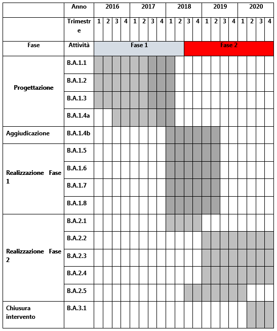

.. _h5c93943e3a8044643717611e262144:

PA1.1.1.b – Piattaforma ICT “Edilizia e Catasto”
################################################

+---------------+--------------------------------------------------------+
|Codice progetto|\ |STYLE0|\                                             |
+---------------+--------------------------------------------------------+
|\ |STYLE1|\    |\ |STYLE2|\                                             |
+---------------+--------------------------------------------------------+
|\ |STYLE3|\    |D71H17000020007                                         |
+---------------+--------------------------------------------------------+
|\ |STYLE4|\    |\ |STYLE6|\                                             |
|               |                                                        |
|\ |STYLE5|\    |                                                        |
+---------------+--------------------------------------------------------+
|\ |STYLE7|\    |\ |STYLE8|\                                             |
+---------------+--------------------------------------------------------+
|\ |STYLE9|\    |Comune di Palermo – C.F. 80016350821                    |
+---------------+--------------------------------------------------------+
|\ |STYLE10|\   |Dott. Giuseppe Meli (Comune di Palermo)                 |
|               |                                                        |
|\ |STYLE11|\   |g.meli@comune.palermo.it, +091.7407640                  |
+---------------+--------------------------------------------------------+
|               |                                                        |
+---------------+--------------------------------------------------------+
|\ |STYLE12|\   |SISPI - Sistema Palermo Informatica (“in house”)        |
|               |                                                        |
|               |Salvatore Morreale, s.morreale@sispi.it, +39 091 6319811|
+---------------+--------------------------------------------------------+
|               |                                                        |
+---------------+--------------------------------------------------------+

.. _h122e634036157b7d235c25455a5918:

Descrizione del progetto
************************

.. _h6e6359221a5a3c7d4e35346c6c471978:

Obiettivi e ricadute del progetto
=================================

La Piattaforma “\ |STYLE13|\ ” ha l’obiettivo di razionalizzare e armonizzare la filiera dei servizi di natura territoriale all’interno di una visione omogenea e unitaria del ciclo di vita Edilizio-Urbanistico. Tale obiettivo generale può essere declinato più concretamente attraverso il riferimento ai diversi punti di vista (attori) che, intrecciandosi, concorrono alla realizzazione della trasformazione del territorio.

Il progetto si articola in un percorso basato su:

*  un insieme di innovazioni organizzative e informatiche potenzialmente riusabili “ovunque” (e quindi fortemente standardizzate) nei settori Catasto/Urbanistica/Edilizia;

* il rafforzamento dei principi di interoperabilità applicativa e di correlazione tra le informazioni, in un’ottica di cooperazione tra gli Enti;

* l’integrazione dei servizi di \ |STYLE14|\  (processi e banche dati) con i servizi di front-office;

* la disponibilità di servizi telematici a favore di cittadini, professionisti e imprese.

In particolare, la Piattaforma consiste nella realizzazione di un portale caratterizzato dai seguenti ambiti di servizio: accesso, consultazione, correlazione e interoperabilità tra banche dati, interazione e procedimenti on-line, fruizione e pubblicazione secondo il paradigma degli ‘open-data’.

Dal punto di vista dell’architettura logica la piattaforma comprende:

\ |STYLE15|\ , con i quali definire e rendere disponibili “\ |STYLE16|\ ” informativi integrati basati sulla correlazione delle diverse fonti di informazione disponibili all’interno della stessa amministrazione ●        comunale o provenienti da fonti informative esterne grazie, soprattutto, alla molteplicità di servizi offerti ormai dalle pubbliche amministrazioni centrali, dal SITR oltreché dalle agenzie nazionali. Il modello di interoperabilità del quale la piattaforma sarà dotata sarà convergente rispetto alle diverse strutture formali attraverso le quali è possibile utilizzare le informazioni: dati strutturati (geoservizi WMS, WCS e WMF per i dati geografici secondo lo standard dell’Open Geospatial Consortium OGC), metadati e dati non strutturati;

* \ |STYLE17|\ , finalizzati alla comunicazione e all’offerta di dati e informazioni di natura territoriale, amministrativa, normativa, regolamentare e organizzativa. I servizi saranno costruiti in riferimento ad un contesto di informazioni che comprende dati strutturati, dati geografici e dati non strutturati. La peculiarità essenziale del modello di servizio proposto si condensa in una visione nella quale i diversi contenuti vengono contestualizzati e correlati per offrire una consolle esauriente ed efficace rispetto alle dinamiche di trasformazione del territorio, ai procedimenti amministrativi, agli interventi di natura pubblica e privata;

* \ |STYLE18|\ , all’interno del Portale, specificamente rivolta a diversi attori:

    * i \ |STYLE19|\ , per consentire loro di conoscere le informazioni amministrative e tecniche che caratterizzano il territorio, per l’avvio di tutti quei procedimenti che non prevedono l’ausilio di un professionista;

    * i \ |STYLE20|\ , per fornire strumenti di accesso a un insieme di informazioni integrate relative agli oggetti territoriali nell’ambito della presentazione di istanze per avviare, gestire e concludere procedimenti tecnico-amministrativi;  

    * le \ |STYLE21|\ , per un rapido ed efficace accesso alla interazione con la pubblica amministrazione, in modo da sviluppare e realizzare i propri piani industriali; 

    * le \ |STYLE22|\  e \ |STYLE23|\ , per i procedimenti di assegnazione e concessione di beni pubblici;

* \ |STYLE24|\ . Si tratta di:

    * politiche volte a definire le linee guida per la definizione delle banche dati per quanto attiene sia la loro strutturazione logica sia la struttura dei metadati associati; 

    * la disponibilità di strumenti per la preparazione e pubblicazione dei repertori dei metadati secondo gli standard nazionali e internazionali; 

    * strumenti per la distribuzione, tramite procedure automatiche, delle informazioni da rendere accessibili secondo il paradigma degli open-data;

* \ |STYLE25|\  riguardanti:

    * strumenti di sintesi dei risultati provenienti delle analisi e dalle statistiche territoriali; 

    * strumenti di controllo e miglioramento della qualità delle banche dati; 

    * strumenti di monitoraggio degli interventi in corso sul territorio, sia privati sia pubblici.

Le \ |STYLE26|\  attese sono molteplici e schematicamente riassumibili nei seguenti punti:

*  incremento della velocità nella definizione degli elementi necessari per l’avvio e la gestione dei procedimenti del ciclo urbanistico-edilizio;

* incremento della qualità e della trasparenza delle informazioni;

* incremento della possibilità di valorizzazione del territorio;

* supporto ad una pianificazione più accurata e ad un controllo più efficace del territorio.

.. _h5b383b4c5047625c7f4257e7d4d123d:

Beneficiari
===========

I beneficiari della presente Piattaforma sono molteplici:

        ●        \ |STYLE27|\  che potranno disporre di strumenti più efficaci per accedere a un insieme più completo di informazioni territoriali con le quali avviare i procedimenti e che beneficeranno delle politiche territoriali, ambientali e fiscali poste in essere dalle amministrazioni;

        ●        \ |STYLE28|\  che, sfruttando gli strumenti disponibili sulla Piattaforma, potranno operare sul territorio con maggiore efficienza, traendo quindi vantaggio da una pianificazione integrata nonché da un maggior ritorno economico derivante dalla perequazione fiscale e dalla attrazione di investitori;

        ●        \ |STYLE29|\  che, sfruttando una visione più ampia anche in termini di relazioni territoriali, potranno aumentare la qualità dei propri progetti;

        ●        \ |STYLE30|\  che potranno disporre di informazioni accurate con le quali implementare piani di investimento e di sviluppo;

        ●        \ |STYLE31|\  che potranno essere maggiormente propositivi e avviare più rapidamente le proprie iniziative;

il complesso formato da\ |STYLE32|\  che diventeranno parte di un circolo virtuoso nel quale ognuno degli attori trae beneficio, diretto e indiretto, dalle azioni degli altri.

.. _h637d2d14366527a111435544b537a18:

Coerenza con la programmazione nazionale/regionale e con gli strumenti di pianificazione previsti per il livello comunale
=========================================================================================================================

\ |STYLE33|\  sono presenti molteplici elementi di sinergia con il PON Governance, con il PON Cultura e Sviluppo FESR e con l’Agenda Digitale del FESR.

\ |STYLE34|\  è presente una forte sinergia con gli interventi previsti dal PO FESR Regionale e, in particolare, con quanto previsto dagli Assi 2 (Agenda Digitale), 6 (Tutelare l’Ambiente e Promuovere l’uso efficiente delle Risorse), in particolare con le azioni “Servizi per la conoscenza e la fruizione delle risorse culturali/naturali” dell’Agenda Urbana Regionale e 11 (Rafforzare la capacità istituzionale delle autorità pubbliche e delle parti interessate e un’amministrazione pubblica efficiente).

\ |STYLE35|\  la presente proposta presenta molteplici elementi di sinergia con quanto previsto dal Piano d’informatizzazione dell’Amministrazione Comunale.

.. _h112b357f132f3b762c72584697933:

Coerenza con il Programma, i criteri di selezione degli interventi e la strategia d’Asse
========================================================================================

\ |STYLE36|\  la Piattaforma ICT “\ |STYLE37|\ ” è coerente con quanto previsto dal Programma Operativo che sostiene la realizzazione di un’Agenda Digitale attraverso l’acquisizione e messa in esercizio di sistemi tecnologici e gestionali nell’Area Edilizia e Catasto.

\ |STYLE38|\  la Piattaforma risponde ai criteri di selezione previsti dal programma in quanto prevede lo sviluppo e il rinnovamento di servizi digitali dedicati al potenziamento e integrazione dei sistemi di front-office/\ |STYLE39|\ , incrementa il numero di servizi online disponibili per i cittadini, i professionisti e le imprese in modalità multicanale, sviluppa forme di cooperazione applicativa con le piattaforme nazionali relative ai sistemi di pagamento, alle Identità Digitali e ai servizi di Posta Elettronica Certificata, consente la geolocalizzazione dei procedimenti amministrativi e la rappresentazione tematica dei fenomeni territoriali secondo modalità convergenti rispetto alle altre piattaforme tematiche previste. Inoltre, dal punto di vista della ingegnerizzazione della piattaforma, la stessa risponde ai requisiti di riusabilità e di scalabilità individuati dal PON Metro come indirizzi qualificanti per la strategia complessiva di sviluppo.

\ |STYLE40|\  dal punto di vista strategico, la Piattaforma prevede lo sviluppo di servizi on-line fortemente focalizzati rispetto alla utenza e perciò in grado di favorire l’incremento del numero di cittadini che si abiliteranno all’utilizzo di servizi digitali di livello 4 ANAO.

I servizi resi disponibili saranno sviluppati secondo la logica del riuso delle soluzioni tecnologiche e la capitalizzazione delle esperienze sperimentali fatte nel recente passato in relazione all’efficacia sistemica dei servizi da attivare, alla piena interoperabilità dei sistemi, all’omogeneità dei dati raccolti e alla standardizzazione della domanda pubblica rivolta alle Pubbliche Amministrazioni Locali.

.. _h643e4c470556f2a11587657e23160:

Collegamento e sinergia con altre azioni del PON Metro (azioni integrate)
=========================================================================

I collegamenti e le sinergie con altre azioni del PON Metro sono molteplici, anche in ragione dell’approccio sistemico adottato nella implementazione dalla più complessiva piattaforma di Agenda Digitale del PON Metro Palermo.

Per quanto attiene nello specifico la Piattaforma ICT “\ |STYLE41|\ ”, notevoli sono le sinergie con le Piattaforme “\ |STYLE42|\ ”, “\ |STYLE43|\ ” e “\ |STYLE44|\ ” dovute non solo alla condivisione delle componenti tecnologiche abilitanti le singole piattaforme (strato di \ |STYLE45|\ , piattaforma di gestione documentale, piattaforma \ |STYLE46|\ , \ |STYLE47|\ , piattaforma di \ |STYLE48|\ , piattaforma di georeferenziazione, etc.) ma anche a uno stretto coordinamento dei formati e dei modelli dei dati gestiti dalle singole piattaforme al fine di supportare una “naturale” interoperabilità tra le piattaforme.

.. _h165fd805c1c30506f6e24534074f9:

Descrizione dei contenuti progettuali
=====================================

La Piattaforma ICT “\ |STYLE49|\ ” si inserisce nel novero dei portali a supporto della \ |STYLE50|\  e dello sviluppo del territorio. Essa intercetta non solo i temi della gestione del territorio e delle dinamiche connesse ai processi di trasformazione ma anche quello più ampio della trasparenza amministrativa e dell’innovazione di processo e di prodotto. La sua realizzazione si fonda su diversi elementi funzionali, tra i più rilevanti l’integrazione funzionale tra i servizi di front-office con quelli di \ |STYLE51|\ , la standardizzazione dei processi di gestione delle fonti informative interne ed esterne agli Enti, l’integrazione funzionale con le componenti tecnologiche deputate alla geolocalizzazione dei procedimenti, il riferimento ad una piattaforma tecnologica di tipo \ |STYLE52|\ , un modello di gestione documentale trasversale rispetto alle diverse piattaforme tematiche.

La piattaforma dovrà, in particolare, gestire una mole consistente di dati e documenti attinenti una molteplicità di sorgenti di diverse tipologie tra le quali:

        ●        \ |STYLE53|\ , con diversi livelli di approfondimento, gestibili in modo dinamico e profilato su specifiche tipologie di utenti, \ |STYLE54|\ ;

        ●        \ |STYLE55|\ , attraverso il completamento di processi di reingegnerizzazione finalizzati alla semplificazione e alla trasparenza amministrativa:

        ●        \ |STYLE56|\  in aderenza ai requisiti previsti dai servizi nazionali.

Grande rilievo verrà riservato agli elementi di geolocalizzazione dei contenuti, dei servizi e dei fenomeni connessi al ciclo urbanistico-edilizio (in questo ambito particolarmente rilevante sono le interazioni con la piattaforma “\ |STYLE57|\ ”), che consentano elevati livelli di interazione con l’utente nonché forme di interazione innovative basate sul \ |STYLE58|\  dei servizi, sulla sincronizzazione/aggiornamento degli eventi e sui servizi erogati in modalità multicanale (web, totem, sportelli fisici, app, etc.).

.. _h433ac47c5d441b546c7b551f24b2d:

Articolazione temporale delle attività progettuali
==================================================

Lo sviluppo temporale della Piattaforma ICT “\ |STYLE59|\ ”, che prevede la reingegnerizzazione e l’evoluzione dei servizi attualmente disponibili in un contesto di piattaforma unitaria, si articola in due Fasi. Ciò è reso necessario dalla molteplicità di componenti tecnologiche coinvolte nella realizzazione della Piattaforma in questione combinata con la complessità e con l’elevato livello di innovatività delle stesse che comporta la difficoltà di reperire sul mercato prodotti chiavi-in-mano pronti a soddisfare i requisiti progettuali richiesti.

* \ |STYLE60|\  questa prima fase è dedicata allo studio e implementazione di una prima soluzione prototipale del Portale con specifico riferimento alle sue diverse componenti attinenti al ciclo di vita Edilizio-Urbanistico, ai servizi di interoperabilità e correlazione delle banche dati, di accesso e consultazione, di presentazione di istanze on-line e di realizzazione dei primi cruscotti sul territorio. Tale Fase è previsto che duri fino al 30/06/2019;

* \ |STYLE61|\  dopo avere implementato la soluzione prototipale di piattaforma, si procederà alla messa in esercizio della piattaforma definitiva, completando tutti i servizi e attivandone altresì l’alimentazione nonché la fruizione per il tramite di un portale Web nonché di una pluralità di \ |STYLE62|\  specificamente disegnate per consentire una navigazione ottimale dei contenuti. Tale Fase prenderà avvio il 01/07/2018 per terminare il 31/12/2020.

.. _h2a27307412b1b6951405f6d2b1fb6e:

Sostenibilità economica e gestionale e governance del progetto
==============================================================

La \ |STYLE63|\  della Piattaforma ICT “\ |STYLE64|\ ”, analogamente a quanto accade con le altre Piattaforme, è garantita da una strategia articolata, basata sulla modularità e sul livello dei servizi erogati. In particolare:

        ●        i costi di sviluppo della Piattaforma e dei servizi base sono interamente coperti dalle risorse del presente progetto;

        ●        l’erogazione dei servizi base, quelli cioè prevalentemente attinenti alla componente informativa del Portale, terminato il progetto e quindi a partire dal 2021, saranno erogati dalla società \ |STYLE65|\  Sispi del Comune di Palermo previa copertura dei costi vivi di gestione in esercizio dei servizi stessi;

        ●        lo sviluppo e l’erogazione di nuovi servizi (ad esempio la profilatura degli utenti e loro analisi, erogazione di servizi in Alta Affidabilità, etc.) sarà governata dalla stipula di appositi accordi onerosi negoziati dai singoli committenti con la società \ |STYLE66|\  Sispi del Comune di Palermo cui è affidato lo sviluppo e la gestione in esercizio della piattaforma e dei servizi dalla stessa erogati.

I \ |STYLE67|\  per il Comune di Palermo e per i Comuni di Cintura, associati all’adozione della presente Piattaforma, saranno considerevolmente inferiori rispetto a quelli medi di mercato dal momento che le componenti architetturali sulle quali si fonda la Piattaforma stessa sono parte di un ecosistema che consente di ottimizzare l’impiego delle risorse, riducendone altresì il costo. L’alta \ |STYLE68|\  della Piattaforma, consentita dall’adozione diffusa di tecnologia \ |STYLE69|\ , dallo sviluppo di applicativi \ |STYLE70|\ -ready e dalla condivisione delle componenti infrastrutturali con le altre Piattaforme di progetto, è garanzia di riduzione dei costi unitari di gestione e di esercizio all’aumentare del numero di Amministrazioni che intenderanno avvalersi del servizio.

La \ |STYLE71|\  della Piattaforma sarà garantita dalla società \ |STYLE72|\  Sispi del Comune di Palermo la quale gestirà la Piattaforma inserendola in modo organico, sin dalla sua progettazione e sviluppo, all’interno del SITEC (sistema informatico e telematico comunale) dalla stessa gestito.

La \ |STYLE73|\  sarà affidata all’Autorità Urbana del Comune di Palermo, la quale opererà di concerto con la società \ |STYLE74|\  Sispi del Comune di Palermo e con i diversi Comuni di area metropolitana coinvolti nel progetto stesso, sentite le aziende del territorio e le rispettive associazioni di categoria in una logica di compartecipazione volta a ottimizzare i risultati e a soddisfare un ventaglio quanto più possibile ampio di esigenze.

.. _h504b405a2d6c6a2a924465c1d696631:

Elementi tecnologici
====================

La Piattaforma ICT “\ |STYLE75|\ ” poggia su diverse componenti tecnologiche, alcune delle quali in comune con le altre Piattaforme di progetto. Di seguito si riportano i riferimenti ai principali elementi tecnologici impiegati e utilizzati dalla presente Piattaforma:

        ●        \ |STYLE76|\  si tratta della piattaforma computazionale di base, in grado non solo di fornire il supporto computazionale alla Piattaforma ma anche di renderla scalabile in termini di risorse disponibili e abilitare la replicabilità della stessa, in modo personalizzato, ai Comuni di area metropolitana coinvolti nel progetto. Sulla piattaforma di \ |STYLE77|\  insistono buona parte delle componenti middleware utilizzate e di seguito descritte. Condivisa con altre Piattaforme di progetto.

        ●        \ |STYLE78|\  fornisce gli strumenti per la georeferenziazione delle informazioni e la geolocalizzazione di luoghi, infrastrutture ed opere. La piattaforma è condivisa con altre Piattaforme di progetto.

        ●        \ |STYLE79|\  fornisce il supporto alla gestione dei documenti e delle informazioni, anche a supporto del Portale della Conoscenza, alimentante un sistema di Open, Linked e Big Data, in grado di essere navigato e valorizzato secondo diverse dimensioni di analisi. Tale piattaforma garantirà sia il caricamento e la fruizione di nuovi contenuti, sia la valorizzazione dei contenuti presenti nei repository documentali in possesso delle realtà locali coinvolte (Comune di Palermo, Comuni di Cintura, Assessorato Regionale al Turismo, enti territoriali preposti alla valorizzazione delle attività culturali, etc.). Condivisa con altre Piattaforme di progetto.

        ●        \ |STYLE80|\  la Piattaforma \ |STYLE81|\  (\ |STYLE82|\ ) ricopre un ruolo cruciale nell’analisi delle abitudini, dei feedback e delle esigenze degli utenti della piattaforma, finalizzata alla valorizzazione della \ |STYLE83|\  manifestata dagli utenti stessi e all’ottimale soddisfacimento delle loro esigenze che, in questo caso più che mai, coincidono con la valorizzazione del territorio. Condivisa con altre Piattaforme di progetto;

        ●        \ |STYLE84|\  rappresenta l’elemento collante, di interoperabilità tra le diverse Piattaforme infrastrutturali, in grado altresì di standardizzare i dati per una loro esposizione ad altre applicazioni e piattaforme tematiche. Tale piattaforma supporterà, tra gli altri, il disaccoppiamento del livello di accesso ai dati/applicazioni dai front-end applicativi. Condivisa con altre Piattaforme di progetto.

Verrà sviluppato un sistema articolato di Web Applications basate sul modello SOA e di \ |STYLE85|\  disponibili per le principali piattaforme (iOS, Android, Windows) per consentire agli utenti (privati cittadini, istituzioni, aziende) di fruire delle informazioni presenti sulla piattaforma e di interagire con essa anche in termini attivi di produzione e caricamento delle informazioni e degli eventi. I servizi saranno fruibili online tramite interfacce basate su grafica personalizzabile tramite CSS, erogabili anche tramite \ |STYLE86|\ .

L’adozione nativa del paradigma del \ |STYLE87|\  nonché l’utilizzo di componenti middleware condivisi con le altre Piattaforme, garantisce una naturale \ |STYLE88|\  in termini sia di front-office si di \ |STYLE89|\ . Per quanto concerne le funzionalità di \ |STYLE90|\ , queste potranno essere raggruppate in due categorie:

        ●        quelle di \ |STYLE91|\ , legate alla gestione delle funzionalità di base degli applicativi e delle componenti infrastrutturali, in capo alla società \ |STYLE92|\  Sispi del Comune di Palermo che se ne farà garante per l’intera Piattaforma e per tutti gli utenti;

        ●        quelle di \ |STYLE93|\ , legate alla personalizzazione dei servizi da parte delle singole Amministrazioni/utenti, in capo ai singoli presidi delle rispettive Amministrazioni/utenti.

Relativamente alla \ |STYLE94|\ , si prevede che la piattaforma sarà progressivamente implementata a partire dal 2016 per essere completata entro il 30/06/2019. Le stesse componenti potranno essere rese disponibili ai Comuni dell’area metropolitana progressivamente già a partire dal 2018 per completarsi entro il 31/12/2020.

Relativamente alla \ |STYLE95|\ , si prevede che il servizio sarà operativo e accessibile agli operatori istituzionali di almeno 7 Comuni entro il 31/12/2018 e di almeno 44 Comuni entro il 31/12/2023.

Relativamente al \ |STYLE96|\  e al \ |STYLE97|\  (in sinergia con la Piattaforma “\ |STYLE98|\ ), si prevede che i servizi saranno operativi e accessibili agli operatori istituzionali di almeno 4 Comuni entro il 31/12/2018 ed esteso alla fruizione da parte di almeno 44 Comuni e ai turisti entro il 31/12/2023.

.. _h40575ce71476d3a3d4a6627c37193d:

Area territoriale di intervento
===============================

L’ambito territoriale di intervento della Piattaforma ICT “\ |STYLE99|\ ” è rappresentato, in primo luogo, dal Comune di Palermo nonché dai Comuni dell’area metropolitana coinvolti nel progetto. Considerata la natura dei servizi sviluppati, sintetizzabile nella messa a punto di un Portale, nonché la modalità di erogazione dei servizi in \ |STYLE100|\  (in grado pertanto di garantire un’ampia scalabilità dei servizi erogati), è possibile immaginare l’estensione della Piattaforma ad un ambito territoriale molto più vasto, potendo pensare di candidarla a diventare il Portale Edilizia e Catasto per l’intera Regione Sicilia.

.. _h6a4330416f555f6b102d6e6d75573c16:

Risultato atteso - Indicatori di Output
=======================================

+------------+---------------------+------+------+
|Descrizione |Descrizione          |Target|Target|
|indicatore  |indicatore           |2018  |2023  |
|output      |output               |      |      |
+============+=====================+======+======+
|IO01        |Numero di comuni     |0     |7     |
|            |                     |      |      |
|            |associati a sistemi  |      |      |
|            |                     |      |      |
|            |informativi integrati|      |      |
+------------+---------------------+------+------+

.. _h271f768271872255d2f7d182d767d38:

Data inizio / fine 
===================

01/2016 – 12/2020

.. _h4268225104312295833593b4d173410:

Fonti di finanziamento
======================

+----------------------------+--------------+
|Risorse PON METRO           |\ |STYLE101|\ |
+----------------------------+--------------+
|\ |STYLE102|\  (se presenti)|\ |STYLE103|\ |
+----------------------------+--------------+
|\ |STYLE104|\  (se presenti)|\ |STYLE105|\ |
+----------------------------+--------------+
|\ |STYLE106|\               |\ |STYLE107|\ |
+----------------------------+--------------+

.. _h131c113c45802457634c7e701a6b5f59:

Cronoprogramma attività
=======================

\ |IMG1|\ 

.. _h2626a662a6b113685261702b40722c:

Cronoprogramma finanziario
==========================

+--------------+--------------+
|\ |STYLE108|\ |€ 0,00        |
+--------------+--------------+
|\ |STYLE109|\ |€ 0,00        |
+--------------+--------------+
|\ |STYLE110|\ |€ 0,00        |
+--------------+--------------+
|\ |STYLE111|\ |€ 463.857,00  |
+--------------+--------------+
|\ |STYLE112|\ |€ 321.428,00  |
+--------------+--------------+
|\ |STYLE113|\ |€ 1.199.715,00|
+--------------+--------------+
|\ |STYLE114|\ |\ |STYLE115|\ |
+--------------+--------------+

.. bottom of content

.. |STYLE0| replace:: *PA1.1.1.b*

.. |STYLE1| replace:: **Titolo progetto**

.. |STYLE2| replace:: *Piattaforma ICT “Edilizia e Catasto”*

.. |STYLE3| replace:: **CUP (se presente)**

.. |STYLE4| replace:: **Modalità di**

.. |STYLE5| replace:: **attuazione**

.. |STYLE6| replace:: *A titolarità*

.. |STYLE7| replace:: **Tipologia di operazione**

.. |STYLE8| replace:: *Acquisto e realizzazione di servizi*

.. |STYLE9| replace:: **Beneficiario**

.. |STYLE10| replace:: **Responsabile Unico**

.. |STYLE11| replace:: **del Procedimento**

.. |STYLE12| replace:: **Soggetto attuatore**

.. |STYLE13| replace:: *Edilizia e Catasto*

.. |STYLE14| replace:: *back-office*

.. |STYLE15| replace:: **Servizi di interoperabilità e correlazione delle banche dati**

.. |STYLE16| replace:: *layer*

.. |STYLE17| replace:: **Servizi di accesso e consultazione**

.. |STYLE18| replace:: **Presentazione Istanze Online**

.. |STYLE19| replace:: *cittadini*

.. |STYLE20| replace:: *professionisti*

.. |STYLE21| replace:: *aziende*

.. |STYLE22| replace:: *Associazioni*

.. |STYLE23| replace:: *enti no-profit*

.. |STYLE24| replace:: **Implementazione delle politiche e degli strumenti a supporto della definizione e integrazione delle banche dati**

.. |STYLE25| replace:: **Cruscotti per la governance del territorio**

.. |STYLE26| replace:: **ricadute**

.. |STYLE27| replace:: **i cittadini**

.. |STYLE28| replace:: **le Amministrazioni Locali**

.. |STYLE29| replace:: **i professionisti**

.. |STYLE30| replace:: **le aziende**

.. |STYLE31| replace:: **le Associazioni e gli enti non-profit**

.. |STYLE32| replace:: **: cittadini <-> Amministrazioni Locali <-> professionisti <-> aziende <-> Associazioni**

.. |STYLE33| replace:: **Programmazione Nazionale:**

.. |STYLE34| replace:: **Programmazione Regionale:**

.. |STYLE35| replace:: **Pianificazione Comunale:**

.. |STYLE36| replace:: **Coerenza con il Programma:**

.. |STYLE37| replace:: *Edilizia e Catasto*

.. |STYLE38| replace:: **Criteri di selezione:**

.. |STYLE39| replace:: *back-office*

.. |STYLE40| replace:: **Strategia di Asse:**

.. |STYLE41| replace:: *Edilizia e Catasto*

.. |STYLE42| replace:: *Tributi Locali*

.. |STYLE43| replace:: *Lavori Pubblici*

.. |STYLE44| replace:: *Ambiente e Territorio*

.. |STYLE45| replace:: *Cloud Computing*

.. |STYLE46| replace:: *CRM*

.. |STYLE47| replace:: *DataWareHouse*

.. |STYLE48| replace:: *Big Data Analytics*

.. |STYLE49| replace:: *Edilizia e Catasto*

.. |STYLE50| replace:: *governance*

.. |STYLE51| replace:: *back-office*

.. |STYLE52| replace:: *Cloud*

.. |STYLE53| replace:: **Informazioni**

.. |STYLE54| replace:: **relative alla consistenza e alla tipologia edilizia presente sul territorio, alle classificazioni relative all’uso e allo stato (schedario degli edifici), alla sicurezza (edilizia pericolante), agli oggetti del patrimonio immobiliare comunale, alle zonizzazioni, ai dati catastali e alle diverse tipologie di interazioni**

.. |STYLE55| replace:: **Regolamenti, Procedimenti amministrativi e processi di lavoro**

.. |STYLE56| replace:: **Modalità di pagamenti e sistemi di autenticazione**

.. |STYLE57| replace:: *Ambiente e Territorio*

.. |STYLE58| replace:: *tailoring*

.. |STYLE59| replace:: *Edilizia e Catasto*

.. |STYLE60| replace:: **Fase 1 – realizzazione di un’infrastruttura prototipale e rilascio dei primi servizi:**

.. |STYLE61| replace:: **Fase 2 – implementazione della Piattaforma completa:**

.. |STYLE62| replace:: *Mobile Apps*

.. |STYLE63| replace:: **sostenibilità economica**

.. |STYLE64| replace:: *Edilizia e Catasto*

.. |STYLE65| replace:: *in-house*

.. |STYLE66| replace:: *in-house*

.. |STYLE67| replace:: **costi marginali**

.. |STYLE68| replace:: **scalabilità**

.. |STYLE69| replace:: *Cloud*

.. |STYLE70| replace:: *Cloud*

.. |STYLE71| replace:: **sostenibilità gestionale**

.. |STYLE72| replace:: *in-house*

.. |STYLE73| replace:: **governance del progetto**

.. |STYLE74| replace:: *in-house*

.. |STYLE75| replace:: *Edilizia e Catasto*

.. |STYLE76| replace:: **Infrastruttura computazionale di Cloud Computing:**

.. |STYLE77| replace:: *Cloud Computing*

.. |STYLE78| replace:: **Piattaforma di Georeferenziazione:**

.. |STYLE79| replace:: **Piattaforma di Gestione Documentale:**

.. |STYLE80| replace:: **Piattaforma CRM:**

.. |STYLE81| replace:: *CRM*

.. |STYLE82| replace:: *Customer Relashionship Management*

.. |STYLE83| replace:: *user experience*

.. |STYLE84| replace:: **Piattaforma ESB:**

.. |STYLE85| replace:: *Mobile Apps*

.. |STYLE86| replace:: *widget*

.. |STYLE87| replace:: *Cloud Computing*

.. |STYLE88| replace:: **scalabilità del servizio**

.. |STYLE89| replace:: *back-office*

.. |STYLE90| replace:: *back-office*

.. |STYLE91| replace:: **basso livello**

.. |STYLE92| replace:: *in-house*

.. |STYLE93| replace:: **alto livello**

.. |STYLE94| replace:: **realizzazione e integrazione delle componenti di back-office**

.. |STYLE95| replace:: **completa digitalizzazione dei procedimenti amministrativi**

.. |STYLE96| replace:: **Sistema integrato di geolocalizzazione e di storicizzazione dei dati**

.. |STYLE97| replace:: **Sistema integrato di governance del Territorio**

.. |STYLE98| replace:: *Ambiente e Territorio”*

.. |STYLE99| replace:: *Edilizia e Catasto*

.. |STYLE100| replace:: *Cloud*

.. |STYLE101| replace:: *€ 1.985.000,00*

.. |STYLE102| replace:: **Altre risorse pubbliche**

.. |STYLE103| replace:: *€ 0,00*

.. |STYLE104| replace:: **Risorse private**

.. |STYLE105| replace:: *€ 0,00*

.. |STYLE106| replace:: **Costo totale**

.. |STYLE107| replace:: *€ 1.985.000,00*

.. |STYLE108| replace:: *2014/2015*

.. |STYLE109| replace:: *2016*

.. |STYLE110| replace:: *2017*

.. |STYLE111| replace:: *2018*

.. |STYLE112| replace:: *2019*

.. |STYLE113| replace:: *2020*

.. |STYLE114| replace:: **Totale**

.. |STYLE115| replace:: **€ 1.985.000,00**

