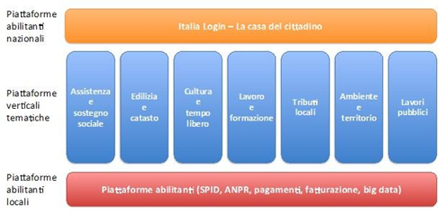
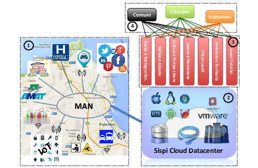
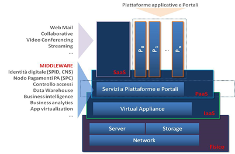

.. _h7d3d1f1f533d5c33805214d17347380:

PON Metro Palermo 2014-2020 Asse 1 agenda digitale
##################################################

\ |IMG1|\ 

\ |LINK1|\  

\ |LINK2|\  

Revisione Marzo 2018 - Post Deliberazione G.M. n. 268 del 07/12/2016

Asse 1 - Agenda Digitale Metropolitana

.. _h2b42474a43685a553b6213394d385675:

Sintesi della strategia di intervento
*************************************

Il PON Metro rappresenta una grande opportunità per l’intero Sistema-Paese dal momento che prevede la realizzazione, per la prima volta in modo coordinato, di un vasto programma di investimenti rivolto non solo a 14 Città Capoluogo italiane ma anche al loro hinterland, attraverso il coinvolgimento di un numero assai rilevante di Comuni dell’area metropolitana, variabile da Città a Città. Un aspetto rilevante del PON Metro è rappresentato dagli investimenti per il potenziamento dell’Agenda Digitale che destina, per la sola Città di Palermo, risorse pari a 16 M€. La denominazione esatta dell’azione specifica è, in effetti, esplicativa della valenza che viene posta sull’azione stessa dalla Commissione Europea: “\ |STYLE0|\ .

Si tratta cioè di interventi volti non tanto a introdurre generiche nuove tecnologie da sperimentare quanto piuttosto ad adottare tecnologie, in alcuni casi mature, che siano in grado di apportare significativi e tangibili benefici alle comunità alle quali si rivolgono: Comuni Capoluogo e Comuni dell’area metropolitana.

Il PON Metro “Città di Palermo” 2014 - 2020 rappresenta altresì una grande opportunità per il territorio del Comune di Palermo per continuare il lungo il cammino di innovazione volto a garantire nuovi servizi, anche ridisegnando quelli già esistenti, ai propri cittadini e alle realtà produttive presenti; inoltre, offre la possibilità di avvicinare e coinvolgere "\ |STYLE1|\ " l’intero territorio metropolitano così da integrarlo nei processi di uso sostenibile e di governo. Tutto ciò con l’obiettivo di aumentare il grado di "vivibilità" delle città, prestando in particolare attenzione alle modalità di estensione dei servizi (\ |STYLE2|\  e \ |STYLE3|\ ) anche ai Comuni dell’area metropolitana che verranno federati.

La progettualità in materia di Agenda Digitale, esposta nelle singole “Schede Progetto” a seguire, riguarderà i servizi, le infrastrutture, l’organizzazione e i modelli di gestione abilitanti rispetto agli obiettivi generali del PON Metro che la Città di Palermo deve porre in essere in coerenza con i contenuti e gli indirizzi definiti dall'Asse 1 del Programma PON Metro - Agenda Digitale.

Poiché, inoltre, in termini generali le Azioni di Programma si collocano nella cornice più generale costituita dai quattro Assi previsti dal PON Metro, la realizzazione, nell'ambito dell'Asse 1, della Piattaforma Informatica Integrata dovrà intendersi come fattore abilitante delle Azioni di Progetto previste sia nei settori tematici della Mobilità Sostenibile, dell'Efficienza Energetica e dell’Inclusione Sociale, sia nel contesto più generale dei servizi di \ |STYLE4|\  implicitamente introdotti dall’integrazione nell’area metropolitana dei Comuni di area metropolitana e dal potenziamento/estensione degli stessi servizi erogati.

Il Programma, in particolare, prevede in modo esplicito che gli interventi realizzati nell’ambito dell’Asse 1 – Agenda Digitale riguardino in modo specifico 7 aree tematiche corrispondenti ad altrettante piattaforme verticali, in grado di inter operare con le piattaforme di servizio abilitanti, locali e nazionali, secondo lo schema di seguito rappresentato.

\ |IMG2|\ 

\ |STYLE5|\ 

Nelle “\ |STYLE6|\ ” vengono descritte le singole Piattaforme Tematiche che il Comune di Palermo intende sviluppare. Sebbene le singole piattaforme potrebbero essere, in linea di principio, l’una indipendente dall’altra, nella fase di progettazione degli interventi è stata posta una particolare enfasi nella individuazione di tutti quegli elementi di trasversalità funzionale tra le diverse piattaforme che consentano all’Azione, vista nella sua interezza, di presentarsi come un vero e proprio ecosistema applicativo e architetturale; tale approccio risulterà in particolare capace di amplificare gli effetti sinergici tra i diversi investimenti oltre che di uniformare gli approcci implementativi in una chiave di interoperabilità nativa tra i diversi contesti applicativi.

Le singole piattaforme in alcuni casi rappresenteranno un’evoluzione radicale dell’esistente, prevedendo in particolare l’adozione del \ |STYLE7|\  come modello base e fondante per l’erogazione dei servizi e per la loro fruizione; è questo il caso delle Piattaforme “\ |STYLE8|\ ”, “\ |STYLE9|\ ” e “\ |STYLE10|\ ”. Negli altri casi, “\ |STYLE11|\ ”, “\ |STYLE12|\ ”, “\ |STYLE13|\ ” e “\ |STYLE14|\ ”, le piattaforme saranno sviluppate \ |STYLE15|\ , ricorrendo allo stato dell’arte della tecnologia disponibile e sviluppando le applicazioni nativamente aderenti al paradigma del \ |STYLE16|\ .

Per quanto attiene il modello di Cloud Computing cui si pensa di aderire, questo sarà prevalentemente il modello privato attraverso un potenziamento della infrastruttura di datacenter già in possesso della società \ |STYLE17|\  SISPI S.p.A. preposta alla gestione di tutti gli aspetti ICT del Comune di Palermo e alla quale sarà affidata la realizzazione di tutti gli interventi in materia di Agenda Digitale di cui al PON Metro “Città di Palermo”.

Per ciascuna delle piattaforme da sviluppare, particolare cura verrà posta nella determinazione e implementazione dei protocolli di comunicazione e interoperabilità delle piattaforme tra loro, con le altre piattaforme presenti a livello locale nonché con le piattaforme di servizio a livello nazionale. Altrettanta enfasi verrà altresì posta nell’azione di raccordo con le analoghe attività di sviluppo svolte dalle altre 13 Città Capoluogo coinvolte nel PON Metro, alla ricerca di soluzioni comuni e condivise che consentano lo sviluppo di un ecosistema applicativo nazionale quanto più possibile interoperabile. Nel fare ciò un ruolo fondamentale verrà ricoperto dalle soluzioni tecnologiche che verranno adottate, le quali dovranno garantire:

* un’interoperabilità, quanto più possibile estesa e pervasiva, tra le diverse piattaforme. Ciò verrà realizzato da un lato adottando protocolli di comunicazione tra le applicazioni e formati dei dati quanto più possibili aperti e aderenti a standard riconosciuti dai contesti di riferimento, dall’altro ricorrendo ad un elemento architetturale a fondamento dell’infrastruttura di progetto dell’intera piattaforma tecnologica rappresento da un \ |STYLE18|\  (\ |STYLE19|\ ). Tale elemento infrastrutturale fungerà da accoppiatore tra le singole componenti middleware a fondamento delle singole piattaforme e degli strati applicativi specifici; 

* l’adozione di strumenti estremamente efficaci per estrarre conoscenza e rappresentarla in forme intellegibili per i diversi fruitori delle piattaforme. Si tratta di strumenti di Business Intelligence e di Business Analytics, fondati su una piattaforma di \ |STYLE20|\  trasversale a tutte le piattaforme;

* l’implementazione di \ |STYLE21|\  (\ |STYLE22|\ ) come elementi fondanti dei sistemi di dematerializzazione e di automazione e controllo dei procedimenti di \ |STYLE23|\ .

Elemento comune a buona parte delle Piattaforme sviluppate sarà l’articolazione delle attività di sviluppo in due fasi distinte, ancorché strettamente collegate l’una all’altra, che richiamino idealmente la divisione in due fasi temporali dell’intero programma:

* \ |STYLE24|\ : analisi delle soluzioni tecnologiche e funzionali presenti sul mercato, implementazione di infrastrutture pilota, ancorché operative, e rilascio delle prime componenti applicative; 

* \ |STYLE25|\ : selezione delle soluzioni ottimali e messa in esercizio delle soluzioni applicative.

Tale articolazione origina dalla necessità e opportunità di fare ricorso allo stato dell’arte delle tecnologie disponibili e dalla volontà di creare un ecosistema applicativo che miri all’ottimale impiego delle risorse disponibili nonché alla nativa interoperabilità delle stesse. Tutto ciò non è facilmente o immediatamente reperibile sul mercato, come soluzione pronta “a scaffale”, viceversa necessitando di una fase di \ |STYLE26|\  tecnologico seguita da una fase di implementazione operativa che porti a dei prototipi funzionanti, da sperimentare su scala ridotta entro il 2018 (coinvolgendo almeno 3 Comuni dell’area metropolitana), che verranno valutati come soluzione da mettere in produzione su una più ampia scala entro il termine ultimo del progetto (coinvolgendo almeno 44 Comuni dell’area metropolitana\*):

+-----------------------------+----------------------------------------------------------+-------------+-------------+
|Descrizione indicatore output|Descrizione indicatore output                             |Target 2018\*|Target 2023\*|
+=============================+==========================================================+=============+=============+
|IO01                         |Numero di comuni associati a sistemi informativi integrati|4            |42           |
+-----------------------------+----------------------------------------------------------+-------------+-------------+

\ |STYLE27|\ 

Particolare attenzione verrà riservata alle attività di raccordo con i Comuni dell’area metropolitana con i quali si conta di avviare una vera e propria condivisione di diversi aspetti operativi legati alla implementazione dei servizi offerti dalle Piattaforme Tecnologiche. Se, infatti, il disegno delle singole Piattaforme e dell’infrastruttura tecnologica di progetto è centralizzata, anche grazie alle potenzialità offerte dalle moderne tecnologie Cloud, le funzionalità che verranno rese disponibili da tali piattaforme ai cittadini sono il frutto di un esteso lavoro di condivisione che vede i Comuni dell’area metropolitana partecipare con un ruolo attivo nel fornire le tipologie e le specifiche di base dei servizi nonché le modalità di fruizione degli stessi da parte dei cittadini. Tale fase sarà preceduta da un’attività di raccordo, che è partita già nel mese di dicembre 2016, e che consisterà nella presentazione del Piano Operativo ai rappresentanti dei Comuni dell’area metropolitana e nell’insediamento di specifici tavoli tematici, uno per ciascuna Piattaforma Tecnologica. L’adesione dei Comuni alle Piattaforme potrà essere trasversale o mirata, in base alle esigenze specifiche manifestate da ciascuno di essi.

Considerata l’entità della sfida tecnologica sottesa alla creazione di un vero e proprio ecosistema applicativo, fondato sull’impiego coordinato di tecnologie differenti e, in alcuni casi, estremamente innovative e pertanto prive di una consolidata base professionale ed esperienziale a supporto, difficilmente reperibile sul mercato, risulta cruciale oltre che territorialmente strategica \ |STYLE28|\ . Tale collaborazione è in grado di dispiegare due diversi elementi di valore:

* da un lato, quelli connessi con la collaborazione qualificata con un ente di ricerca e innovazione quale l’Università di Palermo la quale, grazie alle diverse competenze presenti al suo interno proprio sui temi intercettati dall’Agenda Digitale, è in grado di valorizzarle, mettendole al servizio del territorio per contribuire alla realizzazione di una piattaforma di servizio volta a contribuire al rilancio dell’intero territorio oltre che a erogare servizi avanzati e funzionali ai cittadini;

* dall’altro, quelli connessi con la possibilità di rafforzare in modo strutturato l’intera filiera digitale presente sul territorio, consolidando le competenze presenti attraverso attività mirate di formazione e di trasferimento delle professionalità o attraendo sul territorio realtà industriali interessate allo sviluppo di soluzioni di avanguardia in una logica sistemica.

.. _h80421d5e92644230c3610484256:

Indicatori di risultato
***********************

\ |STYLE29|\ 

[IR01, IR02]

IR01 - Numero di Comuni della Città metropolitana con servizi pienamente interattivi in percentuale sul totale dei Comuni della Città metropolitana.

IR02 - Persone di 14 e più anni che hanno usato internet negli ultimi 12 mesi per relazionarsi per uso privato con la Pubblica Amministrazione o con i gestori di servizi pubblici.

+-----------------------+---------------+--------------+---------------+
|Indicatore di risultato|Unità di misura|Baseline (RMS)|Obiettivo (RMS)|
+=======================+===============+==============+===============+
|IR01                   |%              |15,50         |70,00          |
+-----------------------+---------------+--------------+---------------+
|IR02                   |%              |29,10         |50,00          |
+-----------------------+---------------+--------------+---------------+

.. _h3a247b4f3668261c463261685b586f:

Dotazione finanziaria
*********************

Di seguito si riporta lo schema di ripartizione delle risorse destinate all’Asse 1 tra le diverse Piattaforme tematiche che si prevede di realizzare.

+---------------+-------------------------------+-----------------+
|Codice progetto|Titolo progetto                |Risorse assegnate|
+===============+===============================+=================+
|PA1.1.1.a      |Piattaforma ICT “\ |STYLE30|\ ”|€ 2.735.000,00   |
+---------------+-------------------------------+-----------------+
|PA1.1.1.b      |Piattaforma ICT “\ |STYLE31|\ ”|€ 1.985.000,00   |
+---------------+-------------------------------+-----------------+
|PA1.1.1.c      |Piattaforma ICT “\ |STYLE32|\ ”|€ 1.290.000,00   |
+---------------+-------------------------------+-----------------+
|PA1.1.1.d      |Piattaforma ICT “\ |STYLE33|\ ”|€ 1.705.000,00   |
+---------------+-------------------------------+-----------------+
|PA1.1.1.e      |Piattaforma ICT “\ |STYLE34|\ ”|€ 1.785.000,00   |
+---------------+-------------------------------+-----------------+
|PA1.1.1.f      |Piattaforma ICT “\ |STYLE35|\ ”|€ 4.515.000,00   |
+---------------+-------------------------------+-----------------+
|PA1.1.1.g      |Piattaforma ICT “\ |STYLE36|\ ”|€1.985.000,00    |
+---------------+-------------------------------+-----------------+
|\ |STYLE37|\   |                               |\ |STYLE38|\     |
+---------------+-------------------------------+-----------------+

.. _h2626a662a6b113685261702b40722c:

Cronoprogramma finanziario
**************************

+---------------+---------+----+----+---------+---------+---------+----------+
|Codice progetto|2014/2015|2016|2017|2018     |2019     |2020     |Totale    |
+===============+=========+====+====+=========+=========+=========+==========+
|PA1.1.1.a      |0        |0   |0   |603.714  |844.464  |1.286.822|2.735.000 |
+---------------+---------+----+----+---------+---------+---------+----------+
|PA1.1.1.b      |0        |0   |0   |463.857  | 321.428 |1.199.715|1.985.000 |
+---------------+---------+----+----+---------+---------+---------+----------+
|PA1.1.1.c      |0        |0   |0   |427.142  | 241.071 |621.787  |1.290.000 |
+---------------+---------+----+----+---------+---------+---------+----------+
|PA1.1.1.d      |0        |0   |0   |397.785  |485.428  |821.787  |1.705.000 |
+---------------+---------+----+----+---------+---------+---------+----------+
|PA1.1.1.e      |0        |0   |0   |392.857  |250.000  |1.142.143|1.785.000 |
+---------------+---------+----+----+---------+---------+---------+----------+
|PA1.1.1.f      |0        |0   |0   |571.428  |571.428  |3.372.144|4.515.000 |
+---------------+---------+----+----+---------+---------+---------+----------+
|PA1.1.1.g      |0        |0   |0   |693.332  |344.539  |947.129  |1.985.000 |
+---------------+---------+----+----+---------+---------+---------+----------+
|Totale         |0        |0   |0   |3.550.115|3.058.358|9.391.527|16.000.000|
+---------------+---------+----+----+---------+---------+---------+----------+

.. _h3d2231792332f56687a7544693a25:

Analisi della spesa
*******************

\ |STYLE39|\ 

L'Asse 1 del Programma PON Metro, descritto con il presente Piano Operativo, disegna un quadro di riferimento entro il quale, i diversi ambiti progettuali di intervento concorrono, unitariamente e organicamente, a definire i servizi, le infrastrutture, l’organizzazione ed i modelli di gestione abilitanti rispetto agli obiettivi generali del PON METRO che la Città di Palermo intende porre in atto in coerenza con i contenuti e gli indirizzi definiti dall’ Agenda Digitale.

In questa cornice, assumono una particolare rilevanza le azioni di convergenza che hanno per obiettivo una programmazione della spesa organizzata sia in termini di ambito di intervento che in termini di modello di propagazione dei servizi.

Le figure che seguono rappresentano, rispettivamente, lo schema architetturale della piattaforma Informatica di Città e un dettaglio dello schema logico del datacenter.

Tali schemi vengono assunti quali elementi cardine di riferimento per rappresentare sinteticamente il modello di convergenza della spesa riportato nella tabella seguente.

\ |IMG3|\ 

Piattaforma Informatica di Città

Lo schema precedente rappresenta la Piattaforma Informatica di Città con l’insieme dei macro-servizi offerti:

        ●      Servizi Cloud (\ |STYLE40|\ , \ |STYLE41|\ ) secondo i modelli:

            o    IaaS: Infrastructure as a Service

            o    Paas: Platform as a Service

            o    SaaS: Software as a Service

        ●      Connettività di Città:

            o    MAN: rete di trasporto (Anello telematico)

            o    LAN: reti di raccolta/accesso

            o    WAN: accesso Internet e alle reti geografiche.

\ |IMG4|\ 

\ |STYLE42|\ 

L’architettura Logica del Data Center evidenzia, invece, la disarticolazione delle diverse piattaforme costitutive.

Nella Tabella seguente si riporta l’articolazione in Piattaforme dell’intera infrastruttura ICT del progetto.

+-----------------------------------------------------+------------------------------------------------------------------------------------------------------------------------------------------------+------------------------------------------------------------------------------------------------------------------+
|Piattaforma                                          |Descrizione                                                                                                                                     |Articolazione                                                                                                     |
+=====================================================+================================================================================================================================================+==================================================================================================================+
|Piattaforma Cloud                                    |Infrastruttura computazionale, Cloud e SLA                                                                                                      |Server, storage enetwork                                                                                          |
|                                                     |                                                                                                                                                |                                                                                                                  |
|                                                     |                                                                                                                                                |                                                                                                                  |
+-----------------------------------------------------+------------------------------------------------------------------------------------------------------------------------------------------------+------------------------------------------------------------------------------------------------------------------+
|                                                     |                                                                                                                                                |Piattaforma IaaS                                                                                                  |
+-----------------------------------------------------+------------------------------------------------------------------------------------------------------------------------------------------------+------------------------------------------------------------------------------------------------------------------+
|                                                     |                                                                                                                                                |Servizi di Business Continuity                                                                                    |
+-----------------------------------------------------+------------------------------------------------------------------------------------------------------------------------------------------------+------------------------------------------------------------------------------------------------------------------+
|                                                     |                                                                                                                                                |Servizi di integrazione                                                                                           |
+-----------------------------------------------------+------------------------------------------------------------------------------------------------------------------------------------------------+------------------------------------------------------------------------------------------------------------------+
|Piattaforma Middleware                               |Strato middleware polivalente, trasversale e funzionale al supporto delle diverse piattaforme applicative implementate col programma            |Piattaforma ESB, IM e AC                                                                                          |
+-----------------------------------------------------+------------------------------------------------------------------------------------------------------------------------------------------------+------------------------------------------------------------------------------------------------------------------+
|                                                     |                                                                                                                                                |Strato PaaS                                                                                                       |
+-----------------------------------------------------+------------------------------------------------------------------------------------------------------------------------------------------------+------------------------------------------------------------------------------------------------------------------+
|                                                     |                                                                                                                                                |Piattaforma BPM e gestione documentale + piattaforma CMS/portali                                                  |
+-----------------------------------------------------+------------------------------------------------------------------------------------------------------------------------------------------------+------------------------------------------------------------------------------------------------------------------+
|                                                     |                                                                                                                                                |Datawarehouse, Business Intelligence & Business Analytics                                                         |
+-----------------------------------------------------+------------------------------------------------------------------------------------------------------------------------------------------------+------------------------------------------------------------------------------------------------------------------+
|                                                     |                                                                                                                                                |Integrazione SPID e Carta del cittadino                                                                           |
+-----------------------------------------------------+------------------------------------------------------------------------------------------------------------------------------------------------+------------------------------------------------------------------------------------------------------------------+
|                                                     |                                                                                                                                                |Servizi di integrazione                                                                                           |
+-----------------------------------------------------+------------------------------------------------------------------------------------------------------------------------------------------------+------------------------------------------------------------------------------------------------------------------+
|Piattaforme Applicative                              |Piattaforme applicative specifiche, concepite nativamente in tecnologia Cloud, che si avvalgono delle diverse componenti middleware implementate|Piattaforma Applicative con specifico riferimento allo sviluppo degli elementi di interfaccia front-end e back-end|
+-----------------------------------------------------+------------------------------------------------------------------------------------------------------------------------------------------------+------------------------------------------------------------------------------------------------------------------+
|Portale metropolitano                                |Portale di Accesso, integrato alle piattaforme applicative e aperto anche ai Comuni di area metropolitana coinvolti nel programma               |Portale di Accesso                                                                                                |
+-----------------------------------------------------+------------------------------------------------------------------------------------------------------------------------------------------------+------------------------------------------------------------------------------------------------------------------+
|Piattaforma di connettività urbana: WiFi di distretto|Piattaforma di accesso per la connettività multimodale di supporto all'infrastruttura IoT di monitoraggio ambientale                            |Servizi per la Funzionalizzazione dell’anello telematico                                                          |
|                                                     |                                                                                                                                                |                                                                                                                  |
|                                                     |                                                                                                                                                |                                                                                                                  |
|                                                     |                                                                                                                                                |                                                                                                                  |
|                                                     |                                                                                                                                                |                                                                                                                  |
+-----------------------------------------------------+------------------------------------------------------------------------------------------------------------------------------------------------+------------------------------------------------------------------------------------------------------------------+
|                                                     |                                                                                                                                                |Integrazione servizi e reti a banda larga ed ultra larga                                                          |
+-----------------------------------------------------+------------------------------------------------------------------------------------------------------------------------------------------------+------------------------------------------------------------------------------------------------------------------+
|                                                     |                                                                                                                                                |WiFi di distretto                                                                                                 |
+-----------------------------------------------------+------------------------------------------------------------------------------------------------------------------------------------------------+------------------------------------------------------------------------------------------------------------------+
|Sensoristica IOT ambientale                          |Infrastruttura IoT di monitoraggio ambientale                                                                                                   |Sensori IoT ambientali - TPL                                                                                      |
|                                                     |                                                                                                                                                |                                                                                                                  |
|                                                     |                                                                                                                                                |                                                                                                                  |
+-----------------------------------------------------+------------------------------------------------------------------------------------------------------------------------------------------------+------------------------------------------------------------------------------------------------------------------+
|                                                     |                                                                                                                                                |Sensori IoT ambientali - pali illuminazione                                                                       |
+-----------------------------------------------------+------------------------------------------------------------------------------------------------------------------------------------------------+------------------------------------------------------------------------------------------------------------------+
|                                                     |                                                                                                                                                |Sensori IoT ambientali - territorio                                                                               |
+-----------------------------------------------------+------------------------------------------------------------------------------------------------------------------------------------------------+------------------------------------------------------------------------------------------------------------------+

Con riferimento alla “\ |STYLE43|\ ” si precisa che il sistema è esclusivamente funzionale e strumentale all'attuazione del servizio di sensoristica IOT ambientale. La piattaforma non è volta ad aumentare l’accessibilità ai servizi da parte dei cittadini.

 

È opportuno menzionare in questa fase come le diverse piattaforme contribuiscano in modo trasversale e funzionale alla implementazione delle diverse piattaforme applicative espressamente previste dal progetto e meglio descritte nelle singole schede seguenti. È inoltre opportuno precisare in questa sede che alcuni servizi/piattaforme annoverate nello schema di cui sopra, pur essendo logicamente inserite nel novero delle componenti dell’infrastruttura ICT di progetto, verranno realizzati con risorse da rinvenire sugli altri Assi; è questo il caso della sensoristica IoT Ambientale – TPL e dei pali di illuminazione o della piattaforma semaforica. Tali componenti sono annoverate nello schema di cui sopra dal momento che, per la loro implementazione, si avvarranno, in modo assolutamente rilevante, delle componenti architetturali implementate per le altre piattaforme di progetto, nella logica di ecosistema di progetto più volte richiamata in precedenza.

.. toctree:: 
    :maxdepth: 3
    :caption: Indice 

    assistenza-sostegno-sociale
    edilizia-catasto
    cultura
    lavoro-formazione

.. bottom of content

.. |STYLE0| replace:: *Adozione di tecnologie per migliorare i servizi urbani della Smart City”*

.. |STYLE1| replace:: *digitalmente*

.. |STYLE2| replace:: *back-end*

.. |STYLE3| replace:: *front-end*

.. |STYLE4| replace:: *e-Government*

.. |STYLE5| replace:: *Agenda Digitale - Piattaforme Tematiche*

.. |STYLE6| replace:: *Schede Progetto*

.. |STYLE7| replace:: **paradigma del Cloud Computing**

.. |STYLE8| replace:: *Edilizia e Catasto*

.. |STYLE9| replace:: *Tributi Locali*

.. |STYLE10| replace:: *Lavori Pubblici*

.. |STYLE11| replace:: *Assistenza e Sostegno Sociale*

.. |STYLE12| replace:: *Cultura e Tempo Libero*

.. |STYLE13| replace:: *Lavoro e Formazione*

.. |STYLE14| replace:: *Ambiente e Territorio*

.. |STYLE15| replace:: *ex novo*

.. |STYLE16| replace:: *Cloud Computing*

.. |STYLE17| replace:: *in-house*

.. |STYLE18| replace:: **Enterprise Service Bus**

.. |STYLE19| replace:: **ESB**

.. |STYLE20| replace:: **Big Data Analytics**

.. |STYLE21| replace:: **Sistemi di Controllo dei Processi**

.. |STYLE22| replace:: **BPMS – Business Process Management System**

.. |STYLE23| replace:: *back-office*

.. |STYLE24| replace:: **Fase 1**

.. |STYLE25| replace:: **Fase 2**

.. |STYLE26| replace:: *scouting*

.. |STYLE27| replace:: *\*Nota: la previsione/tabella precedente è redatta in modo tale che un Comune federato a più piattaforme venga contato una sola volta.*

.. |STYLE28| replace:: **la collaborazione con l’Università degli Studi di Palermo**

.. |STYLE29| replace:: *Indicatori di Risultato del Programma*

.. |STYLE30| replace:: *Assistenza e Sostegno Sociale*

.. |STYLE31| replace:: *Edilizia e Catasto*

.. |STYLE32| replace:: *Cultura e Tempo Libero*

.. |STYLE33| replace:: *Lavoro e Formazione*

.. |STYLE34| replace:: *Tributi Locali*

.. |STYLE35| replace:: *Ambiente e Territorio*

.. |STYLE36| replace:: *Lavori Pubblici*

.. |STYLE37| replace:: **Totale**

.. |STYLE38| replace:: **€ 16.000.000,00**

.. |STYLE39| replace:: *Classificazione della spesa per ambito/destinazione*

.. |STYLE40| replace:: *server virtualization*

.. |STYLE41| replace:: *virtual storage*

.. |STYLE42| replace:: *Architettura logica del DataCenter*

.. |STYLE43| replace:: *Piattaforma di connettività urbana: WiFi di distretto*

.. |LINK1| raw:: html

    <a href="https://ponmetro.comune.palermo.it" target="_blank">https://ponmetro.comune.palermo.it</a>

.. |LINK2| raw:: html

    <a href="http://www.ponmetro.it/home/ecosistema/viaggio-nei-cantieri-pon-metro/pon-metro-palermo/" target="_blank">http://www.ponmetro.it/home/ecosistema/viaggio-nei-cantieri-pon-metro/pon-metro-palermo/</a>

