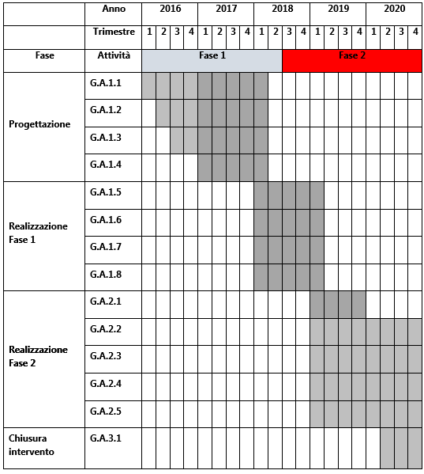

.. _h13536847106385559556d2d15223d1a:

PA1.1.1.g – Piattaforma ICT “Lavori Pubblici”
#############################################

+--------------------------+--------------------------------------------------------+
|Codice progetto           |\ |STYLE0|\                                             |
+--------------------------+--------------------------------------------------------+
|\ |STYLE1|\               |\ |STYLE2|\                                             |
+--------------------------+--------------------------------------------------------+
|\ |STYLE3|\  (se presente)|D71H17000060007                                         |
+--------------------------+--------------------------------------------------------+
|\ |STYLE4|\               |\ |STYLE5|\                                             |
+--------------------------+--------------------------------------------------------+
|\ |STYLE6|\               |\ |STYLE7|\                                             |
+--------------------------+--------------------------------------------------------+
|\ |STYLE8|\               |Comune di Palermo – C.F. 80016350821                    |
+--------------------------+--------------------------------------------------------+
|\ |STYLE9|\               |Dott. Giuseppe Meli (Comune di Palermo)                 |
+--------------------------+--------------------------------------------------------+
|                          |g.meli@comune.palermo.it, +091.7407640                  |
+--------------------------+--------------------------------------------------------+
|\ |STYLE10|\              |SISPI - Sistema Palermo Informatica (“in house”)        |
+--------------------------+--------------------------------------------------------+
|                          |Salvatore Morreale, s.morreale@sispi.it, +39 091 6319811|
+--------------------------+--------------------------------------------------------+

.. _h122e634036157b7d235c25455a5918:

Descrizione del progetto
************************

.. _h6e6359221a5a3c7d4e35346c6c471978:

Obiettivi e ricadute del progetto
=================================

Gli obiettivi che la Piattaforma ICT “\ |STYLE11|\ ” si prefigge di raggiungere sono molteplici e riguardano, prioritariamente, le seguenti direttrici di intervento:

* \ |STYLE12|\ : attraverso il completamento della componente di back-end saranno resi disponibili le componenti applicative necessarie per offrire servizi all’utenza interna impegnata nella gestione dell’intera filiera della gestione lavori pubblici secondo un modello in grado di interpretare, in una visione unitaria e omogenea, le diverse fasi di processo e la concatenazione logico-funzionale tra le diverse fasi;

* \ |STYLE13|\ : lo sportello ha l’obiettivo di fornire servizi specializzati alle diverse categorie di utenze (Imprese, professionisti, altri enti);

* \ |STYLE14|\ : il portale informativo ha lo scopo di fornire elementi di conoscenza sugli interventi pubblici che si realizzano nel territorio. Di particolare rilevanza la geolocalizzazione del programma triennale i cui contenuti, contestualizzati nell’ambito delle perimetrazioni amministrative della città, costituiscono un importante elemento di visibilità e di comunicazione;

* sviluppo di un \ |STYLE15|\  a supporto di una piattaforma di \ |STYLE16|\  per lo studio e il monitoraggio del territorio anche attraverso la creazione di cruscotti di visualizzazione specifici per le diverse categorie di utenti: cittadini, autorità politiche, tecnici.

Il progetto si articola in un percorso basato su:

* un insieme di innovazioni organizzative e informatiche potenzialmente riusabili “ovunque” (e quindi fortemente standardizzate);

* il rafforzamento dei principi di interoperabilità applicativa e di correlazione tra le informazioni, in un’ottica di cooperazione tra Enti;

* l’integrazione dei back office (processi e banche dati) con i servizi di front office;

* la disponibilità di servizi telematici a favore di cittadini, professionisti e imprese.

Dal punto di vista dell’architettura logica, la piattaforma comprende:

* Gestione documentale

* Servizi e sistemi BPM

* Servizi \ |STYLE17|\ 

* Servizi di \ |STYLE18|\ 

* Interoperabilità e cooperazione applicativa con PEC

* Integrazione con i servizi nazionali di pagamento e identità digitale

Dal punto di vista della gestione amministrativa e dello svolgimento dei connessi processi operativi del ciclo di vita dei Lavori Pubblici, gli obiettivi essenziali che devono essere soddisfatti attraverso lo sviluppo un assetto funzionale della piattaforma tecnologica di servizio che soddisfi le tre macro fasi concettuali seguenti:

* la programmazione;

* l’attuazione;

* il monitoraggio.

Il progetto, inoltre, delinea i punti nodali di un piano di lavoro generale avente l’obiettivo di sostenere l’utilizzo dei servizi di piattaforma nel contesto geografico dell’area metropolitana di riferimento (comuni di cintura) e di sviluppare i modelli di interoperabilità e cooperazione tra le diverse Aree Metropolitane.

Per quanto riguarda il modello funzionale, esso deve essere coerente con il quadro normativo di riferimento prevalentemente delineato dal decreto 163/2006, dal Codice dei Contratti Pubblici, dalle determinazioni dell’Autorità di Vigilanza, dal Regolamento sugli Appalti, dalle disposizioni in tema di Ricorsi e Tracciabilità, dalle disposizioni in tema di Anticorruzione, Trasparenza nella Pubblica Amministrazione e dagli obblighi di rendicontazione BDAP.

Gli elementi essenziali dell’architettura assunti come obiettivi prioritari della piattaforma possono essere rappresentati come segue:

* completezza dell’assetto funzionale per garantire il necessario grado di copertura alle diverse macro fasi concettuali caratteristiche del ciclo di vita delle Opere Pubbliche. In particolare, la piattaforma “Lavori Pubblici” consentirà di gestire:

    * Programmazione opere 

    * Progettazione 

    * Analisi prezzi 

    * Attuazione 

        *  Affidamento

        * Esecuzione

        * Collaudo

    * Espropri 

    * Sicurezza cantiere 

    * Contabilità lavori 

    * Monitoraggio  

    * Comunicazione/informazione

* aderenza ad una architettura logico funzionale ed a un modello di implementazione che comprende i seguenti sottosistemi:

    * Sistema Informativo territoriale 

    * Portale dei servizi online

* conformità a processi di normalizzazione e armonizzazione dei dati:

                ▪          Fascicolo elettronico

                ▪          Stradario Ufficiale

                ▪          Mappe Catastali e archivi censuari

* interoperabilità dei dati verso l’interno del sistema informativo dell’Ente (Ambito Metropolitano), verso l’esterno (altre Pubbliche Amministrazioni, Enti e Imprese e Cittadini) e verso

    * Interoperabilità Interna

        * Protocollo 

        * Ragioneria e Servizi finanziari

        * Gare e Contratti

        * Gestione Delibere

        * Urbanistica

        * Mobilità e traffico

    * interoperabilità esterna (Pubbliche Amministrazione ed altri Enti)

        * MIT-Servizio Contratti Pubblici e/o Osservatori Regionali Ragioneria e Servizi finanziari 

        * CIPE/DIPE 

        * ANAC (Ex AVCP) Osservatori Regionali 

        * MEF/Ragioneria Centrale 

        * Strumenti di partecipazione 

        * Open data

La piattaforma, inoltre, supporta i seguenti standard nazionali (Network, pagamenti, identità, …)

* Rete SPC  

* PEC 

* SPID – Identità Digitale 

* Nodo Pagamento SPD 

* Firma digitale

.. _h5b383b4c5047625c7f4257e7d4d123d:

Beneficiari
===========

I beneficiari del presente progetto sono:

* \ |STYLE19|\  che potranno disporre di strumenti più efficaci per accedere a un insieme più completo di informazioni territoriali riguardanti l’intervento pubblico, con cui avviare i procedimenti amministrativi connessi (espropri, etc..) e che beneficeranno degli interventi territoriali, ambientali e fiscali posti in essere dalle amministrazioni;

* \ |STYLE20|\  che, sfruttando gli strumenti disponibili nella Piattaforma, potranno operare sul territorio con maggiore efficienza, traendo quindi vantaggio da una pianificazione integrata e anche da un maggior ritorno economico derivante dalla razionalizzazione degli interventi e dalla gestione dei complessi procedimenti amministrativi connessi (appalti, contratti, avanzamento lavori, etc.);

* \ |STYLE21|\  che, sfruttando una visione più ampia anche in termini di relazioni territoriali, potranno aumentare la qualità dei propri progetti;

* \ |STYLE22|\  che potranno disporre di informazioni più accurate con le quali effettuare piani di investimento e di sviluppo;

* \ |STYLE23|\  che potranno essere maggiormente propositivi e avviare più rapidamente le proprie iniziative;

\ |STYLE24|\ l complesso formato da\ |STYLE25|\  che diventeranno parte di un circolo virtuoso nel quale ognuno degli attori trae beneficio diretto e indiretto dalle azioni degli altri.

.. _h637d2d14366527a111435544b537a18:

Coerenza con la programmazione nazionale/regionale e con gli strumenti di pianificazione previsti per il livello comunale
=========================================================================================================================

\ |STYLE26|\  sono presenti molteplici elementi di sinergia con il PON Governance, il PON Cultura e Sviluppo FESR e con l’Agenda Digitale del FESR.

\ |STYLE27|\  è presente una forte sinergia con gli interventi previsti dal PO FESR Regionale e, in particolare, con quanto previsto dagli Assi 2 (Agenda Digitale), 6 (Tutelare l’Ambiente e Promuovere l’uso efficiente delle Risorse), in particolare con le azioni “Servizi per la conoscenza e la fruizione delle risorse culturali/naturali”, dell’Agenda Urbana Regionale e 11 (Rafforzare la capacità istituzionale delle autorità pubbliche e delle parti interessate e un’amministrazione pubblica efficiente

\ |STYLE28|\  la presente proposta presenta molteplici elementi di sinergia con quanto previsto dal Piano d’informatizzazione dell’Amministrazione Comunale.

.. _h112b357f132f3b762c72584697933:

Coerenza con il Programma, i criteri di selezione degli interventi e la strategia d’Asse
========================================================================================

\ |STYLE29|\  la Piattaforma ICT “\ |STYLE30|\ ” è coerente con quanto previsto dal Programma Operativo che sostiene la realizzazione di un’Agenda Digitale attraverso l’acquisizione e messa in esercizio di sistemi tecnologici e gestionali nell’Area Lavori Pubblici e Territorio.

\ |STYLE31|\  la Piattaforma risponde ai criteri di selezione previsti dal programma in quanto prevede lo sviluppo e il rinnovamento di servizi digitali dedicati al potenziamento e integrazione dei sistemi di front-office/\ |STYLE32|\ , incrementa il numero di servizi online disponibili per i cittadini e le imprese in modalità multicanale, sviluppa forme di cooperazione applicativa con le piattaforme nazionali relative ai sistemi di pagamento ed alle Identità digitali, consente la geolocalizzazione dei procedimenti amministrativi e la rappresentazione tematica degli interventi territoriali secondo modalità convergenti rispetto alle altre piattaforme tematiche previste. Inoltre, dal punto di vista della ingegnerizzazione della piattaforma, la stessa risponde ai requisiti di riusabilità e di scalabilità individuati dal PON Metro come indirizzi qualificanti per la strategia complessiva di sviluppo.

\ |STYLE33|\  dal punto di vista strategico, la Piattaforma prevede lo sviluppo di servizi on-line fortemente focalizzati rispetto alla utenza e perciò in grado di favorire l’incremento del numero di utenti che si abiliteranno all’utilizzo di servizi digitali. I servizi resi disponibili saranno sviluppati secondo la logica del riuso delle soluzioni tecnologiche e la capitalizzazione delle esperienze sperimentali fatte nel recente passato in relazione all’efficacia sistemica dei servizi da attivare, alla la piena interoperabilità dei sistemi, all’omogeneità dei dati raccolti e alla standardizzazione della domanda pubblica rivolta alle Pubbliche Amministrazioni Locali.

.. _h643e4c470556f2a11587657e23160:

Collegamento e sinergia con altre azioni del PON Metro (azioni integrate)
=========================================================================

I collegamenti e le sinergie con altre azioni del PON Metro sono molteplici, anche in ragione dell’approccio sistemico adottato nella implementazione dalla più complessiva piattaforma di Agenda Digitale del PON Metro Palermo.

Per quanto attiene nello specifico la Piattaforma ICT “\ |STYLE34|\ ”, notevoli sono le sinergie con le Piattaforme “\ |STYLE35|\ ”, “\ |STYLE36|\ ” e “\ |STYLE37|\ ” dovute non solo alla condivisione delle componenti tecnologiche abilitanti le singole piattaforme (strato di \ |STYLE38|\ , piattaforma di gestione documentale, piattaforma \ |STYLE39|\ , \ |STYLE40|\ , piattaforma di \ |STYLE41|\ , piattaforma di georeferenziazione, etc.) ma anche a uno stretto coordinamento dei formati e dei modelli dei dati gestiti dalle singole piattaforme al fine di supportare una “naturale” interoperabilità tra le piattaforme.

.. _h165fd805c1c30506f6e24534074f9:

Descrizione dei contenuti progettuali
=====================================

La Piattaforma ICT “\ |STYLE42|\ ” si inserisce nel novero dei portali a supporto della \ |STYLE43|\  e dello sviluppo del territorio. Essa intercetta non solo i temi degli interventi pubblici sul territorio ma anche quello più ampio della trasparenza amministrativa e della innovazione di processo e di prodotto.

La sua realizzazione si fonda su diversi elementi funzionali, tra i più rilevanti dei quali è possibile annoverare l’integrazione funzionale tra i servizi di front-office con quelli di \ |STYLE44|\ , la standardizzazione dei processi di gestione dell’iter di programma/progetto, l’integrazione funzionale con le componenti tecnologiche deputate alla geolocalizzazione dei procedimenti, il riferimento ad una piattaforma tecnologica di tipo \ |STYLE45|\ , un modello di gestione documentale trasversale rispetto alle diverse piattaforme tematiche.

La piattaforma dovrà in particolare gestire una mole consistente di dati e documenti attinenti una molteplicità di sorgenti di diverse tipologie tra le quali:

* \ |STYLE46|\ , con diversi livelli di approfondimento, gestibili in modo dinamico e profilato su specifiche tipologie di servizio: piani urbanistici, oggetti territoriali, zonizzazioni commerciali, dati catastali, viabilità e mobilità, toponomastica ed ordinamento ecografico, etc.;

* \ |STYLE47|\ , attraverso il completamento di processi di reingegnerizzazione finalizzati alla semplificazione e alla trasparenza amministrativa:

* \ |STYLE48|\  in aderenza ai requisiti previsti dai servizi nazionali.

Grande rilievo verrà riservato agli elementi di geolocalizzazione dei contenuti, dei servizi e degli fenomeni tributari, che consentano elevati livelli di interazione con i professionisti e le imprese anche forme di interazione innovative basate sul \ |STYLE49|\  dei servizi, sulla sincronizzazione degli eventi all’interno del programma triennale e sui servizi erogati in modalità multicanale (web, totem, sportelli fisici, app, etc.).

.. _h433ac47c5d441b546c7b551f24b2d:

Articolazione temporale delle attività progettuali
==================================================

Lo sviluppo temporale della Piattaforma ICT “\ |STYLE50|\ ”, analogamente a quanto previsto per altre Piattaforme, si articola in due Fasi. Ciò è reso necessario dalla molteplicità di piattaforme tecnologiche coinvolte nella realizzazione della Piattaforma in questione combinata con la complessità e con l’elevato livello di innovatività delle stesse che comporta la difficoltà di reperire sul mercato prodotti chiavi-in-mano pronti a soddisfare i requisiti progettuali richiesti.

* \ |STYLE51|\  questa prima fase è dedicata allo studio e implementazione di una prima soluzione prototipale del Portale “\ |STYLE52|\ ” con specifico riferimento alle sue diversi componenti attinenti alla valorizzazione del territorio e delle imprese, al censimento e valorizzazione delle infrastrutture. Tale Fase è previsto che duri fino al 31/03/2019;

* \ |STYLE53|\  dopo avere implementato la soluzione prototipale di piattaforma, si procederà alla messa in esercizio della piattaforma definitiva, attivandone altresì l’alimentazione nonché la fruizione per il tramite di un portale Web nonché di una pluralità di \ |STYLE54|\  specificamente disegnate per consentire una navigazione ottimale dei contenuti. Tale Fase verrà avviata il 01/01/2019 e proseguirà sino al 31/12/2020.

.. _h2a27307412b1b6951405f6d2b1fb6e:

Sostenibilità economica e gestionale e governance del progetto
==============================================================

La \ |STYLE55|\  della Piattaforma ICT “\ |STYLE56|\ ”, analogamente a quanto accade con le altre Piattaforme, è garantita da una strategia articolata, basata sulla modularità e sul livello dei servizi erogati. In particolare:

* i costi di sviluppo della Piattaforma e dei servizi base sono interamente coperti dalle risorse del presente progetto;

* l’erogazione dei servizi base, quelli cioè prevalentemente attinenti alla componente informativa del Portale dei Lavori Pubblici, terminato il progetto e quindi a partire dal 2011, saranno erogati dalla società \ |STYLE57|\  Sispi del Comune di Palermo previa copertura dei costi vivi di gestione in esercizio dei servizi stessi;

* lo sviluppo e l’erogazione di nuovi servizi (sviluppo di un portale di marketing e/o di booking, profilatura degli utenti e loro analisi, erogazione di servizi in Alta Affidabilità, etc.) sarà governata dalla stipula di appositi accordi onerosi negoziati dai singoli committenti con la società \ |STYLE58|\  Sispi del Comune di Palermo cui è affidato lo sviluppo e la gestione in esercizio della piattaforma e dei servizi dalla stessa erogati.

I \ |STYLE59|\  per il Comune di Palermo e per i Comuni di Cintura, associati all’adozione della presente Piattaforma, saranno considerevolmente inferiori rispetto a quelli medi di mercato dal momento che le componenti architetturali sulle quali si fonda la Piattaforma stessa sono parte di un ecosistema che consente di ottimizzare l’impiego delle risorse, riducendone altresì il costo. L’alta \ |STYLE60|\  della Piattaforma, consentita dall’adozione diffusa di tecnologia \ |STYLE61|\ , dallo sviluppo di applicativi \ |STYLE62|\ -ready e dalla condivisione delle componenti infrastrutturali con le altre Piattaforme di progetto, è garanzia di riduzione dei costi di gestione e di esercizio all’aumentare del numero di Amministrazioni che intenderanno avvalersi del servizio.

La \ |STYLE63|\  della Piattaforma sarà garantita dalla società \ |STYLE64|\  Sispi del Comune di Palermo la quale gestirà la Piattaforma inserendola in modo organico, sin dalla sua progettazione e sviluppo, all’interno del parco applicativo dalla stessa gestito.

La \ |STYLE65|\  sarà gestita dall’Autorità Urbana del Comune di Palermo, di concerto con la società \ |STYLE66|\  Sispi e con i diversi Comuni di area metropolitana coinvolti nel progetto stesso.

.. _h504b405a2d6c6a2a924465c1d696631:

Elementi tecnologici
====================

La Piattaforma ICT “\ |STYLE67|\ ” poggia su diversi componenti tecnologici, alcuni dei quali in comune con le altre Piattaforme di progetto. Di seguito si riportano i riferimenti ai principali elementi tecnologici impiegati e utilizzati dalla presente Piattaforma:

* \ |STYLE68|\  si tratta della piattaforma computazionale di base, in grado non solo di fornire il supporto computazionale alla Piattaforma ma anche di renderla scalabile in termini di risorse disponibili e abilitare la replicabilità della stessa, in modo personalizzato, ai Comuni di area metropolitana coinvolti nel progetto. Sulla piattaforma di \ |STYLE69|\  insistono buona parte delle componenti middleware utilizzate e di seguito descritte. Condivisa con altre Piattaforme di progetto;

* \ |STYLE70|\  fornisce gli strumenti per la georeferenziazione delle informazioni e la geolocalizzazione di eventi, oggetti e individui. Condivisa con altre Piattaforme di progetto;

* \ |STYLE71|\  fornisce il supporto alla gestione dei documenti e delle informazioni, anche a supporto del Portale della Conoscenza, alimentante un sistema di Open, Linked e \ |STYLE72|\  in grado di essere navigato e valorizzato secondo diverse dimensioni di analisi. Tale piattaforma garantirà sia il caricamento e la fruizione di nuovi contenuti, sia la valorizzazione dei contenuti presenti nei repository documentali in possesso delle realtà locali coinvolte (Comune di Palermo, Comuni di Cintura, Assessorato Regionale al Turismo, enti territoriali preposti alla valorizzazione delle attività culturali, etc.). Condivisa con altre Piattaforme di progetto;

* \ |STYLE73|\  la Piattaforma \ |STYLE74|\  (Customer Relashionship Management) ricopre un ruolo cruciale nell’analisi delle abitudini, dei feedback e delle esigenze degli utenti della piattaforma, finalizzata alla valorizzazione della \ |STYLE75|\  manifestata dagli utenti stessi e all’ottimale soddisfacimento delle loro esigenze che, in questo caso più che mai, coincidono con la valorizzazione del territorio. Condivisa con altre Piattaforme di progetto;

* \ |STYLE76|\  rappresenta l’elemento collante, di interoperabilità tra le diverse Piattaforme infrastrutturali, in grado altresì di standardizzare i dati per una loro esposizione ad altre applicazioni e piattaforme tematiche. Tale piattaforma supporterà, tra gli altri, il disaccoppiamento del livello di accesso ai dati/applicazioni dai front-end applicativi. Condivisa con altre Piattaforme di progetto.

Verrà sviluppato un sistema articolato di Web Applications basate sul modello SOA e di \ |STYLE77|\  disponibili per le principali piattaforme (iOS, Android, Windows) per consentire agli utenti (privati cittadini, istituzioni, aziende) di fruire delle informazioni presenti sulla piattaforma e di interagire con essa anche in termini attivi di produzione e caricamento delle informazioni e degli eventi. I servizi saranno fruibili online tramite interfacce basate su grafica personalizzabile tramite CSS, erogabili anche tramite \ |STYLE78|\ .

L’adozione nativa del paradigma del \ |STYLE79|\  nonché l’utilizzo di componenti middleware condivisi con le altre Piattaforme, garantisce una naturale \ |STYLE80|\  in termini sia di front-office si di \ |STYLE81|\ . Per quanto concerne le funzionalità di \ |STYLE82|\ , queste potranno essere raggruppate in due categorie:

* quelle di \ |STYLE83|\ , legate alla gestione delle funzionalità di base degli applicativi e delle componenti infrastrutturali, in capo alla società \ |STYLE84|\  Sispi del Comune di Palermo che se ne farà garante per l’intera Piattaforma e per tutti gli utenti;

* quelle di \ |STYLE85|\ , legate alla personalizzazione dei servizi da parte delle singole Amministrazioni/utenti, in capo ai singoli presidi delle rispettive Amministrazioni/utenti.

\ |STYLE86|\  e al \ |STYLE87|\ , si prevede che i servizi saranno aperti e disponibili agli operatori istituzionali di almeno 4 Comuni entro il 31/12/2019 ed esteso alla fruizione da parte di almeno 42 Comuni e ai turisti entro il 31/12/2023.

\ |STYLE88|\ : relativamente alla realizzazione componenti per il monitoraggio, si prevede che i servizi saranno aperti e disponibili agli operatori istituzionali di almeno 4 Comuni entro il 31/12/2019 ed esteso alla fruizione da parte di almeno 42Comuni e ai turisti entro il 31/12/2020.

\ |STYLE89|\ : L’implementazione di servizi per la gestione dell’intera filiera del ciclo delle OOPP, consentirà all’amministrazione di migliorare la comunicazione ed il coinvolgimento degli stakeholder, di garantire la necessaria trasparenza e di sostenere le ricadute sociali che, in termini di impatto sul territorio, le OOPP sovente generano (mobilità, sicurezza, tempestività, etc.). La componente deputata alla gestione implementata entro il 31/03/2020, sarà resa disponibile ad almeno 42 Comuni entro il 31/12/2023.

.. _h40575ce71476d3a3d4a6627c37193d:

Area territoriale di intervento
===============================

L’ambito territoriale di intervento della Piattaforma ICT “\ |STYLE90|\ ” è rappresentato, in primo luogo, dal Comune di Palermo nonché dai Comuni di area metropolitana coinvolti nel progetto. Considerata la natura dei servizi sviluppati, sintetizzabile nella messa a punto di un Portale dei Lavori Pubblici, nonché la modalità di erogazione dei servizi in \ |STYLE91|\  (in grado pertanto di garantire un’ampia scalabilità dei servizi erogati) è possibile immaginare l’estensione della Piattaforma ad un ambito territoriale molto più vasto, potendo pensare di candidarla a diventare la Piattaforma Lavori Pubblici per l’intera Regione Sicilia. 

.. _h5d4e63201617411656760177b1be:

Risultato atteso  - Indicatori di Output
========================================

+-----------------------------+-----------------------------+-----------+-----------+
|Descrizione indicatore output|Descrizione indicatore output|Target 2018|Target 2023|
+-----------------------------+-----------------------------+-----------+-----------+
|IO01                         |Numero di                    |0          |7          |
|                             |comuni associati             |           |           |
|                             |a sistemi                    |           |           |
|                             |informativi                  |           |           |
|                             |integrati                    |           |           |
+-----------------------------+-----------------------------+-----------+-----------+

\ |STYLE92|\ 

.. _h271f768271872255d2f7d182d767d38:

Data inizio / fine 
===================

01/2016 – 12/2020

.. _h4268225104312295833593b4d173410:

Fonti di finanziamento
======================

+---------------------------+-------------+
|Risorse PON METRO          |\ |STYLE93|\ |
+---------------------------+-------------+
|\ |STYLE94|\  (se presenti)|\ |STYLE95|\ |
+---------------------------+-------------+
|\ |STYLE96|\  (se presenti)|\ |STYLE97|\ |
+---------------------------+-------------+
|\ |STYLE98|\               |\ |STYLE99|\ |
+---------------------------+-------------+

.. _h131c113c45802457634c7e701a6b5f59:

Cronoprogramma attività
=======================

\ |IMG1|\ 

.. _h2626a662a6b113685261702b40722c:

Cronoprogramma finanziario
==========================

+--------------+---------------+
|\ |STYLE100|\ | € 0,00        |
+--------------+---------------+
|\ |STYLE101|\ | € 0,00        |
+--------------+---------------+
|\ |STYLE102|\ |€ 0,00         |
+--------------+---------------+
|\ |STYLE103|\ |€ 693.332,00   |
+--------------+---------------+
|\ |STYLE104|\ |€ 344.539,00   |
+--------------+---------------+
|\ |STYLE105|\ |€ 947.129,00   |
+--------------+---------------+
|\ |STYLE106|\ | \ |STYLE107|\ |
+--------------+---------------+

.. bottom of content

.. |STYLE0| replace:: *PA1.1.1.g*

.. |STYLE1| replace:: **Titolo progetto**

.. |STYLE2| replace:: *Piattaforma ICT “Lavori Pubblici”*

.. |STYLE3| replace:: **CUP**

.. |STYLE4| replace:: **Modalità di attuazione**

.. |STYLE5| replace:: *A titolarità*

.. |STYLE6| replace:: **Tipologia di operazione**

.. |STYLE7| replace:: *Acquisto e realizzazione di servizi*

.. |STYLE8| replace:: **Beneficiario**

.. |STYLE9| replace:: **Responsabile Unico del Procedimento**

.. |STYLE10| replace:: **Soggetto attuatore**

.. |STYLE11| replace:: *Lavori Pubblici*

.. |STYLE12| replace:: **evoluzione e completamento dell’asset funzionale a disposizione del back-end**

.. |STYLE13| replace:: **realizzazione di uno sportello online**

.. |STYLE14| replace:: **portale Informativo**

.. |STYLE15| replace:: **sistema integrato di geolocalizzazione e di storicizzazione dei dati**

.. |STYLE16| replace:: *Big Data Analytics*

.. |STYLE17| replace:: *CRM*

.. |STYLE18| replace:: *Big Data Analytics*

.. |STYLE19| replace:: **i cittadini**

.. |STYLE20| replace:: **le Amministrazioni Locali**

.. |STYLE21| replace:: **i professionisti**

.. |STYLE22| replace:: **le aziende**

.. |STYLE23| replace:: **le Associazioni e gli enti non-profit**

.. |STYLE24| replace:: **i**

.. |STYLE25| replace:: **: cittadini <-> Amministrazioni Locali <-> professionisti <-> aziende <-> Associazioni**

.. |STYLE26| replace:: **Programmazione Nazionale:**

.. |STYLE27| replace:: **Programmazione Regionale:**

.. |STYLE28| replace:: **Pianificazione Comunale:**

.. |STYLE29| replace:: **Coerenza con il Programma:**

.. |STYLE30| replace:: *Lavori Pubblici*

.. |STYLE31| replace:: **Criteri di selezione:**

.. |STYLE32| replace:: *back-office*

.. |STYLE33| replace:: **Strategia di Asse:**

.. |STYLE34| replace:: *Lavori Pubblici*

.. |STYLE35| replace:: *Tributi Locali*

.. |STYLE36| replace:: *Edilizia e Catasto*

.. |STYLE37| replace:: *Ambiente e Territorio*

.. |STYLE38| replace:: *Cloud Computing*

.. |STYLE39| replace:: *CRM*

.. |STYLE40| replace:: *DataWareHouse*

.. |STYLE41| replace:: *Big Data Analytics*

.. |STYLE42| replace:: *Lavori Pubblici*

.. |STYLE43| replace:: *governance*

.. |STYLE44| replace:: *back-office*

.. |STYLE45| replace:: *Cloud*

.. |STYLE46| replace:: **informazioni**

.. |STYLE47| replace:: **regolamenti, procedimenti amministrativi e processi di lavoro**

.. |STYLE48| replace:: **modalità di pagamenti e sistemi di autenticazione**

.. |STYLE49| replace:: *tailoring*

.. |STYLE50| replace:: *Lavori Pubblici*

.. |STYLE51| replace:: **Fase 1 – realizzazione di un’infrastruttura iniziale e rilascio dei primi servizi:**

.. |STYLE52| replace:: *Lavori Pubblici*

.. |STYLE53| replace:: **Fase 2 – implementazione della Piattaforma completa:**

.. |STYLE54| replace:: *Mobile Apps*

.. |STYLE55| replace:: **sostenibilità economica**

.. |STYLE56| replace:: *Lavori Pubblici*

.. |STYLE57| replace:: *in-house*

.. |STYLE58| replace:: *in-house*

.. |STYLE59| replace:: **costi marginali**

.. |STYLE60| replace:: **scalabilità**

.. |STYLE61| replace:: *Cloud*

.. |STYLE62| replace:: *Cloud*

.. |STYLE63| replace:: **sostenibilità gestionale**

.. |STYLE64| replace:: *in-house*

.. |STYLE65| replace:: **governance del progetto**

.. |STYLE66| replace:: *in-house*

.. |STYLE67| replace:: *Lavori Pubblici*

.. |STYLE68| replace:: **Infrastruttura computazionale diCloud Computing:**

.. |STYLE69| replace:: *Cloud Computing*

.. |STYLE70| replace:: **Piattaforma di Georeferenziazione:**

.. |STYLE71| replace:: **Piattaforma di Gestione Documentale:**

.. |STYLE72| replace:: *Big Data*

.. |STYLE73| replace:: **Piattaforma CRM:**

.. |STYLE74| replace:: *CRM*

.. |STYLE75| replace:: *user experience*

.. |STYLE76| replace:: **Piattaforma ESB:**

.. |STYLE77| replace:: *Mobile Apps*

.. |STYLE78| replace:: *widget*

.. |STYLE79| replace:: *Cloud Computing*

.. |STYLE80| replace:: **scalabilità del servizio**

.. |STYLE81| replace:: *back-office*

.. |STYLE82| replace:: *back-office*

.. |STYLE83| replace:: **basso livello**

.. |STYLE84| replace:: *in-house*

.. |STYLE85| replace:: **alto livello**

.. |STYLE86| replace:: **Sistema integrato di geolocalizzazione e di storicizzazione dei dati**

.. |STYLE87| replace:: **Sistema integrato di governance del Territorio (in sinergia con la piattaforma Ambiente e Territorio)**

.. |STYLE88| replace:: **Monitoraggio**

.. |STYLE89| replace:: **Gestione della filiera dei processi connessi con l’amministrazione dei procedimenti**

.. |STYLE90| replace:: *Lavori Pubblici*

.. |STYLE91| replace:: *Cloud*

.. |STYLE92| replace:: **Nota: la previsione/tabella precedente è redatta in modo tale che un Comune federato a più piattaforme venga contato una sola volta.**

.. |STYLE93| replace:: *€ 1.985.000,00*

.. |STYLE94| replace:: **Altre risorse pubbliche**

.. |STYLE95| replace:: *€ 0,00*

.. |STYLE96| replace:: **Risorse private**

.. |STYLE97| replace:: *€ 0,00*

.. |STYLE98| replace:: **Costo totale**

.. |STYLE99| replace:: *€ 1.985.000,00*

.. |STYLE100| replace:: *2014/2015*

.. |STYLE101| replace:: *2016*

.. |STYLE102| replace:: *2017*

.. |STYLE103| replace:: *2018*

.. |STYLE104| replace:: *2019*

.. |STYLE105| replace:: *2020*

.. |STYLE106| replace:: **Totale**

.. |STYLE107| replace:: **€ 1.985.000,00**

