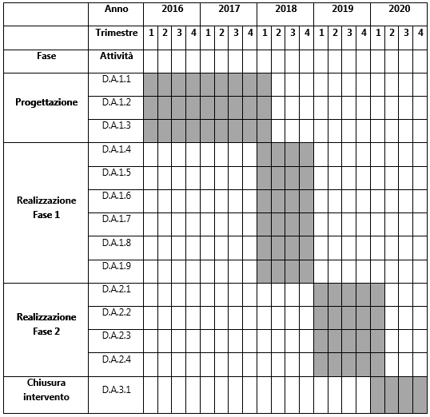

.. _h6f247b59443754784a771e1c2073615e:

PA1.1.1.d – Piattaforma ICT “Lavoro e Formazione”
#################################################

\ |STYLE0|\ 

+--------------------------+--------------------------------------------------------+
|Codice progetto           |\ |STYLE1|\                                             |
+--------------------------+--------------------------------------------------------+
|\ |STYLE2|\               |\ |STYLE3|\                                             |
+--------------------------+--------------------------------------------------------+
|\ |STYLE4|\  (se presente)|D71H17000040007                                         |
+--------------------------+--------------------------------------------------------+
|\ |STYLE5|\               |\ |STYLE6|\                                             |
+--------------------------+--------------------------------------------------------+
|\ |STYLE7|\               |\ |STYLE8|\                                             |
+--------------------------+--------------------------------------------------------+
|\ |STYLE9|\               |Comune di Palermo – C.F. 80016350821                    |
+--------------------------+--------------------------------------------------------+
|\ |STYLE10|\              |Dott. Giuseppe Meli (Comune di Palermo)                 |
+--------------------------+--------------------------------------------------------+
|                          |g.meli@comune.palermo.it, +091.7407640                  |
+--------------------------+--------------------------------------------------------+
|\ |STYLE11|\              |SISPI - Sistema Palermo Informatica (“in house”)        |
+--------------------------+--------------------------------------------------------+
|                          |Salvatore Morreale, s.morreale@sispi.it, +39 091 6319811|
+--------------------------+--------------------------------------------------------+

.. _h34647264e475a4b2b6b3d4e636d383b:

Descrizione del progetto 
*************************

.. _h6e6359221a5a3c7d4e35346c6c471978:

Obiettivi e ricadute del progetto
=================================

Gli \ |STYLE12|\  che si prefigge di raggiungere la Piattaforma ICT “\ |STYLE13|\ ” sono molteplici e di seguito schematicamente rappresentati:

* \ |STYLE14|\ , d’intesa anche con le diverse associazioni di categoria, in grado di dare visibilità alle aziende stesse attraverso la possibilità di indirizzare molteplici dimensioni di ricerca e navigazione dei dati avvalendosi anche di un supporto cartografico utile alla realizzazione di una mappa dei fabbisogni di filiera;

* \ |STYLE15|\  in grado di proporre degli abbinamenti tra richieste di profili professionali e offerta;

* \ |STYLE16|\ 

* \ |STYLE17|\  erogati sul territorio o presenti sulla piattaforma;

* \ |STYLE18|\ , con particolare riferimento agli aspetti legati agli \ |STYLE19|\  professionali;

*  \ |STYLE20|\ , in grado di erogare corsi in modalità e-learning e di capitalizzare gli investimenti in formazione degli Enti e/o delle Aziende di Formazione, consentendo la fruizione dei corsi anche da parte di soggetti ubicati geograficamente in luoghi remoti rispetto al territorio della Città o dell’area metropolitana;

* stretta \ |STYLE21|\  al        fine di consentire interventi mirati volti a ridurre il disagio sociale.

Le \ |STYLE22|\  attese della Piattaforma attengono prevalentemente alla implementazione di una molteplicità di strumenti che concorrono a creare un vero e proprio ecosistema applicativo volto a supportare le politiche attive per il lavoro e quelle per la formazione, due facce di un’unica medaglia che si compendiano vicendevolmente. In particolare, la Piattaforma ICT “Lavoro e Formazione” mira ad avviare il percorso che porterà alla creazione del Fascicolo Digitale del Cittadino, passando attraverso l’implementazione del Fascicolo Elettronico del Lavoratore e del Portale delle Aziende. Per quanto attiene gli aspetti formativi, la Piattaforma implementerà il Portale della Formazione.

.. _h5b383b4c5047625c7f4257e7d4d123d:

Beneficiari
===========

I beneficiari della presente piattaforma sono principalmente i cittadini sebbene, considerata la natura del tema che la Piattaforma si prefigge di supportare, per potere raggiungere efficacemente gli obiettivi prefissati, si necessita di un coinvolgimento esteso di molteplici attori di seguito menzionati i quali, a loro volta, trarranno beneficio dai servizi erogati dalla Piattaforma stessa:

* le \ |STYLE23|\ , che possono utilizzare la piattaforma come strumento al quale attingere per la raccolta di dati aggiornati e circostanziati sui quali basare le politiche di sviluppo e di supporto del mercato del lavoro nonché quelle di formazione;

* le \ |STYLE24|\ , che possono vedere nella piattaforma un valido strumento per incrociare le proprie esigenze con l’offerta di competenze presente sul mercato;

* le \ |STYLE25|\  ma interessate ad insediarsi, che possono utilizzare la piattaforma come valido strumento a supporto del reclutamento delle professionalità richieste;

* le \ |STYLE26|\ , che possono utilizzare la piattaforma come vetrina per i propri prodotti formativi, indirizzando in modo particolare quegli ambiti tematici dei quali esiste un’evidente richiesta da parte del mercato;

* i \ |STYLE27|\ , che possono trovare nella piattaforma un valido riferimento al quale rivolgersi per individuare le opportunità lavorative offerte dal territorio oltre ad uno strumento per avviare dei percorsi formativi mirati dei quali esiste un’evidenza di richiesta da parte del mercato;

* i \ |STYLE28|\  e le \ |STYLE29|\ , che possono utilizzare la piattaforma come strumento di la riqualificazione o valido supporto per la formazione continua (life-long learning).

La Piattaforma è pertanto prevalentemente orientata a supportare i cittadini nella ricerca di opportunità occupazionali che, in coerenza con quanto previsto dagli orientamenti nazionali in materia di politiche attive per il lavoro, può essere compiutamente implementata attraverso il coinvolgimento di tutti gli attori (Pubbliche Amministrazioni e aziende in primis), attraverso uno stretto coordinamento con le politiche formative, queste ultime intese prevalentemente in una logica di formazione continua.

.. _h637d2d14366527a111435544b537a18:

Coerenza con la programmazione nazionale/regionale e con gli strumenti di pianificazione previsti per il livello comunale
=========================================================================================================================

\ |STYLE30|\  sono presenti molteplici elementi di sinergia con il PON “Governance e Capacità Istituzionali” FESR e FSE, il Programma Nazionale per la Cultura, Formazione e le Competenze Digitali, il PON “Per la Scuola – competenze e ambienti per l’apprendimento” FESR e FSE, il PON “Sistemi di Politiche Attive per l’Occupazione” FSE, il PON “Inclusione” FSE, il PON “Iniziativa Occupazione Giovani” FSE e con l’Agenda Digitale del FESR.

\ |STYLE31|\  è presente una forte sinergia con gli interventi previsti dal PO FESR Regionale.

\ |STYLE32|\  la presente proposta presenta molteplici elementi di sinergia con quanto previsto dal progetto “\ |STYLE33|\ ” di cui alla delibera di Giunta Municipale n. 56 del 05/04/2016.

.. _h112b357f132f3b762c72584697933:

Coerenza con il Programma, i criteri di selezione degli interventi e la strategia d’Asse
========================================================================================

\ |STYLE34|\  la Piattaforma ICT “\ |STYLE35|\ ” è coerente con quanto previsto dal Programma Operativo che sostiene la realizzazione di iniziative coerenti con l’Agenda Digitale attraverso l’acquisizione e messa in esercizio di sistemi tecnologici e gestionali nell’Area Tematica Lavoro e Formazione.

\ |STYLE36|\  la Piattaforma risponde ai criteri di selezione previsti dal programma in quanto prevede lo sviluppo e il rinnovamento di servizi digitali dedicati alla creazione di un’anagrafe delle aziende e dei corsi di formazione nonché alla messa in rete e integrazione dei servizi offerti dai Centri per l’Impiego e dalle Agenzie per il Lavoro.

\ |STYLE37|\  dal punto di vista strategico, la Piattaforma prevede lo sviluppo di servizi on-line dedicati all’incontro domanda-offerta di lavoro nonché allo sviluppo di un portale della formazione.

.. _h643e4c470556f2a11587657e23160:

Collegamento e sinergia con altre azioni del PON Metro (azioni integrate)
=========================================================================

I collegamenti e le sinergie con altre azioni del PON Metro sono molteplici, anche in ragione dell’approccio sistemico adottato nella implementazione dalla più complessiva piattaforma di Agenda Digitale del PON Metro Palermo.

Per quanto attiene nello specifico la Piattaforma ICT “\ |STYLE38|\ ”, notevoli sono le sinergie con le Piattaforme “\ |STYLE39|\ ” e “\ |STYLE40|\ ” dovute non solo alla condivisione delle componenti tecnologiche abilitanti le singole piattaforme (strato di \ |STYLE41|\ , piattaforma di gestione documentale e \ |STYLE42|\ , \ |STYLE43|\ , piattaforma di georeferenziazione, etc.) ma anche a uno stretto coordinamento dei formati e modelli dei dati gestiti dalle singole piattaforme al fine di supportare una “naturale” interoperabilità tra le piattaforme.

Gli interventi legati a lenire il disagio sociale trovano altresì molteplici ragioni di collegamento e sinergia con gli interventi previsti negli Assi 3 e 4 del PON Metro Palermo.

.. _h165fd805c1c30506f6e24534074f9:

Descrizione dei contenuti progettuali
=====================================

La Piattaforma ICT “\ |STYLE44|\ ” indirizza due tematiche strettamente collegate l’una all’altra: il lavoro e la formazione appunto. Analogamente alla Piattaforma “\ |STYLE45|\ ”, la Piattaforma “\ |STYLE46|\ ” è rivolta all’intero spettro di soggetti coinvolti dal PON Metro Palermo: cittadini, aziende e istituzioni.

Sebbene le componenti Lavoro e Formazione siano strettamente collegate l’una all’altra, nell’implementazione della piattaforma si presterà specifica attenzione alle peculiarità di ciascuna di esse. In particolare:

* la componente “\ |STYLE47|\ ” della piattaforma sarà prevalentemente rivolta a cercare di coniugare la richiesta di lavoro, anche riferita a profili con alta qualificazione professionale e pertanto talvolta di difficile reperimento, con l’offerta. Particolare attenzione verrà posta alla implementazione di alcune componenti funzionali e applicative di seguito rappresentate:

    * \ |STYLE48|\ : i cittadini saranno censiti attraverso una pluralità di strumenti tra i quali le tradizionali anagrafi (residenziali, elettorali, fiscali, ANPR, etc), il Fascicolo Sanitario Elettronico (FSE), il Fascicolo del Dipendente, il Fascicolo Elettronico dello Studente, il Fascicolo Previdenziale, il Fascicolo delle Pratiche Edilizie etc. Al fine di rendere più efficiente l’intero sistema, dispiegando compiutamente le potenzialità dei moderni sistemi tecnologici, pur nel pieno rispetto della riservatezza dei dati personali e di quelli sensibili e del corretto trattamento dei dati, si avvierà la realizzazione del FDC partendo dalla realizzazione di un sistema di interoperabilità tra gli altri sistemi attualmente presenti secondo l’approccio federativo previsto dalle Linee Guida per la realizzazione del FSE. In particolare, il FDC potrà contenere informazioni inerenti i CV dei cittadini, i propri \ |STYLE49|\  professionali, i titoli di studio posseduti, i propri desiderata lavorativi, consentendo così al FDC di diventare una sorta di evoluzione di piattaforme quali LinkedIn in chiave istituzionale, a servizio del cittadino e delle istituzioni; 

    * \ |STYLE50|\ : nell’ambito del suddetto FDC, particolare rilievo avrà la realizzazione, in stretto raccordo con l’ANPAL (Agenzia Nazionale per le Politiche Attive del Lavoro) della piattaforma di supporto al FEL. Si tratta di uno strumento di particolare rilievo, previsto dal D. Lgs. 150/2015, volto a supportare le politiche attive per il lavoro e a superare gli elementi di criticità, di recente ravvisati dall’ISTAT nel suo Rapporto Annuale 2014, circa l’efficacia dell’azione dei Centri per l’Impiego e delle Agenzie per il Lavoro, che pure verranno raccordate dallo strumento proposto. Il FEL, oltre a contenere i dati tradizionalmente previsti e, in alcuni casi, obbligatori (assunzione, trasformazione e cessazione del rapporto di lavoro, ammortizzatori sociali, etc.), potrà essere collegato, tramite il FDC, alle altre informazioni riferite al cittadino, in particolare quelle legate agli aspetti formativi. È inoltre prevista l’integrazione con le banche dati dell’INPS;

\ |STYLE51|\ : si tratta di uno strumento cardine della piattaforma, in grado di fornire non solo una vetrina per le aziende ma anche uno strumento a supporto dell’incontro tra domanda e offerta, non solo in ambito lavorativo. 

* Tale strumento sarà sviluppato d’intesa con le singole aziende, in collaborazione con la Camera di Commercio e con le diverse associazioni di categoria e dovrà contenere, oltre ai tradizionali dati anagrafici (partita IVA, ragione sociale, codici ATECO, indicazione del Rappresentante Legale, etc), anche informazioni inerenti i prodotti commercializzati, l’articolazione aziendale e della forza lavoro, i progetti di sviluppo (inclusi progetti Comunitari, Nazionali e Regionali) in essere per i quali si richiedono specifiche collaborazioni/competenze e quindi le specifiche richieste lavorative. Appare, infatti, rilevante collocare le richieste lavorative delle aziende all’interno di un quadro d’insieme ben più articolato, in grado non solo di dare evidenza della particolare richiesta, contestualizzandola all’interno del contesto d’insieme nel quale matura, ma anche di consentire la possibilità di una visione d’insieme delle esigenze formative, anche in chiave storica, da raccordare, tra gli altri, con la strategia formativa. Il portale risulterà interoperabile anche con l’attuale piattaforma Super@, in esercizio presso lo sportello SUAP del Comune di Palermo, e supporterà l’elaborazione di analisi dei dati a beneficio delle diverse esigenze informative dell’Amministrazione. Specifica attenzione verrà altresì riservata all’interoperabilità con le banche dati gestite dai Sistemi Camerali (Anagrafe del Registro Imprese). Per quanto attiene la parte di incontro domanda/offerta, prevista all’interno del Portale delle Aziende, sarà implementata una sezione apposita per favorire la capacità di aggregazione tra imprese per reti formali e non formali a supporto dello sviluppo economico del territorio. Specifica attenzione sarà riservata all’implementazione di una sezione dedicata a supportare un sistema di Alternanza scuola-lavoro per l’intera città metropolitana; 

* la componente “\ |STYLE52|\ ” della piattaforma sarà incentrata sulle tematiche della formazione intese sia come elementi a se stanti sia come strumenti di supporto alle politiche attive per il lavoro. Analogamente a quanto previsto per il Lavoro, la piattaforma Formazione si articolerà in diverse componenti di seguito descritte:

    * \ |STYLE53|\ : vuole essere lo strumento attraverso il quale garantire una visione complessiva o coordinare le attività formative rivolte ai cittadini e ai lavoratori. Il Portale, infatti, svolgerà non solo il compito di anagrafe dei corsi formazione, erogati da enti e aziende di ogni ordine e grado, ma anche di vero e proprio strumento per la fruizione dei corsi, in aggiunta o in affiancamento a quelli singolarmente gestisti dai singolo soggetti erogatori di formazione. Questo consentirà al Portale di assolvere a molteplici funzioni: 

        * diventare un elemento di raccordo e di standardizzazione delle modalità di fruizione dei contenuti e delle interfacce formative: si tratta di un elemento di particolare rilievo, strumentale alla creazione di una vera e propria piattaforma MOOC (Massive Open Online Courses) territoriale, in grado di ▪          rendere maggiormente fruibili i contenuti formativi elaborati dai soggetti preposti e di standardizzarne e quindi agevolarne la fruizione da parte degli utenti; 

        * fornire uno strumento di marketing alle aziende locali: l’aggregazione e standardizzazione dei contenuti formativi e delle interfacce diventa un formidabile strumento istituzionale per dare visibilità ad una offerta formativa erogata dalle aziende e dagli enti presenti sul territorio in grado di valicare i confini geografici locali, consentendo altresì ai soggetti locali di concentrarsi sui contenuti formativi piuttosto che sulla piattaforma, in linea con quanto realizzato da \ |STYLE54|\ , \ |STYLE55|\  o \ |STYLE56|\ .

Tale Portale, congiuntamente con i contenuti formativi veicolati attraverso esso, rappresenterà uno strumento di particolare valore non solo per indirizzare la formazione tradizionale ma anche come strumento di supporto alla formazione continua (\ |STYLE57|\ ) che sempre più ricopre un ruolo rilevante nell’ambito lavorativo, consentendo ai cittadini/lavoratori di potersi aggiornare di continuo per restare al passo con le richieste e le esigenze professionali del mondo del lavoro;

* \ |STYLE58|\  il Portale della Formazione sarà integrato con il Portale della Conoscenza, trasversale anche alle altre Piattaforme “Cultura e Tempo Libero” e “Ambiente e Territorio”, fornendo ad esso gli strumenti base per l’erogazione dei contenuti.

Il Portale della Formazione assicurerà l’interoperabilità con piattaforme di incontro domanda/offerta di lavoro e di attivazione di strumenti che favoriscono l’inserimento lavorativo, quali “\ |STYLE59|\  e similari. Con riferimento alle recenti applicazioni normative regionali sarà realizzato un collegamento con il repertorio delle qualificazioni regionali, il sistema dell’apprendistato e il sistema regionale di accreditamento dei CFP. Il Portale della Formazione, analogamente al Portale del Lavoro, supporterà un sistema di Alternanza scuola-lavoro per l’intera città metropolitana.

Appare opportuno precisare in questa sede che l’elaborazione dei contenuti formativi non è in alcun modo obiettivo o oggetto del presente intervento, lo stesso limitandosi a implementare l’infrastruttura di raccordo tra domanda di lavoro e offerta nonché di sostegno per le politiche attive; a tale riguardo il Portale della Formazione rappresenta un valido strumento abilitante, ancor prima del suo popolamento di contenuti.

Analogamente a quanto accade con le altre Piattaforme, quella presente sarà concepita aderente ai paradigmi del \ |STYLE60|\ , consentendole di erogare i servizi all’intero territorio metropolitano, pur rimanendo aderenti a una cornice d’insieme unitaria e standard che rappresenta la cifra in grado di fornire un ulteriore valore aggiunto alla piattaforma stessa.

.. _h433ac47c5d441b546c7b551f24b2d:

Articolazione temporale delle attività progettuali
==================================================

Lo sviluppo temporale della Piattaforma ICT “\ |STYLE61|\ ”, analogamente a quanto previsto per altre Piattaforme, si articola in due Fasi. Ciò è reso necessario dalla molteplicità di piattaforme tecnologiche coinvolte nella realizzazione della Piattaforma in questione combinata con la complessità e con l’elevato livello di innovatività delle stesse che comporta la difficoltà di reperire sul mercato prodotti chiavi-in-mano pronti a soddisfare i requisiti progettuali richiesti.

* \ |STYLE62|\  questa prima fase è dedicata allo studio e implementazione di una prima soluzione prototipale della piattaforma con specifico riferimento al Fascicolo Elettronico del Lavoratore, al Portale delle Aziende, al Portale della Formazione e a quello della Conoscenza. Tale Fase è previsto che duri fino al 31/12/2018;

* \ |STYLE63|\  in questa seconda Fase si procederà al consolidamento delle componenti sviluppate nella prima Fase, alla implementazione del Fascicolo Digitale del Cittadino, al popolamento delle diverse piattaforme e Portali nonché allo sviluppo degli strumenti di interfaccia con il cittadino, le aziende e le istituzioni presenti sul territorio del Comune di Palermo e dei Comuni di area metropolitana coinvolti. Tale Fase prenderà avvio il 01/01/2019 per terminare il 31/12/2020.

.. _h2a27307412b1b6951405f6d2b1fb6e:

Sostenibilità economica e gestionale e governance del progetto
==============================================================

La \ |STYLE64|\  della Piattaforma ICT “\ |STYLE65|\ ”, analogamente a quanto accade con le altre Piattaforme, è garantita da una strategia articolata, basata sulla modularità e sul livello dei servizi erogati. In particolare:

* i costi di sviluppo della Piattaforma e dei servizi base sono interamente coperti dalle risorse del presente progetto; 

* l’erogazione dei servizi base, quelli cioè prevalentemente attinenti alle funzionalità base del Fascicolo Digitale del Cittadino, del Fascicolo Elettronico del Lavoratore, del Portale delle Aziende, del Portale della Formazione e del Portale della Conoscenza, terminato il progetto e quindi a partire dal 2011, saranno erogati dalla società \ |STYLE66|\  Sispi previa copertura dei costi vivi di gestione in esercizio dei servizi stessi; 

* lo sviluppo e l’erogazione di nuovi servizi (supporto allo sviluppo dei corsi, attivazione di specifici servizi formativi o di \ |STYLE67|\  per le aziende, erogazione di servizi in Alta Affidabilità, etc.) sarà governata dalla stipula di appositi accordi onerosi negoziati dai singoli committenti con la società \ |STYLE68|\  Sispi del Comune di Palermo cui è affidato lo sviluppo e la gestione in esercizio della piattaforma e dei servizi dalla stessa erogati.

I \ |STYLE69|\  per il Comune di Palermo e per i Comuni di area metropolitana, associati all’adozione della presente Piattaforma, saranno considerevolmente inferiori rispetto a quelli medi di mercato dal momento che le componenti architetturali sulle quali si fonda la Piattaforma stessa sono parte di un ecosistema che consente di ottimizzare l’impiego delle risorse, riducendone altresì il costo. L’alta \ |STYLE70|\  della Piattaforma, consentita dall’adozione diffusa di tecnologia \ |STYLE71|\ , dallo sviluppo di applicativi \ |STYLE72|\ -ready e dalla condivisione delle componenti infrastrutturali con le altre Piattaforme di progetto, è garanzia di riduzione dei costi di gestione e di esercizio all’aumentare del numero di Amministrazioni che intenderanno avvalersi del servizio.

La \ |STYLE73|\  della Piattaforma sarà garantita dalla società \ |STYLE74|\  Sispi del Comune di Palermo la quale gestirà la Piattaforma inserendola in modo organico, sin dalla sua progettazione e sviluppo, all’interno del parco applicativo dalla stessa gestito.

La \ |STYLE75|\  sarà gestita dall’Autorità Urbana del Comune di Palermo, di concerto con la società \ |STYLE76|\  Sispi e con i diversi Comuni di area metropolitana coinvolti nel progetto stesso.

Lo sviluppo e l’erogazione di nuovi servizi (supporto allo sviluppo dei corsi, attivazione di specifici servizi formativi o di \ |STYLE77|\  per le aziende, erogazioni di servizi in alta affidabilità etc.) per quanto attiene funzionalità non comprese nella fase di progettazione esecutiva del portale, saranno oggetto di apposita co-progettazione partecipata con le strutture utilizzatrici finali dell’Amministrazione della città metropolitana (e nello specifico l’Assessorato Comunale alle Attività Produttive) alle quali delegare la gestione dei servizi finali attivati, con l’eventuale coinvolgimento di società interamente partecipate dal Comune di Palermo, assoggettate a controllo analogo ai sensi della normativa comunitaria e nazionale e nel rispetto della legislazione sugli aiuti di Stato.

.. _h504b405a2d6c6a2a924465c1d696631:

Elementi tecnologici
====================

La Piattaforma ICT “\ |STYLE78|\ ” poggia su diversi componenti tecnologici, alcuni dei quali in comune con le altre Piattaforme di progetto. Di seguito si riportano i riferimenti ai principali elementi tecnologici impiegati e utilizzati dalla presente Piattaforma:

        ●        \ |STYLE79|\  si tratta della piattaforma computazionale di base, in grado non solo di fornire il supporto computazionale alla Piattaforma ma anche di renderla scalabile in termini di risorse disponibili e abilitare la replicabilità della stessa, in modo personalizzato, ai Comuni di area metropolitana coinvolti nel progetto. Sulla piattaforma di \ |STYLE80|\  insistono buona parte delle componenti middleware utilizzate e di seguito descritte. Condivisa con altre Piattaforme di progetto;

        ●        \ |STYLE81|\  fornisce gli strumenti per la georeferenziazione delle informazioni e la geolocalizzazione di eventi, oggetti e individui. Condivisa con altre Piattaforme di progetto;

        ●        \ |STYLE82|\  fornisce il supporto alla gestione dei documenti e delle informazioni, prevalentemente a supporto del Portale della Conoscenza. Condivisa con altre Piattaforme di progetto;

        ●        \ |STYLE83|\  fornisce il supporto alla gestione per processi di tutta la componente di \ |STYLE84|\ . Condivisa con altre Piattaforme di progetto;

        ●        \ |STYLE85|\  la Piattaforma \ |STYLE86|\  (\ |STYLE87|\ ) ricopre un ruolo cruciale nell’analisi dei feedback e delle esigenze degli utenti della piattaforma, finalizzata alla valorizzazione della \ |STYLE88|\  manifestata dagli utenti stessi e all’ottimale soddisfacimento delle loro esigenze. Condivisa con altre Piattaforme di progetto;

        ●        \ |STYLE89|\  rappresenta l’elemento collante, di interoperabilità tra le diverse Piattaforme infrastrutturali, in grado altresì di standardizzare i dati per una loro esposizione ad altre applicazioni e piattaforme tematiche. Condivisa con altre Piattaforme di progetto;

        ●        \ |STYLE90|\  fornirà gli strumenti base di autenticazione degli utenti alla piattaforma, siano essi cittadini, operatori delle istituzioni o aziende. Condivisa con altre Piattaforme di progetto.

Particolare enfasi verrà posta nello sviluppo del Portale della Formazione, del Fascicolo Elettronico del Lavoratore nonché del Portale delle Aziende, fruibile sia come Web Applications basate sulla tecnologia SOA sia come \ |STYLE91|\  disponibili per le principali piattaforme (iOS, Android, Windows). I servizi saranno fruibili online tramite interfacce basate su grafica personalizzabile tramite CSS, erogabili anche tramite \ |STYLE92|\ .

L’adozione nativa del paradigma del \ |STYLE93|\  nonché l’utilizzo di componenti middleware condivisi con le altre Piattaforme, garantisce una naturale \ |STYLE94|\  in termini sia di front-office si di \ |STYLE95|\ . Per quanto concerne le funzionalità di \ |STYLE96|\ , queste potranno essere raggruppate in due categorie:

        ●        quelle di \ |STYLE97|\ , legate alla gestione delle funzionalità di base degli applicativi e delle componenti infrastrutturali, in capo alla società \ |STYLE98|\  Sispi del Comune di Palermo che se ne farà garante per l’intera Piattaforma e per tutti gli utenti;

        ●        quelle di \ |STYLE99|\ , legate alla personalizzazione dei servizi da parte delle singole Amministrazioni/utenti, in capo ai singoli presidii delle rispettive Amministrazioni/utenti.

Relativamente all’\ |STYLE100|\ , si prevede che il servizio sarà aperto e disponibile alle aziende di almeno 7 Comuni entro il 31/12/2019 e ad almeno 42 Comuni entro il 31/12/2023.

Relativamente all’\ |STYLE101|\ , si prevede che il servizio sarà aperto e disponibile agli operatori del settore e all’intera popolazione residente di almeno 4 Comuni entro il 31/12/2019 e ad almeno 42 Comuni entro il 31/12/2023.

Relativamente alla \ |STYLE102|\ , si prevede che il servizio sarà aperto e disponibile agli operatori e all’intera popolazione residente di almeno 4 Comuni entro il 31/12/2019 e ad almeno 42 Comuni entro il 31/12/2023.

.. _h40575ce71476d3a3d4a6627c37193d:

Area territoriale di intervento
===============================

L’ambito territoriale di intervento della Piattaforma ICT “\ |STYLE103|\ ” è rappresentato, in primo luogo, dal Comune di Palermo nonché dai Comuni di area metropolitana coinvolti nel progetto. Considerata la natura dei servizi sviluppati, sintetizzabile nella messa a punto di un Portale delle Aziende, di un Portale della Formazione e di un Portale della Conoscenza, nonché la modalità di erogazione dei servizi in \ |STYLE104|\  (in grado pertanto di garantire un’ampia scalabilità dei servizi erogati), è possibile immaginare l’estensione della Piattaforma ad un ambito territoriale molto più vasto, potendo pensare di candidarla a diventare il Portale delle Aziende e della Formazione per l’intera Regione Sicilia.

.. _h6a4330416f555f6b102d6e6d75573c16:

Risultato atteso - Indicatori di Output
=======================================

+-----------------------------+----------------------------------------------------------+-----------+-----------+
|Descrizione indicatore output|Descrizione indicatore output                             |Target 2018|Target 2023|
+=============================+==========================================================+===========+===========+
|IO01                         |Numero di comuni associati a sistemi informativi integrati|0          |7          |
+-----------------------------+----------------------------------------------------------+-----------+-----------+

.. _h271f768271872255d2f7d182d767d38:

Data inizio / fine 
===================

01/2016 – 12/2020

.. _h4268225104312295833593b4d173410:

Fonti di finanziamento
======================

+----------------------------+--------------+
|Risorse PON METRO           |\ |STYLE105|\ |
+----------------------------+--------------+
|\ |STYLE106|\  (se presenti)|\ |STYLE107|\ |
+----------------------------+--------------+
|\ |STYLE108|\  (se presenti)|\ |STYLE109|\ |
+----------------------------+--------------+
|\ |STYLE110|\               |\ |STYLE111|\ |
+----------------------------+--------------+

.. _h131c113c45802457634c7e701a6b5f59:

Cronoprogramma attività
=======================

\ |IMG1|\ 

.. _h2626a662a6b113685261702b40722c:

Cronoprogramma finanziario
==========================

+--------------+--------------+
|\ |STYLE112|\ |€ 0,00        |
+--------------+--------------+
|\ |STYLE113|\ |€ 0,00        |
+--------------+--------------+
|\ |STYLE114|\ |€ 0,00        |
+--------------+--------------+
|\ |STYLE115|\ | € 397.785,00 |
+--------------+--------------+
|\ |STYLE116|\ |€ 485.428,00  |
+--------------+--------------+
|\ |STYLE117|\ |€ 821.787,00  |
+--------------+--------------+
|\ |STYLE118|\ |\ |STYLE119|\ |
+--------------+--------------+

.. bottom of content

.. |STYLE0| replace:: **Anagrafica progetto**

.. |STYLE1| replace:: *PA1.1.1.d*

.. |STYLE2| replace:: **Titolo progetto**

.. |STYLE3| replace:: *Piattaforma ICT “Lavoro e Formazione”*

.. |STYLE4| replace:: **CUP**

.. |STYLE5| replace:: **Modalità di attuazione**

.. |STYLE6| replace:: *A titolarità*

.. |STYLE7| replace:: **Tipologia di operazione**

.. |STYLE8| replace:: *Acquisto e realizzazione di servizi*

.. |STYLE9| replace:: **Beneficiario**

.. |STYLE10| replace:: **Responsabile Unico del Procedimento**

.. |STYLE11| replace:: **Soggetto attuatore**

.. |STYLE12| replace:: **obiettivi**

.. |STYLE13| replace:: *Lavoro e Formazione*

.. |STYLE14| replace:: **creazione di un’Anagrafe delle Aziende**

.. |STYLE15| replace:: **creazione di una Borsa del Lavoro**

.. |STYLE16| replace:: **coordinamento tra Centro per l’Impiego, Agenzie per il Lavoro e Associazioni di Categoria;**

.. |STYLE17| replace:: **creazione di un’Anagrafe dei Corsi di Formazione**

.. |STYLE18| replace:: **implementazione del Fascicolo Elettronico del Lavoratore**

.. |STYLE19| replace:: *skill*

.. |STYLE20| replace:: **implementazione di una piattaforma per la formazione a distanza**

.. |STYLE21| replace:: **integrazione con la Piattaforma ICT “Assistenza e Sostegno Sociale”**

.. |STYLE22| replace:: **ricadute**

.. |STYLE23| replace:: **Pubbliche Amministrazioni**

.. |STYLE24| replace:: **aziende presenti sul territorio**

.. |STYLE25| replace:: **aziende non ancora presenti sul territorio**

.. |STYLE26| replace:: **aziende che si occupano specificamente di formazione**

.. |STYLE27| replace:: **cittadini**

.. |STYLE28| replace:: **lavoratori**

.. |STYLE29| replace:: **aziende**

.. |STYLE30| replace:: **Programmazione Nazionale:**

.. |STYLE31| replace:: **Programmazione Regionale:**

.. |STYLE32| replace:: **Pianificazione Comunale:**

.. |STYLE33| replace:: *Verso Palermo Città Metropolitana – Piano Sociale, prospettive di sviluppo sociale, economico e culturale della città e del suo territorio*

.. |STYLE34| replace:: **Coerenza con il Programma:**

.. |STYLE35| replace:: *Lavoro e Formazione*

.. |STYLE36| replace:: **Criteri di selezione:**

.. |STYLE37| replace:: **Strategia di Asse:**

.. |STYLE38| replace:: *Lavoro e Formazione*

.. |STYLE39| replace:: *Cultura e Tempo Libero*

.. |STYLE40| replace:: *Ambiente e Territorio*

.. |STYLE41| replace:: *Cloud Computing*

.. |STYLE42| replace:: *CRM*

.. |STYLE43| replace:: *DataWareHouse*

.. |STYLE44| replace:: *Lavoro e Formazione*

.. |STYLE45| replace:: *Cultura e Tempo Libero*

.. |STYLE46| replace:: *Lavoro e Formazione*

.. |STYLE47| replace:: **Lavoro**

.. |STYLE48| replace:: **evoluzione degli strumenti di anagrafe del cittadino verso il Fascicolo Digitale del Cittadino (FDC)**

.. |STYLE49| replace:: *skill*

.. |STYLE50| replace:: **Fascicolo Elettronico del Lavoratore (FEL)**

.. |STYLE51| replace:: **Portale delle aziende**

.. |STYLE52| replace:: **Formazione**

.. |STYLE53| replace:: **Portale della Formazione**

.. |STYLE54| replace:: *Coursera*

.. |STYLE55| replace:: *edX*

.. |STYLE56| replace:: *Udacity*

.. |STYLE57| replace:: *life-long learning*

.. |STYLE58| replace:: **collegamento con il Portale della Conoscenza:**

.. |STYLE59| replace:: *Clic Lavoro”*

.. |STYLE60| replace:: *Cloud Computing*

.. |STYLE61| replace:: *Lavoro e Formazione*

.. |STYLE62| replace:: **Fase 1 – realizzazione di un’infrastruttura iniziale e rilascio dei primi servizi:**

.. |STYLE63| replace:: **Fase 2 – implementazione della Piattaforma completa:**

.. |STYLE64| replace:: **sostenibilità economica**

.. |STYLE65| replace:: *Lavoro e Formazione*

.. |STYLE66| replace:: *in-house*

.. |STYLE67| replace:: *recruitment*

.. |STYLE68| replace:: *in-house*

.. |STYLE69| replace:: **costi marginali**

.. |STYLE70| replace:: **scalabilità**

.. |STYLE71| replace:: *Cloud*

.. |STYLE72| replace:: *Cloud*

.. |STYLE73| replace:: **sostenibilità gestionale**

.. |STYLE74| replace:: *in-house*

.. |STYLE75| replace:: **governance del progetto**

.. |STYLE76| replace:: *in-house*

.. |STYLE77| replace:: *recruitment*

.. |STYLE78| replace:: *Lavoro e Formazione*

.. |STYLE79| replace:: **Infrastruttura computazionale diCloud Computing:**

.. |STYLE80| replace:: *Cloud Computing*

.. |STYLE81| replace:: **Piattaforma di georeferenziazione:**

.. |STYLE82| replace:: **Piattaforma di Gestione Documentale:**

.. |STYLE83| replace:: **Piattaforma di BPM:**

.. |STYLE84| replace:: *back-office*

.. |STYLE85| replace:: **Piattaforma CRM:**

.. |STYLE86| replace:: *CRM*

.. |STYLE87| replace:: *Customer Relashionship Management*

.. |STYLE88| replace:: *user experience*

.. |STYLE89| replace:: **Piattaforma ESB:**

.. |STYLE90| replace:: **Piattaforma SPID:**

.. |STYLE91| replace:: *Mobile Apps*

.. |STYLE92| replace:: *widget*

.. |STYLE93| replace:: *Cloud Computing*

.. |STYLE94| replace:: **scalabilità del servizio**

.. |STYLE95| replace:: *back-office*

.. |STYLE96| replace:: *back-office*

.. |STYLE97| replace:: **basso livello**

.. |STYLE98| replace:: *in-house*

.. |STYLE99| replace:: **alto livello**

.. |STYLE100| replace:: **Anagrafe delle Aziende**

.. |STYLE101| replace:: **Anagrafe dei Corsi di Formazione**

.. |STYLE102| replace:: **Piattaforma di Formazione a Distanza**

.. |STYLE103| replace:: *Lavoro e Formazione*

.. |STYLE104| replace:: *Cloud*

.. |STYLE105| replace:: *€ 1.705.000,00*

.. |STYLE106| replace:: **Altre risorse pubbliche**

.. |STYLE107| replace:: *€ 0,00*

.. |STYLE108| replace:: **Risorse private**

.. |STYLE109| replace:: *€ 0,00*

.. |STYLE110| replace:: **Costo totale**

.. |STYLE111| replace:: *€ 1.705.000,00*

.. |STYLE112| replace:: *2014/2015*

.. |STYLE113| replace:: *2016*

.. |STYLE114| replace:: *2017*

.. |STYLE115| replace:: *2018*

.. |STYLE116| replace:: *2019*

.. |STYLE117| replace:: *2020*

.. |STYLE118| replace:: **Totale**

.. |STYLE119| replace:: **€ 1.705.000,00**

