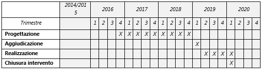

.. _h28f39b5943541166331cc3b132075:

PA2.2.1.e – Infrastruttura di bordo per il tracciamento in tempo reale della flotta autobus (AVM di bordo)
##########################################################################################################

+--------------------------+-------------------------------------------------------------------------------------------------------------------------------------------------------------+
|Codice progetto           |PA2.2.1.e                                                                                                                                                    |
+--------------------------+-------------------------------------------------------------------------------------------------------------------------------------------------------------+
|\ |STYLE0|\               |Realizzazione infrastruttura di bordo per il tracciamento in tempo reale della flotta autobus (AVM di bordo) e sensoristica ambientale IoT a bordo dei mezzi.|
+--------------------------+-------------------------------------------------------------------------------------------------------------------------------------------------------------+
|\ |STYLE1|\  (se presente)|                                                                                                                                                             |
+--------------------------+-------------------------------------------------------------------------------------------------------------------------------------------------------------+
|\ |STYLE2|\               |A titolarità                                                                                                                                                 |
+--------------------------+-------------------------------------------------------------------------------------------------------------------------------------------------------------+
|\ |STYLE3|\               |Acquisto beni                                                                                                                                                |
+--------------------------+-------------------------------------------------------------------------------------------------------------------------------------------------------------+
|\ |STYLE4|\               |Comune di Palermo, C.F.: 80016350821                                                                                                                         |
+--------------------------+-------------------------------------------------------------------------------------------------------------------------------------------------------------+
|\ |STYLE5|\               |Ing. Roberto Biondo                                                                                                                                          |
+--------------------------+-------------------------------------------------------------------------------------------------------------------------------------------------------------+
|                          |r.biondo@comune.palermo.it - 091/7401588                                                                                                                     |
+--------------------------+-------------------------------------------------------------------------------------------------------------------------------------------------------------+
|\ |STYLE6|\               |Comune di Palermo                                                                                                                                            |
+--------------------------+-------------------------------------------------------------------------------------------------------------------------------------------------------------+
|                          |pianotraffico@comune.palermo.it                                                                                                                              |
+--------------------------+-------------------------------------------------------------------------------------------------------------------------------------------------------------+

.. _h122e634036157b7d235c25455a5918:

Descrizione del progetto
========================

Il progetto si propone l’obiettivo di adeguare l’offerta di trasporto pubblico ad elevati standard tecnologici. I mezzi saranno dotati di sistemi di localizzazione (GPS) e di tecnologie per la comunicazione con la centrale di controllo e i livelli periferici (deposito, pannelli per l’infomobilità), in modo da consentire la piena integrazione all’interno dei sistemi ITS in coerenza con le indicazioni della Direttiva ITS Europea 2010/40/UE e del Piano d’Azione Nazionale sui Sistemi Intelligenti di Trasporto. La piattaforma di gestione e tracciamento in tempo reale della flotta autobus, acquisita con il progetto PA2.2.1.d, consisterà di una centrale di controllo mediante la quale sarà possibile monitorare il servizio di trasporto pubblico al fine di intervenire tempestivamente per risolverne eventuali criticità.

Le principali ricadute cui questo progetto intende contribuire riguardano l’aumento dei livelli di servizio in termini di qualità dello stesso, grazie allo sfruttamento delle informazioni e dei dati scaturenti dai sistemi ITS, di cui la flotta verrà dotata. I benefici derivanti dall’attuazione del progetto ricadranno sia sull’utenza sotto forma di informazioni puntuali e dettagliate, fornite per mezzo, Portale Web e Trip Planner, APP per smartphone, servizi SMS, messaggistica sui “Social Media”, piattaforme Open Data e pannelli per l’infomobilità, acquisiti nel contesto del progetto PA2.2.4.a “Pannelli per l’infomobilità in Hub strategici”; inoltre questo progetto tende a supportare il gestore nelle attività istituzionali, in quanto avrà le informazioni necessarie per effettuare attività di data analysis che consentiranno la pianificazione di un servizio più efficiente, attraverso la piattaforma realizzata con il progetto PA2.2.1.d “City Compass”. La piattaforma di gestione e tracciamento, di cui al presente progetto, è da considerare necessaria e abilitante per l’intero sistema.

Il progetto opera in sinergia con i seguenti altri progetti previsti nel PON METRO:

* \ |STYLE7|\ 

* \ |STYLE8|\ 

Al fine di realizzare una piattaforma perfettamente funzionale con tutti i requisiti della piattaforma “City Compass”, è prevista la progettazione congiunta tra gli interventi PA2.2.1.d, PA2.2.1.e e PA2.2.4.a. A tal fine si prevede di bandire un'unica gara, la quale prevederà la rendicontazione separata in relazione ai tre progetti del PON METRO. Inoltre, nell’acquisizione delle apparecchiature per l’intera flotta del TPL, è prevista l’acquisizione dei sistemi AVM di bordo da installare sui bus che saranno acquistati con gli interventi PA2.2.2.a (n. 10 bus 18 metri autosnodati), PA2.2.2.b (n. 23 bus 12 metri), entrambi del PON METRO, e PAC_PA_I.4.3 (n. 10 bus 18 metri autosnodati e n. 12 bus 12 metri) del Programma Operativo Complementare (POC) al PON METRO.

\ |STYLE9|\  a bordo dei mezzi TPL, integrati nel sistema di illuminazione pubblica, fisicamente integrati nel territorio. Tali sensori, gestiti in una logica propria dell’\ |STYLE10|\ , collegati tra loro e con il CED attraverso la rete Wi-Fi e l’anello telematico del Comune, rappresentano una vera e propria \ |STYLE11|\  che consentirà alla piattaforma di essere costantemente in contatto con il territorio, monitorandolo, analizzandolo e supportando gli interventi mirati per governarlo.

La sensoristica distribuita sul territorio, a bordo dei mezzi del TPL (originariamente inserita tra gli interventi dell’asse pa1.1.1.f), è inserita tra le spese di cui all’intervento in trattazione, con riserva di una possibile integrazione finanziaria.

L’intervento si inserisce nell’ambito della programmazione Comunale in tema di mobilità sostenibile prevista dal PAES con l’azione 2.4 \ |STYLE12|\  (pag. 114 e 115 del PAES Comune di Palermo Rev. Giugno 2013).

\ |STYLE13|\ 

\ |STYLE14|\ 

Totale mancanza di apparati di geolocalizzazione a bordo della flotta di TPL

\ |STYLE15|\ 

N. di apparati installati a bordo della flotta di TPL

\ |STYLE16|\ 

Aumento degli utilizzatori del servizio pubblico di linea

.. _h40575ce71476d3a3d4a6627c37193d:

Area territoriale di intervento
===============================

Comune capoluogo

.. _h6a4330416f555f6b102d6e6d75573c16:

Risultato atteso - Indicatori di Output
=======================================

+-----------------+-----------------------------+-----------+-----------+
|Indicatore output|Descrizione indicatore output|Target 2018|Target 2023|
+=================+=============================+===========+===========+
|IO05             |Unità di beni acquistati     |300        |300        |
|                 |                             |           |           |
|                 |(autobus)                    |           |           |
+-----------------+-----------------------------+-----------+-----------+

.. _h4268225104312295833593b4d173410:

Fonti di finanziamento
======================

+---------------------------+-------------+
|Risorse PON METRO          |\ |STYLE17|\ |
+---------------------------+-------------+
|\ |STYLE18|\  (se presenti)|\ |STYLE19|\ |
+---------------------------+-------------+
|\ |STYLE20|\  (se presenti)|\ |STYLE21|\ |
+---------------------------+-------------+
|\ |STYLE22|\               |\ |STYLE23|\ |
+---------------------------+-------------+

 

.. _h2c1d74277104e41780968148427e:

.. _h131c113c45802457634c7e701a6b5f59:

Cronoprogramma attività
=======================

\ |IMG1|\ 

.. _h2626a662a6b113685261702b40722c:

Cronoprogramma finanziario
==========================

+-------------+--------------+
|\ |STYLE24|\ |€ 0,00        |
+-------------+--------------+
|\ |STYLE25|\ |€ 0,00        |
+-------------+--------------+
|\ |STYLE26|\ |€ 0,00        |
+-------------+--------------+
|\ |STYLE27|\ |€ 0,00        |
+-------------+--------------+
|\ |STYLE28|\ |€ 2.000.000,00|
+-------------+--------------+
|\ |STYLE29|\ |€ 291.000,00  |
+-------------+--------------+
|\ |STYLE30|\ |\ |STYLE31|\  |
+-------------+--------------+

.. bottom of content

.. |STYLE0| replace:: **Titolo progetto**

.. |STYLE1| replace:: **CUP**

.. |STYLE2| replace:: **Modalità di attuazione**

.. |STYLE3| replace:: **Tipologia di operazione**

.. |STYLE4| replace:: **Beneficiario**

.. |STYLE5| replace:: **Responsabile Unico del Procedimento**

.. |STYLE6| replace:: **Soggetto attuatore**

.. |STYLE7| replace:: **PA2.2.1.d City Compass – Piattaforma di gestione e tracciamento in tempo reale flotta autobus e sistema integrato a servizio del cittadino per la previsione di arrivo dei mezzi di trasporto pubblico;**

.. |STYLE8| replace:: **PA2.2.4.a Acquisto pannelli per l’informazione dinamica sul TPL, disposti in hub strategici.**

.. |STYLE9| replace:: **Sensoristica distribuita sul territorio:**

.. |STYLE10| replace:: *Internet of Things (IOT)*

.. |STYLE11| replace:: **rete sensiente**

.. |STYLE12| replace:: *“Miglioramento ambientale della flotta per il trasporto pubblico e infrastrutture connesse”*

.. |STYLE13| replace:: *L’attuazione del progetto permetterà di costituire l’infrastruttura di tracciamento bus sull’intera flotta di autobus, al fine di ottenere i dati in tempo reale sul servizio espletato. Tale infrastruttura, necessaria e abilitante per il progetto PA2.2.1.d (City Compass), consentirà tra l’altro di offrire all’utente informazioni sul servizio in tempo reale ed al gestore di poter erogare il servizio secondo standard di maggiore efficienza.*

.. |STYLE14| replace:: **Indicatori di stato**

.. |STYLE15| replace:: **Indicatori di progetto**

.. |STYLE16| replace:: **Indicatori di risultato**

.. |STYLE17| replace:: *€ 2.291.000,00*

.. |STYLE18| replace:: **Altre risorse pubbliche**

.. |STYLE19| replace:: *€ 0,00*

.. |STYLE20| replace:: **Risorse private**

.. |STYLE21| replace:: *€ 0,00*

.. |STYLE22| replace:: **Costo totale**

.. |STYLE23| replace:: *€ 2.291.000,00*

.. |STYLE24| replace:: *2014/2015*

.. |STYLE25| replace:: *2016*

.. |STYLE26| replace:: *2017*

.. |STYLE27| replace:: *2018*

.. |STYLE28| replace:: *2019*

.. |STYLE29| replace:: *2020*

.. |STYLE30| replace:: **Totale**

.. |STYLE31| replace:: **€ 2.291.000,00**

