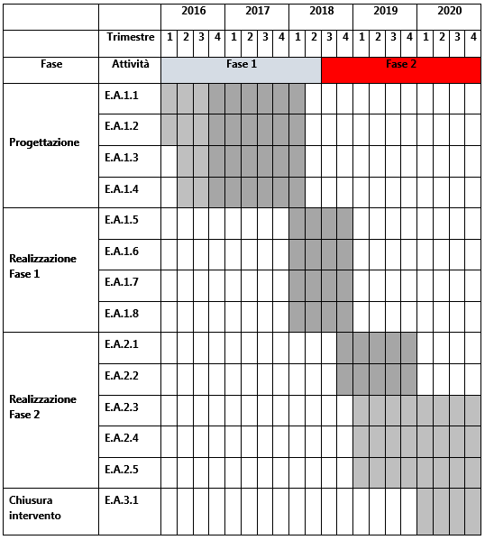

.. _h7f59c2816424078146831a3c232c29:

PA1.1.1.e – Piattaforma ICT “Tributi Locali”
############################################

+--------------------------+--------------------------------------------------------+
|Codice progetto           |\ |STYLE0|\                                             |
+--------------------------+--------------------------------------------------------+
|\ |STYLE1|\               |\ |STYLE2|\                                             |
+--------------------------+--------------------------------------------------------+
|\ |STYLE3|\  (se presente)|D71H17000000007                                         |
+--------------------------+--------------------------------------------------------+
|\ |STYLE4|\               |\ |STYLE5|\                                             |
+--------------------------+--------------------------------------------------------+
|\ |STYLE6|\               |\ |STYLE7|\                                             |
+--------------------------+--------------------------------------------------------+
|\ |STYLE8|\               |Comune di Palermo – C.F. 80016350821                    |
+--------------------------+--------------------------------------------------------+
|\ |STYLE9|\               |Dott.ssa Vincenza Simonte (Comune di Palermo)           |
+--------------------------+--------------------------------------------------------+
|                          |v.simonte@comune.palermo.it, +39 091 7406342/43         |
+--------------------------+--------------------------------------------------------+
|\ |STYLE10|\              |SISPI - Sistema Palermo Informatica (“in house”)        |
+--------------------------+--------------------------------------------------------+
|                          |Salvatore Morreale, s.morreale@sispi.it, +39 091 6319811|
+--------------------------+--------------------------------------------------------+

.. _h122e634036157b7d235c25455a5918:

Descrizione del progetto
************************

.. _h6e6359221a5a3c7d4e35346c6c471978:

Obiettivi e ricadute del progetto
=================================

La Piattaforma “\ |STYLE11|\ ” si prefigge l’obiettivo di migliorare la performance complessiva del sistema di imposizione, riscossione e controllo dei tributi locali attraverso un complesso di interventi mirati e convergenti verso un modello di gestione fortemente basato sulla digitalizzazione dei processi, l’integrazione back-end/front-end, la correlazione e la geolocalizzazione delle informazioni e l’attivazione di servizi di comunicazione/consultazione fruibili direttamente dagli utenti, anche interagendo con altri sistemi informativi e altre Piattaforme ICT previste dal PON Metro Palermo.

L’ambito tributario di riferimento comprende l’intero contesto impositivo attraverso cui si attua la fiscalità locale. Il riconoscimento dei presupposti di imposta è basato sul legame Soggetto/Oggetto/Relazioni i cui contenuti specifici saranno valorizzati da una Piattaforma applicativa capace di armonizzare anche le funzioni e i servizi per lo scambio informativo bi-direzionale tra le basi dati di interesse nazionale e quelle presenti presso le Amministrazioni Territoriali.

La Piattaforma “\ |STYLE12|\ ” è, inoltre, intesa quale strumento per:

* promuovere modelli di interazione con gli utenti basati sulla completezza e trasparenza delle informazioni e sulla facilità di accesso ai servizi e alle informazioni;

* fornire proattivamente accesso a strumenti e servizi di agevolazione/benefici-fiscali personalizzati sul profilo del singolo utente.

Il modello adottato sarà in grado di interpretare e sostenere le imprescindibili e urgenti azioni di governance rispetto ai fenomeni territoriali direttamente e indirettamente collegati con la gestione delle entrate. In questo senso, le direttrici lungo le quali si svilupperà l’azione progettuale saranno fortemente indirizzate ad assicurare:

* una visione unitaria e organica delle entrate, profondamente integrata con la gestione della fiscalità locale e con il governo del territorio;

* una ristrutturazione dei processi organizzativi, funzionali e logistici, finalizzati ad una più spinta automazione dei processi e alla massima sinergia gestionale e operativa;

* il miglioramento dei servizi offerti all’utenza attraverso il completamento di una offerta di servizi on-line multicanale finalizzati non solo alla gestione specifica dei procedimenti amministrativi connessi con la fiscalità ma soprattutto alla promozione di processi di interazione/comunicazione che favoriscano la revisione oggettiva delle informazioni;

* strumenti di monitoraggio e controllo che forniscano la massima visibilità sull’intero ciclo di vita della gestione;

* strumenti di supporto alle decisioni al servizio della governance comunale già in fase di programmazione e pianificazione;

* il consolidamento di sistemi di supporto alla gestione digitale dei processi per la dematerializzazione dei procedimenti amministrativi.

Dal punto di vista della semplificazione operativa e gestionale, la Piattaforma “\ |STYLE13|\ ” prevede il completamento e la standardizzazione di una suite di servizi funzionali a:

la \ |STYLE14|\ , attraverso servizi di:

* pagamento accessibili da cittadini e imprese identificati/e e anonimi/e, su piattaforma web multicanale e multi ente e/o tramite unica infrastruttura per vari canali fisici (Sisal, Lottomatica, atm, grande distribuzione) o mobile (app, etc.), con creazione e gestione di identificativo univoco del pagamento; 

* estratto conto in grado di rappresentare, in modo organizzato e unitario, il carico tributario del singolo utente al fine di personalizzare eventuali strategie di compensazione; 

* standardizzazione e automazione dei processi di acquisizione dei dati analitici di pagamento, forniti da tutti gli intermediari della riscossione; 

* supporto alla riconciliazione automatica e manuale dei pagamenti ai crediti e alla cooperazione applicativa con i sistemi gestionali di area; 

* verifica e qualificazione delle somme riversate dagli intermediari, rispetto ai risultati della rendicontazione, con quadrature contabili e monitoraggio costi dei diversi servizi; 

* assegnazione degli incassi alle diverse poste contabili di bilancio per ogni Ente dell’area in conformità a quanto richiesto dai bilanci “armonizzati”;

il \ |STYLE15|\ , attraverso:

* realizzazioni di servizi tematici, di natura territoriale, attraverso i quali produrre analisi oggettive relative alle diverse ”patologie fiscali” quali, per esempio, la morosità, l’evasione e l’elusione tributaria; 

* cruscotti direzionali per le simulazioni di politiche di agevolazione/perequazione finalizzate a fornire analisi utili in fase di revisione dei regolamenti attuativi dei diversi tributi;

\ |STYLE16|\ , attraverso servizi di:

* analisi di congruità e consistenza dei dati attraverso processi standardizzati sui flussi di import per quanto riguarda le fonti esterne; 

* interoperabilità con le basi dati direttamente gestite dall’Ente;

* consultazione omogenea per singolo utente delle posizioni amministrative e di servizi di interazione per facilitare lo scambio e l’allineamento delle informazioni; 

* cooperazione applicativa con i servizi nazionali (PAGOPA, SPID…).

.. _h5b383b4c5047625c7f4257e7d4d123d:

Beneficiari
===========

I beneficiari della presente piattaforma sono molteplici:

        ●        \ |STYLE17|\ , che potranno interagire con le amministrazioni di riferimento attraverso canali ad alta fruibilità e in mobilità, sperimentando concretamente forme di semplificazione amministrativa che, “sburocratizzando” i rapporti, favoriscano lo sviluppo di modelli partecipativi in grado di riequilibrare il rapporto amministrazione-cittadino. Tra i benefici di maggiore rilevanza attesi è possibile annoverare la possibilità di consolidare forme di compensazione o di richiesta di agevolazioni/benefici-fiscali il cui presupposto essenziale è rappresentato da una capacità degli Enti di esprimere una governance unitaria e organica rispetto alla trasversalità dei presupposti di imposta e delle entrate in generale;

        ●        \ |STYLE18|\ , i cui benefici possono essere valutati sotto diversi punti di vista:

            o	semplificazione ed efficienza dei processi di lavoro connessi con la gestione dei tributi;

            o	miglioramento della capacità di servizio verso l’utenza attraverso l’incremento del numero di servizi pienamente interattivi erogati online;

            o	strumenti efficaci per la pianificazione e la gestione dei tributi locali;

            o	maggiore governo del sistema delle entrate;

            o	governance del territorio e delle dinamiche ad esso connesse;

diffusione nel proprio ambito territoriale di riferimento di servizi in grado di promuovere la crescita di una cittadinanza digitale inclusiva e partecipativa.

.. _h637d2d14366527a111435544b537a18:

Coerenza con la programmazione nazionale/regionale e con gli strumenti di pianificazione previsti per il livello comunale
=========================================================================================================================

\ |STYLE19|\  sono presenti molteplici elementi di sinergia con il PON “Governance e Capacità Istituzionali” FESR e FSE, con l’Agenda Digitale del FESR nonché con programmi a finanziamento diretto quali Horizon2020, Life etc.

\ |STYLE20|\  è presente una forte sinergia con gli interventi previsti dal PO FESR Regionale.

\ |STYLE21|\  la presente proposta presenta molteplici elementi di sinergia con quanto previsto dal progetto “\ |STYLE22|\ ” di cui alla delibera di Giunta Municipale n. 56 del 05/04/2016 e con il “\ |STYLE23|\ ” esitato dalla Giunta Municipale nel marzo del 2015.

.. _h112b357f132f3b762c72584697933:

Coerenza con il Programma, i criteri di selezione degli interventi e la strategia d’Asse
========================================================================================

\ |STYLE24|\  la Piattaforma ICT “\ |STYLE25|\ ” è coerente con quanto previsto dal Programma Operativo che sostiene la realizzazione di un’Agenda Digitale attraverso l’acquisizione e messa in esercizio di sistemi tecnologici e gestionali nell’Area Tematica tributi.

\ |STYLE26|\  la Piattaforma risponde ai criteri di selezione previsti dal programma in quanto prevede lo sviluppo e il rinnovamento di servizi digitali dedicati al potenziamento e integrazione dei sistemi di front-office/\ |STYLE27|\ , incrementa il numero di servizi online disponibili per i cittadini e le imprese in modalità multicanale, sviluppa forme di cooperazione applicativa con le piattaforme nazionali relative ai sistemi di pagamento e alle Identità digitali, consente la geolocalizzazione dei procedimenti amministrativi e la rappresentazione tematica dei fenomeni tributari secondo modalità convergenti rispetto alle altre piattaforme tematiche previste.

\ |STYLE28|\  dal punto di vista strategico, la Piattaforma prevede lo sviluppo di servizi on-line fortemente focalizzati rispetto alla utenza e perciò in grado di favorire l’incremento del numero di cittadini che si abiliteranno all’utilizzo di servizi digitali di livello 4 ANAO.

I servizi resi disponibili saranno sviluppati secondo la logica del riuso delle soluzioni tecnologiche e la capitalizzazione delle esperienze sperimentali fatte nel recente passato in relazione all’efficacia sistemica dei servizi da attivare, alla la piena interoperabilità dei sistemi, all’omogeneità dei dati raccolti e alla standardizzazione della domanda pubblica rivolta alle Pubbliche Amministrazioni Locali.

.. _h643e4c470556f2a11587657e23160:

Collegamento e sinergia con altre azioni del PON Metro (azioni integrate)
=========================================================================

I collegamenti e le sinergie con altre azioni del PON Metro sono molteplici, anche in ragione dell’approccio sistemico adottato nella implementazione dalla più complessiva piattaforma di Agenda Digitale del PON Metro Palermo.

Per quanto attiene nello specifico la Piattaforma ICT “\ |STYLE29|\ ”, notevoli sono le sinergie con le Piattaforme “\ |STYLE30|\ ” e “\ |STYLE31|\ ” dovute non solo alla condivisione delle componenti tecnologiche abilitanti le singole piattaforme (strato di \ |STYLE32|\ , piattaforma di gestione documentale, piattaforma \ |STYLE33|\ , \ |STYLE34|\ , piattaforma di \ |STYLE35|\ , piattaforma di georeferenziazione, etc.) ma anche a uno stretto coordinamento dei formati e modelli dei dati gestiti dalle singole piattaforme al fine di supportare una “naturale” interoperabilità tra le piattaforme.

.. _h165fd805c1c30506f6e24534074f9:

Descrizione dei contenuti progettuali
=====================================

La Piattaforma ICT “\ |STYLE36|\ ” si inserisce nel novero dei portali a supporto della \ |STYLE37|\  e dello sviluppo del territorio. Esso intercetta non solo i temi della Fiscalità locale ma anche quello più ampio della trasparenza amministrativa e della innovazione di processo e di prodotto.

La sua realizzazione si fonda su diversi elementi funzionali, tra i più rilevanti dei quali occorre annoverare l’integrazione funzionale tra i servizi di front-office con quelli di \ |STYLE38|\ , la standardizzazione dei processi di gestione delle fonti informative interne ed esterne agli Enti, l’integrazione funzionale con le componenti tecnologiche deputate alla geolocalizzazione dei procedimenti, il riferimento ad una piattaforma tecnologica di tipo \ |STYLE39|\ , un modello di gestione documentale trasversale rispetto alle diverse piattaforme tematiche.

La piattaforma dovrà in particolare gestire una mole consistente di dati e documenti attinenti una molteplicità di sorgenti di diverse tipologie, tra le quali:

*  \ |STYLE40|\ , con diversi livelli di approfondimento, gestibili in modo dinamico e profilato su specifiche tipologie di utenti, \ |STYLE41|\ ;

* \ |STYLE42|\ , attraverso il completamento di processi di reingegnerizzazione finalizzati alla semplificazione ed alla trasparenza amministrativa:

* \ |STYLE43|\  in aderenza ai requisiti previsti dai servizi nazionali.

Grande rilievo verrà riservato agli elementi di geolocalizzazione dei contenuti, dei servizi e dei fenomeni tributari, che consentano elevati livelli di interazione con l’utente anche ricorrendo a forme di interazione innovative basate sul \ |STYLE44|\  dei servizi, sulla sincronizzazione degli eventi all’interno di una agenda tributaria e sui servizi erogati in modalità multicanale (web, totem, sportelli fisici, app, etc.).

.. _h433ac47c5d441b546c7b551f24b2d:

Articolazione temporale delle attività progettuali
==================================================

Lo sviluppo della Piattaforma ICT “\ |STYLE45|\ ” si articola in più linee di intervento.

Per garantire la massima riusabilità, la piattaforma viene concepita all’interno di un’architettura composita che individua diversi sottosistemi funzionalmente indipendenti la cui integrazione è affidata a meccanismi di cooperazione di diversa natura. La componente dati viene disaccoppiata attraverso il riferimento allo strato middleware ESB (Enterprise Service Bus).

In questo quadro le fasi realizzative comprendono:

        ●        \ |STYLE46|\  Il completamento dei servizi di front-end sarà realizzato in conformità ai paradigmi dell’\ |STYLE47|\  e dell’Agenda Digitale. Di prioritaria importanza il collegamento con i servizi di autenticazione e con i servizi di pagamento;

        ●        \ |STYLE48|\  rientrano in questa linea di intervento le attività finalizzate alla revisione dei processi di \ |STYLE49|\ , i processi di sincronizzazione con il \ |STYLE50|\ , l’interscambio con le fonti informative correlate e i sistemi di messaggistica;

        ●        \ |STYLE51|\  rientrano in questa linea di intervento le attività finalizzate geolocalizzazione dei procedimenti e la realizzazione dei motori per la produzione di analisi tematiche afferenti la governance dei tributi;

        ●        \ |STYLE52|\  rientrano in questa linea di intervento le attività finalizzate alla implementazione dei cruscotti direzionali connessi con il monitoraggio e la rendicontazione delle entrate e con la pianificazione delle politiche tributarie;

        ●        \ |STYLE53|\  rientrano in questa linea di intervento le attività finalizzate alla standardizzazione e normalizzazione dei processi “logistici” connessi con l’invio e la gestione delle comunicazioni secondo i modelli di programmazione definiti dall’agenda tributaria.

Lo sviluppo temporale della Piattaforma ICT “\ |STYLE54|\ ”, analogamente a quanto previsto per altre Piattaforme, si articola in due Fasi. Ciò è reso necessario dalla molteplicità di piattaforme tecnologiche coinvolte nella realizzazione della Piattaforma in questione combinata con la complessità e con l’elevato livello di innovatività delle stesse che comporta la difficoltà di reperire sul mercato prodotti chiavi-in-mano pronti a soddisfare i requisiti progettuali richiesti.

* \ |STYLE55|\  questa prima fase è dedicata allo studio e implementazione di una prima soluzione prototipale della piattaforma, in grado di integrare le diverse piattaforme tecnologiche di supporto. Tale Fase è previsto che duri fino al 31/12/2018;

* \ |STYLE56|\  dopo avere testato le diverse soluzioni presenti sul mercato che maggiormente soddisfano i requisiti progettuali e sviluppato una soluzione prototipale, nel corso di questa seconda fase si procederà alla implementazione della infrastruttura definitiva di progetto, allo sviluppo delle interfacce utente nonché all’erogazione dei servizi ai cittadini e ai Comuni di cintura. Tale Fase prenderà avvio il 01/10/2018 per terminare il 31/12/2020.

.. _h2a27307412b1b6951405f6d2b1fb6e:

Sostenibilità economica e gestionale e governance del progetto
==============================================================

La \ |STYLE57|\  della Piattaforma ICT “\ |STYLE58|\ ”, analogamente a quanto accade con le altre Piattaforme, è garantita da una strategia articolata, basata sulla modularità e sul livello dei servizi erogati. In particolare:

* i costi di sviluppo della Piattaforma e dei servizi base sono interamente coperti dalle risorse del presente progetto;

* l’erogazione dei servizi base, quelli cioè prevalentemente attinenti alla componente informativa del Portale, terminato il progetto e quindi a partire dal 2021, saranno erogati dalla società \ |STYLE59|\  Sispi del Comune di Palermo previa copertura dei costi vivi di gestione in esercizio dei servizi stessi;

* lo sviluppo e l’erogazione di nuovi servizi sarà governata dalla stipula di appositi accordi onerosi negoziati dai singoli committenti con la società \ |STYLE60|\  Sispi del Comune di Palermo cui è affidato lo sviluppo e la gestione in esercizio della piattaforma e dei servizi dalla stessa erogati.

I \ |STYLE61|\  per il Comune di Palermo e per i Comuni di Cintura, associati all’adozione della presente Piattaforma, saranno considerevolmente inferiori rispetto a quelli medi di mercato dal momento che le componenti architetturali sulle quali si fonda la Piattaforma stessa sono parte di un ecosistema che consente di ottimizzare l’impiego delle risorse, riducendone altresì il costo. L’alta \ |STYLE62|\  della Piattaforma, consentita dall’adozione diffusa di tecnologia \ |STYLE63|\ , dallo sviluppo di applicativi \ |STYLE64|\ -ready e dalla condivisione delle componenti infrastrutturali con le altre Piattaforme di progetto, è garanzia di riduzione dei costi di gestione e di esercizio all’aumentare del numero di Amministrazioni che intenderanno avvalersi del servizio.

La \ |STYLE65|\  della Piattaforma sarà garantita dalla società \ |STYLE66|\  Sispi del Comune di Palermo la quale gestirà la Piattaforma inserendola in modo organico, sin dalla sua progettazione e sviluppo, all’interno del parco applicativo dalla stessa gestito.

La \ |STYLE67|\  sarà gestita dall’Autorità Urbana del Comune di Palermo, di concerto con la società \ |STYLE68|\  Sispi e con i diversi Comuni di area metropolitana coinvolti nel progetto stesso.

.. _h504b405a2d6c6a2a924465c1d696631:

Elementi tecnologici
====================

La Piattaforma ICT “\ |STYLE69|\ ” poggia su diversi componenti tecnologici, alcuni dei quali in comune con le altre Piattaforme di progetto. Di seguito si riportano i riferimenti ai principali elementi tecnologici impiegati e utilizzati dalla presente Piattaforma:

* \ |STYLE70|\  si tratta della piattaforma computazionale di base, in grado non solo di fornire il supporto computazionale alla Piattaforma ma anche di renderla scalabile in termini di risorse disponibili e abilitare la replicabilità della stessa, in modo personalizzato, ai Comuni di area metropolitana coinvolti nel progetto. Sulla piattaforma di \ |STYLE71|\  insistono buona parte delle componenti middleware utilizzate e di seguito descritte. Condivisa con altre Piattaforme di progetto.

* \ |STYLE72|\  fornisce gli strumenti per la georeferenziazione delle informazioni e la geolocalizzazione di eventi, oggetti e soggetti; consente la rappresentazione tematica delle informazioni utili per l’analisi e la comprensione di fenomeni strettamente connessi con le dinamiche tributarie (morosità, evasione ed elusione). La piattaforma è condivisa con altre piattaforme di progetto.

* \ |STYLE73|\  fornisce il supporto alla gestione dei documenti e delle informazioni, anche a supporto del Portale della Conoscenza, alimentante un sistema di Open, Linked e \ |STYLE74|\  in grado di essere navigato e valorizzato secondo diverse dimensioni di analisi. Tale piattaforma garantirà sia il caricamento e la fruizione di nuovi contenuti, sia la valorizzazione dei contenuti presenti nei \ |STYLE75|\  documentali in possesso delle realtà locali coinvolte (Comune di Palermo, Comuni di Cintura, Assessorato Regionale al Turismo, enti territoriali preposti alla valorizzazione delle attività culturali, etc.). La piattaforma è condivisa con altre Piattaforme di progetto;

* \ |STYLE76|\  la Piattaforma \ |STYLE77|\  (\ |STYLE78|\ ) ricopre un ruolo cruciale nell’analisi delle abitudini, dei feedback e delle esigenze degli utenti della piattaforma, finalizzata alla valorizzazione della \ |STYLE79|\  manifestata dagli utenti stessi e all’ottimale soddisfacimento delle loro esigenze che, in questo caso più che mai, coincidono con la valorizzazione del territorio. La piattaforma è condivisa con altre Piattaforme di progetto.

* \ |STYLE80|\  rappresenta l’elemento collante, di interoperabilità tra le diverse Piattaforme infrastrutturali, in grado altresì di standardizzare i dati per una loro esposizione ad altre applicazioni e piattaforme tematiche. Tale piattaforma supporterà, tra gli altri, il disaccoppiamento del livello di accesso ai dati/applicazioni dai front-end applicativi. La piattaforma è condivisa con altre Piattaforme di progetto.

Verrà sviluppato un sistema articolato di \ |STYLE81|\  basate sul modello SOA e di \ |STYLE82|\  disponibili per le principali piattaforme (iOS, Android, Windows) per consentire agli utenti (privati cittadini, istituzioni, aziende) di fruire delle informazioni presenti sulla piattaforma e di interagire con essa anche in termini attivi di produzione e caricamento delle informazioni e degli eventi. I servizi saranno fruibili online tramite interfacce basate su grafica personalizzabile tramite CSS, erogabili anche tramite \ |STYLE83|\ .

L’adozione nativa del paradigma del \ |STYLE84|\  nonché l’utilizzo di componenti middleware condivisi con le altre Piattaforme, garantisce una naturale \ |STYLE85|\  in termini sia di front-office sia di \ |STYLE86|\ . Per quanto concerne le funzionalità di \ |STYLE87|\ , queste potranno essere raggruppate in due categorie:

* quelle di \ |STYLE88|\ , legate alla gestione delle funzionalità di base degli applicativi e delle componenti infrastrutturali, in capo alla società \ |STYLE89|\  Sispi del Comune di Palermo che se ne farà garante per l’intera Piattaforma e per tutti gli utenti;

* quelle di \ |STYLE90|\ , legate alla personalizzazione dei servizi da parte delle singole Amministrazioni/utenti, in capo ai singoli presidi delle rispettive Amministrazioni/utenti.

 

Relativamente alla realizzazione della piattaforma Tributi, si prevede che:

* il \ |STYLE91|\  sarà completato entro il 2018 e potrà essere reso disponibile, progressivamente, anche ai Comuni di area metropolitana entro il 2019 (7 Comuni) ed entro il 2020 (42 Comuni). L’attivazione di servizi online, sostenuta da opportune iniziative di informazione e inclusione, favoriranno la crescita di del numero di utenti digitali, la quantità di servizi erogati e la riconversione degli attuali servizi di sportello verso modelli di assistenza e supporto alla identità digitale degli utenti;

* il \ |STYLE92|\  favoriranno una maggiore efficienza degli uffici e una più elevata qualità dei servizi offerti agli utenti. La componente di \ |STYLE93|\  potrà essere disponibile entro il 2018 e potrà essere resa disponibile, progressivamente, anche ai Comuni di area metropolitana entro il 2019 (7 Comuni) ed entro il 2023 (42 Comuni);

il \ |STYLE94|\ , anche in considerazione dell’elevato grado di riuso all’interno di tutte le piattaforme previste dal PON Metro Palermo, sarà reso disponibile in convergenza con le previsioni della pianificazione delle attività su scala generale. In particolare, il sottosistema sarà completato entro il 2019 e potrà essere reso disponibile, progressivamente, anche ai Comuni di area metropolitana entro il 2019 (7 Comuni) ed entro il 2023 (42 Comuni).

.. _h40575ce71476d3a3d4a6627c37193d:

Area territoriale di intervento
===============================

L’ambito territoriale di intervento della Piattaforma ICT “\ |STYLE95|\ ” è rappresentato, in primo luogo, dal Comune di Palermo nonché dai Comuni di area metropolitana coinvolti nel progetto. Considerata la natura dei servizi sviluppati, sintetizzabile nella messa a punto di un Portale dei Tributi, nonché la modalità di erogazione dei servizi in \ |STYLE96|\  (in grado pertanto di garantire un’ampia scalabilità dei servizi erogati), è possibile immaginare l’estensione della Piattaforma ad un ambito territoriale molto più vasto, potendo pensare di candidarla a diventare il Portale dei Tributi per l’intera Regione Sicilia.

.. _h5d4e63201617411656760177b1be:

Risultato atteso  - Indicatori di Output
========================================

+-----------------------------+-----------------------------+-----------+-----------+
|Descrizione indicatore output|Descrizione indicatore output|Target 2018|Target 2023|
+-----------------------------+-----------------------------+-----------+-----------+
|IO01                         |Numero di                    |3          |7          |
|                             |comuni associati             |           |           |
|                             |a sistemi                    |           |           |
|                             |informativi                  |           |           |
|                             |integrati                    |           |           |
+-----------------------------+-----------------------------+-----------+-----------+

.. _h271f768271872255d2f7d182d767d38:

Data inizio / fine 
===================

01/2016 – 12/2020

.. _h4268225104312295833593b4d173410:

Fonti di finanziamento
======================

+----------------------------+--------------+
|Risorse PON METRO           |\ |STYLE97|\  |
+----------------------------+--------------+
|\ |STYLE98|\  (se presenti) |\ |STYLE99|\  |
+----------------------------+--------------+
|\ |STYLE100|\  (se presenti)|\ |STYLE101|\ |
+----------------------------+--------------+
|\ |STYLE102|\               |\ |STYLE103|\ |
+----------------------------+--------------+

.. _h131c113c45802457634c7e701a6b5f59:

Cronoprogramma attività
=======================

\ |IMG1|\ 

.. _h2626a662a6b113685261702b40722c:

Cronoprogramma finanziario
==========================

+--------------+---------------+
|\ |STYLE104|\ | € 0,00        |
+--------------+---------------+
|\ |STYLE105|\ | € 0,00        |
+--------------+---------------+
|\ |STYLE106|\ |€ 0,00         |
+--------------+---------------+
|\ |STYLE107|\ | € 392.857,00  |
+--------------+---------------+
|\ |STYLE108|\ |€ 250.000,00   |
+--------------+---------------+
|\ |STYLE109|\ |€ 1.142.143,00 |
+--------------+---------------+
|\ |STYLE110|\ | \ |STYLE111|\ |
+--------------+---------------+

 

.. bottom of content

.. |STYLE0| replace:: *PA1.1.1.e*

.. |STYLE1| replace:: **Titolo progetto**

.. |STYLE2| replace:: *Piattaforma ICT “Tributi Locali”*

.. |STYLE3| replace:: **CUP**

.. |STYLE4| replace:: **Modalità di attuazione**

.. |STYLE5| replace:: *A titolarità*

.. |STYLE6| replace:: **Tipologia di operazione**

.. |STYLE7| replace:: *Acquisto e realizzazione di servizi*

.. |STYLE8| replace:: **Beneficiario**

.. |STYLE9| replace:: **Responsabile Unico del Procedimento**

.. |STYLE10| replace:: **Soggetto attuatore**

.. |STYLE11| replace:: *Tributi Locali*

.. |STYLE12| replace:: *Tributi Locali*

.. |STYLE13| replace:: *Tributi Locali*

.. |STYLE14| replace:: **gestione dell’intero ciclo di vita dei pagamenti**

.. |STYLE15| replace:: **monitoraggio delle Entrate**

.. |STYLE16| replace:: **affidabilità, interoperabilità e correlazione di dati**

.. |STYLE17| replace:: **Cittadini/imprese dell’area metropolitana**

.. |STYLE18| replace:: **Amministrazioni Locali**

.. |STYLE19| replace:: **Programmazione Nazionale:**

.. |STYLE20| replace:: **Programmazione Regionale:**

.. |STYLE21| replace:: **Pianificazione Comunale:**

.. |STYLE22| replace:: *Verso Palermo Città Metropolitana – Piano Sociale, prospettive di sviluppo sociale, economico e culturale della città e del suo territorio*

.. |STYLE23| replace:: *Piano di Informatizzazione*

.. |STYLE24| replace:: **Coerenza con il Programma:**

.. |STYLE25| replace:: *Tributi Locali*

.. |STYLE26| replace:: **Criteri di selezione:**

.. |STYLE27| replace:: *back-office*

.. |STYLE28| replace:: **Strategia di Asse:**

.. |STYLE29| replace:: *Tributi Locali*

.. |STYLE30| replace:: *Edilizia e Catasto*

.. |STYLE31| replace:: *Lavori Pubblici*

.. |STYLE32| replace:: *Cloud Computing*

.. |STYLE33| replace:: *CRM*

.. |STYLE34| replace:: *DataWareHouse*

.. |STYLE35| replace:: *Big Data Analytics*

.. |STYLE36| replace:: *Tributi Locali*

.. |STYLE37| replace:: *governance*

.. |STYLE38| replace:: *back-office*

.. |STYLE39| replace:: *Cloud*

.. |STYLE40| replace:: **informazioni**

.. |STYLE41| replace:: **relative alle utenze, alla residenza, agli oggetti territoriali, alle zonizzazioni commerciali, ai dati catastali, alle diverse tipologie di tributi, alla toponomastica e all’ordinamento geografico**

.. |STYLE42| replace:: **regolamenti, procedimenti amministrativi e processi di lavoro**

.. |STYLE43| replace:: **modalità di pagamenti e sistemi di autenticazione**

.. |STYLE44| replace:: *tailoring*

.. |STYLE45| replace:: *Tributi Locali*

.. |STYLE46| replace:: **Linea di Intervento 1 – completamento dei servizi di portale per la presentazione delle istanze e delle comunicazioni:**

.. |STYLE47| replace:: *e-government*

.. |STYLE48| replace:: **Linea di Intervento 2 – completamento dei servizi di back-office:**

.. |STYLE49| replace:: *back-end*

.. |STYLE50| replace:: *front-end*

.. |STYLE51| replace:: **Linea di Intervento 3 – sottosistema territoriale:**

.. |STYLE52| replace:: **Linea di Intervento 4 – sottosistema monitoraggio e politiche tributarie:**

.. |STYLE53| replace:: **Linea di Intervento 5 – Agenda tributi ed emissione atti:**

.. |STYLE54| replace:: *Tributi Locali*

.. |STYLE55| replace:: **Fase 1 – realizzazione di un’infrastruttura iniziale e rilascio dei primi servizi:**

.. |STYLE56| replace:: **Fase 2 – implementazione della Piattaforma completa:**

.. |STYLE57| replace:: **sostenibilità economica**

.. |STYLE58| replace:: *Tributi Locali*

.. |STYLE59| replace:: *in-house*

.. |STYLE60| replace:: *in-house*

.. |STYLE61| replace:: **costi marginali**

.. |STYLE62| replace:: **scalabilità**

.. |STYLE63| replace:: *Cloud*

.. |STYLE64| replace:: *Cloud*

.. |STYLE65| replace:: **sostenibilità gestionale**

.. |STYLE66| replace:: *in-house*

.. |STYLE67| replace:: **governance del progetto**

.. |STYLE68| replace:: *in-house*

.. |STYLE69| replace:: *Tributi Locali*

.. |STYLE70| replace:: **Infrastruttura computazionale diCloud Computing:**

.. |STYLE71| replace:: *Cloud Computing*

.. |STYLE72| replace:: **Piattaforma di Georeferenziazione:**

.. |STYLE73| replace:: **Piattaforma di Gestione Documentale:**

.. |STYLE74| replace:: *Big Data*

.. |STYLE75| replace:: *repository*

.. |STYLE76| replace:: **Piattaforma CRM:**

.. |STYLE77| replace:: *CRM*

.. |STYLE78| replace:: *Customer Relashionship Management*

.. |STYLE79| replace:: *user experience*

.. |STYLE80| replace:: **Piattaforma ESB:**

.. |STYLE81| replace:: *Web Applications*

.. |STYLE82| replace:: *Mobile Apps*

.. |STYLE83| replace:: *widget*

.. |STYLE84| replace:: *Cloud Computing*

.. |STYLE85| replace:: **scalabilità del servizio**

.. |STYLE86| replace:: *back-office*

.. |STYLE87| replace:: *back-office*

.. |STYLE88| replace:: **basso livello**

.. |STYLE89| replace:: *in-house*

.. |STYLE90| replace:: **alto livello**

.. |STYLE91| replace:: **portale dei servizi online**

.. |STYLE92| replace:: **completamento dei servizi di back-office e la reingegnerizzazione dei processi**

.. |STYLE93| replace:: *back-office*

.. |STYLE94| replace:: **sottosistema territoriale**

.. |STYLE95| replace:: *Tributi Locali*

.. |STYLE96| replace:: *Cloud*

.. |STYLE97| replace:: *€ 1.785.000,00*

.. |STYLE98| replace:: **Altre risorse pubbliche**

.. |STYLE99| replace:: *€ 0,00*

.. |STYLE100| replace:: **Risorse private**

.. |STYLE101| replace:: *€ 0,00*

.. |STYLE102| replace:: **Costo totale**

.. |STYLE103| replace:: *€ 1.785.000,00*

.. |STYLE104| replace:: *2014/2015*

.. |STYLE105| replace:: *2016*

.. |STYLE106| replace:: *2017*

.. |STYLE107| replace:: *2018*

.. |STYLE108| replace:: *2019*

.. |STYLE109| replace:: *2020*

.. |STYLE110| replace:: **Totale**

.. |STYLE111| replace:: **€ 1.785.000,00**

